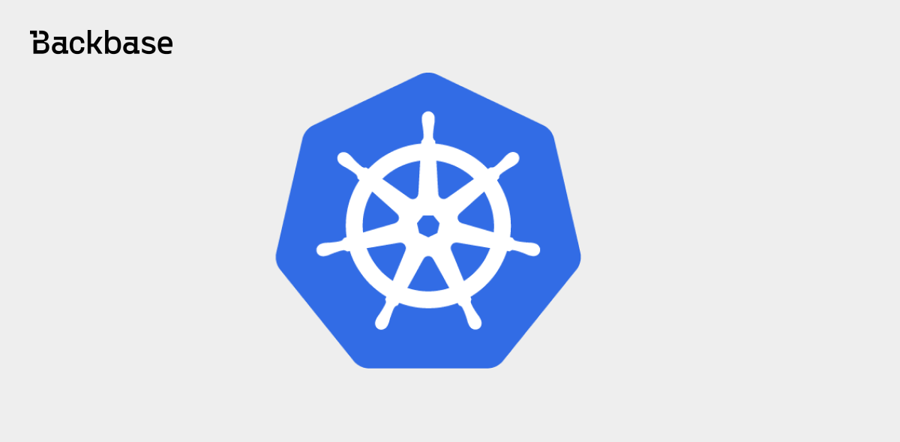
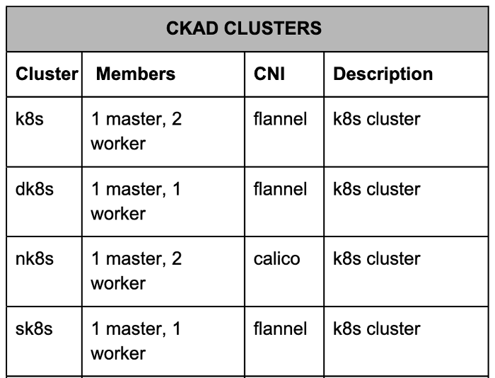
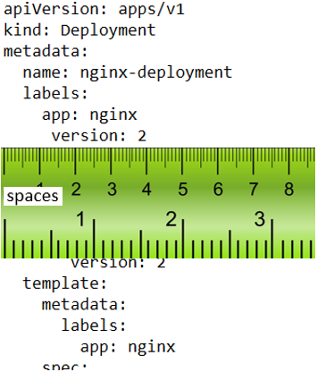
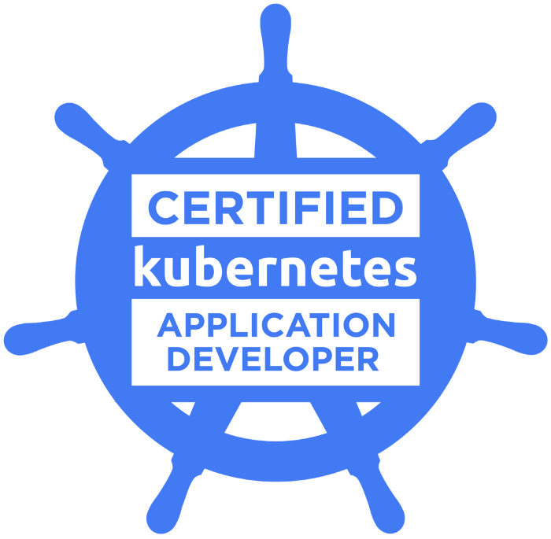

# Kubernetes Application Developer Certification Tips

I just passed the CKAD exam: And I want to share my journey and some tips and recommendations on how to handle the exam itself.



Authors: Andrés Torres
Date: 2020-03-04
Category: devops

tags: ckad,kubernetes,certification,certified,k8s

---

I just passed the Certified Kubernetes Application Developer (CKAD) exam: [https://www.cncf.io/certification/ckad/](https://www.cncf.io/certification/ckad/)

And I want to share my journey and some tips on how to handle the CKAD preparation and the exam itself.

## Preparation

### Starting point

First, you need a base, if you have no work experience with production Kubernetes then I would recommend going through basics of Kubernetes first.

Here some nice intros:


For something more academic I would recommend following the course:

[](https://www.edx.org/course/introduction-to-kubernetes)

### Study the curriculum

Next step with be to study all topics as proposed in the curriculum until you feel comfortable with all:

- **13% — Core Concepts**
  Understand Kubernetes API primitives
  Create and configure basic Pods
- **18% — Configuration**
  Understand ConfigMaps
  Understand SecurityContexts
  Define an application’s resource requirements
  Create & consume Secrets
  Understand ServiceAccounts
- **10% — Multi-Container Pods**
  Understand Multi-Container Pod design patterns (e .g. ambassador, adapter, sidecar
- **18% — Observability**
  Understand LivenessProbes and ReadinessProbes
  Understand container logging
  Understand how to monitor applications in Kubernetes
  Understand debugging in Kubernetes
- **20% — Pod Design**
  Understand Deployments and how to perform rolling updates
  Understand Deployments and how to perform rollbacks
  Understand Jobs and CronJobs
  Understand how to use Labels, Selectors, and Annotations
- **13% — Services & Networking**
  Understand Services
  Demonstrate a basic understanding of NetworkPolicies
- **8% — State Persistence**
  Understand PersistentVolumeClaims for storage

You can use the official docs to prepare all those topics [https://kubernetes.io/docs/home/](https://kubernetes.io/docs/home/)

In my experience, an online course helped me to prepare for the certification better, and that’s what I did when I obtained the Cloud Foundry Certified Developer (CFCD) certification:



And at that time before taking the exam I have followed an online course from The Linux Foundation:



The training was ok and hands-on, with exercises to practice and documentation to study, slides-style, so I decided to do the same for the Kubernetes certification.

I took advantage of a promotion they had during CyberMonday and got a bundle of Training + Example with a 60% discount:
The Linux Foundation announces discounts every now and then so be alert!
This is the training I’ve followed:



It’s self-paced, contains videos, slides and hands-on labs, you have one year access to the content and you will obtain an official badge (never hurts). Here the course outline:

- *Chapter 1. Course Introduction*
- *Chapter 2. Kubernetes Architecture*
- *Chapter 3. Build*
- *Chapter 4. Design*
- *Chapter 5. Deployment Configuration*
- *Chapter 6. Security*
- *Chapter 7. Exposing Applications*
- *Chapter 8. Troubleshooting*

---

### Building a Kubernetes cluster

After you are done with basics of Kubernetes you should try to create Kubernetes cluster from the scratch, for the Developer exam is not mandatory because is too deep, for the admin examen CKA I would say yes, but it’s good a learning exercise for everybody wanting to know how Kubernetes works.

The classic example will be using Kelsey Hightower git repo: [https://github.com/kelseyhightower/kubernetes-the-hard-way](https://github.com/kelseyhightower/kubernetes-the-hard-way)

There’s also an interesting one, more up to date and using new Kubernetes features, it’s divided into 5 parts: [https://clusterise.com/articles/kbp-1-intro/](https://clusterise.com/articles/kbp-1-intro/)

Try to create a cluster on your own a couple of times, it’s a nice way to understand the whole picture and how the components you just learned work with each other.

---

### Practice, Practice, Practice

Reading and learning concepts is ok but not enough, you really need a lot of practice basically because of the time constraint of 2 hours for the CKAD exam, you don’t have time to search in the documentation for examples or read concepts, you need to go straight to the point.

Some resources to help you be fast and breath *kubectl*

- Here you have 150 questions to practices, divided by topics: [https://medium.com/bb-tutorials-and-thoughts/practice-enough-with-these-questions-for-the-ckad-exam-2f42d1228552](https://medium.com/bb-tutorials-and-thoughts/practice-enough-with-these-questions-for-the-ckad-exam-2f42d1228552)
- Do all of these, maybe 2–3 times: [https://github.com/dgkanatsios/CKAD-exercises](https://github.com/dgkanatsios/CKAD-exercises)
- **Game of Pods** a nice gamified set of exercises based on Game Of Thrones: [https://kodekloud.com/p/game-of-pods](https://kodekloud.com/p/game-of-pods)
- Here a series with scenarios, try to do all of them and understand the alternatives to achieve the same result.
- Read this and do all examples: [https://kubernetes.io/docs/concepts/cluster-administration/logging/](https://kubernetes.io/docs/concepts/cluster-administration/logging/)
- Kubernetes docs also gives you some Tasks you can review and do yourself the ones that apply CKAD curriculum: [https://github.com/twajr/ckad-prep-notes#tasks-from-kubernetes-doc](https://github.com/twajr/ckad-prep-notes#tasks-from-kubernetes-doc)
- **Killer.sh** is a great page with an exam simulator that you can do 2 times, with a real cluster, alive for 24 hours, with real scenarios ready and even a timer so you get the feeling of the exam time pressure:



It’s not free, but I definitely think is totally worth it.

Do both test sessions with this CKAD Simulator, one after doing all the study and let the final one for the day before the real exam, to get into the exam mood.
Understand the solutions and maybe try out other ways to achieve the same.

## Books

I’ve used some books also during my preparation:

- [Kubernetes Best Practices: Blueprints for Building Successful Applications on Kubernetes](http://shop.oreilly.com/product/0636920273219.do)
- [Erase una vez Kubernetes (Spanish)](https://leanpub.com/erase-una-vez-kubernetes)

## Exam day Preparation

**Read the Curriculum:** [https://github.com/cncf/curriculum](https://github.com/cncf/curriculum)

**Read the Handbook:** [https://training.linuxfoundation.org/go/cka-ckad-candidate-handbook](https://training.linuxfoundation.org/go/cka-ckad-candidate-handbook)

**Read the important tips:** [http://training.linuxfoundation.org/go//Important-Tips-CKA-CKAD](http://training.linuxfoundation.org/go//Important-Tips-CKA-CKAD)

## Kubernetes documentation

Get familiar with the Kubernetes documentation and be able to use the search. You can have one browser tab open with one of the allowed links: [https://kubernetes.io/docs](https://kubernetes.io/docs) [https://github.com/kubernetes](https://github.com/kubernetes) [https://kubernetes.io/blog](https://kubernetes.io/blog)

## The Test Environment / Browser Terminal

You’ll be provided with a browser terminal which uses Ubuntu 16. The standard shells included with a minimal install of Ubuntu 16 will be available, including bash.

### Laggin

There could be some lagging, definitely make sure you are using a good internet connection because your webcam and screen are uploading all the time.

### Kubectl autocompletion

Autocompletion is not configured by default. Some wouldn’t recommend setting this up because of the lagging internet connection but you can check if it works for you. See further down for how to set up.

### Copy & Paste

There could be issues copying text (like pod names) from the left task information into the terminal. Some suggested to “hard” hit or long hold `Cmd/Ctrl+C` a few times to take action. Apart from that copy and paste should just work like in normal terminals.

### Percentages and Score

There are 19 questions in the exam and you need a 66% percentage to reach. Each question shows the % it gives if you solve it. Your results will be automatically checked according to the handbook. If you don’t agree with the results you can request a review.

### Notepad & Skipping Questions

You have access to a simple notepad in the browser which can be used for storing any kind of plain text. It makes sense to use this for saving skipped question numbers and their percentages. This way it’s possible to move some questions to the end. It might make sense to skip 2% or 3% questions and go directly to higher ones.

### Contexts and namespaces

You’ll receive access to 4 different clusters which multiple namespaces and various resources in each.



Each task on this exam must be completed on a designated cluster/configuration context. To minimize switching, the questions are grouped so that all questions on a given cluster appear consecutively. At the start of each task, you’ll be provided with the command to ensure you are on the correct cluster to complete the question. But you should be comfortable working in different namespaces with `kubectl`.

## Your Desktop

You are allowed to have multiple monitors connected and have to share every monitor with the proctor. Having one large screen definitely helps as you’re only allowed **one** application open (Chrome Browser) with two tabs, one terminal and one k8s docs. The questions will be on the left (maybe ~30% space), the terminal on the right. The larger your desktop the larger the browser terminal.

If you use a laptop you could work with lid closed, external mouse+keyboard+monitor attached. Make sure you also have a webcam+microphone working.

You could also have both monitors, laptop screen and external, active. Though Chrome can only run on one screen. You might be asked that your webcam points straight into your face. So using an external screen and your laptop webcam could not be accepted. Just keep that in mind.

You have to be able to move your webcam around in the beginning to show your whole room and desktop. Have a clean desk with only the necessary on it. You can have a glass/cup with water without anything printed on.
In the end you should feel very comfortable with your setup.

## Browser Terminal Setup

It should be considered to spend ~1 minute in the beginning to setup your terminal. In the real exam, the vast majority of questions will be done from the main terminal. For a few, you might need to ssh into another machine. Just be aware that configurations to your shell will not be transferred in this case.


### Minimal Setup

#### Alias

I suggest to any developer using Kubernetes to setup this alias:

```console
alias k=kubectl
```

which means you always run `kubectl` just with `k`.

#### Kubectl autocompletion

Depending on how much is already pre-installed in the CKAD terminal it might be enough to do this:

```console
source <(kubectl completion bash)

complete -F __start_kubectl k # to make it work with the alias k
```

You don’t need to remember all that, you can copy-paste from the official docs CheatSheet: [https://kubernetes.io/docs/reference/kubectl/cheatsheet/](https://kubernetes.io/docs/reference/kubectl/cheatsheet/)

#### Optional: Alias Namespace

In addition, you could define an alias like:

```console
alias kn='kubectl config set-context --current --namespace '
```

Which allows you to define the default namespace of the current context. Then once you switch a context or namespace you can just run:

```console
kn another-namespace # set default to another-namespace
```

But again, only do this if you used it before and are comfortable doing so. You can always specify the namespace for every call, which is also fine:

```console
k -n another-namespace get services
k -n another-namespace get pod
...
```

#### Persist bash settings

You can store aliases and other setups in `~/.bashrc` if you're planning on using different shells or `tmux`.

## Vim

Be great with vim.

At the beginning of the exam, create the file `~/.vimrc` with the following content:

```console
set tabstop=2
set expandtab
```

The `expandtab` make sure to use spaces for tabs. You will need to memorize these and just type them down because you can search internet have any commands note on your desktop, etc.

### Optional: Vim

You can also add the following to `~/.vimrc` to be able to apply tab on multiple selected lines.

```console
set shiftwidth=2
```

More further down in the `vim` section.

### toggle vim line numbers

When in vim you can press **Esc** and type `:set` number or `:set` nonumber followed by **Enter** to toggle line numbers. This can be useful when finding syntax errors based on the line number- but can be bad when wanting to mark&copy by mouse. You can also just jump to a line number with **Esc** `:22` + **Enter**.

### copy&paste

Get used to copy/paste/cut with vim:

```
Mark lines: Esc+V (then arrow keys)
Copy marked lines: y
Cut marked lines: d
Past lines: p or P
```

### Indent multiple lines

To indent multiple lines press **Esc** and type `:set shiftwidth=2`. First, mark multiple lines using `Shift v` and the up/down keys. Then to indent the marked lines press `Shift .` or `Shift ,`.

## Time is precious, Be fast

2 hours, 120 minutes, 19 questions, that’s less than 7 minutes per question, keep that mind, most of the people failing the test is not because of a lack of knowledge is just a time management issue.

Each question has the % you get if you solve it, if any question looks too complex or too difficult or even too long to accomplish, please write down the number in the Notebook and move to the next one.

There’s always quick wins in the exam, questions like:

```
“List all the namespaces and save the output in a file in \exam01\folder\namespaces.txt” 
```

So go for those first.

Also in most of the questions, you can validate the answer is right, check the Pod is running, check if the Deployment is running, check the number of executions, check the logs in the containers, etc.

> Solving a challenge and knowing how to verify a solution is critical

you don’t have to get 100% to pass the exam, try to attempt as much as you can, cross verify to make sure all questions attempted are correct.

## Avoid YAML, do dry-run



It’s a waste of time, it’s annoying and nobody on this planet like to type YAML files and find it enjoying.



**Use `--dry-run` and `-o yaml` flags, ALWAYS**

These flags are incredibly useful to redirect the YAML configuration to a file by using `>` sign

```console
kubectl run nginx --image=nginx --restart=Never --dry-run -o yaml > nginx.yaml
```

With the file, you can verify the config and make small changes if needed.

## Run command and restart flag

`kubectl run` command is a convenient and useful way to quickly create kubernetes resources without dealing with yaml files. Since kubernetes v1.12, creation acknowledgement (“object created”) is preceded by a message noting that this creation command is deprecated and will no longer be available in future `kubectl` releases.

It can save you a lot of time, but keep in mind it’ll eventually be removed by the kubectl command line because it’s deprecated. (kubectl create is the new proposed way)

You’ll use kubectl run command all the time. It basically creates different workloads/objects based on what you pass to this flag.

```console
+----------------------------------------+----------------------+
|             Command & Flag             |  Generated Resource  |
+----------------------------------------+----------------------+
| k run (without flag)                   | Creates a deployment |
| k run --restart=Never                  | Creates a Pod        |
| k run --restart=OnFailure              | Creates a Job        |
| k run --restart=OnFailure --schedule=  | Creates a Cronjob    |
+----------------------------------------+----------------------+

```

## Be smart using documentation examples

You can wget those files and make small changes, faster than creating the file from the scratch:

- **Pod with InitContainer:** [https://kubernetes.io/docs/tasks/configure-pod-container/configure-pod-initialization/#create-a-pod-that-has-an-init-container](https://kubernetes.io/docs/tasks/configure-pod-container/configure-pod-initialization/#create-a-pod-that-has-an-init-container)
- **Persistent Volume:** [https://kubernetes.io/docs/tasks/configure-pod-container/configure-persistent-volume-storage/#create-a-persistentvolume](https://kubernetes.io/docs/tasks/configure-pod-container/configure-persistent-volume-storage/#create-a-persistentvolume)
- **Persistent Volume Claim:** [https://kubernetes.io/docs/tasks/configure-pod-container/configure-persistent-volume-storage/#create-a-persistentvolumeclaim](https://kubernetes.io/docs/tasks/configure-pod-container/configure-persistent-volume-storage/#create-a-persistentvolumeclaim)
- **Job:** [https://kubernetes.io/docs/concepts/workloads/controllers/jobs-run-to-completion/#running-an-example-job](https://kubernetes.io/docs/concepts/workloads/controllers/jobs-run-to-completion/#running-an-example-job)
- **CronJob:** [https://kubernetes.io/docs/tasks/job/automated-tasks-with-cron-jobs/#creating-a-cron-job](https://kubernetes.io/docs/tasks/job/automated-tasks-with-cron-jobs/#creating-a-cron-job) e.g:
  ```console
  wget https://raw.githubusercontent.com/kubernetes/website/master/content/en/examples/application/job/cronjob.yaml
  ```

## Reuse

Use the `history` command to reuse already entered commands or use even faster history search through **Ctrl r**.

If a command takes some time to execute, like sometimes `kubectl delete pod x`. You can put a task in the background using **Ctrl z** and pull it back into foreground running command `fg`.

You can delete pods fast with:

```
k delete pod x --grace-period 0 --force
```

## The Result

Preparing and passing the CKAD examination was fun but also a little bit stressing, in the real world you have plenty of access to documentation and plenty of time to search for solutions, edit YAML (but try to avoid!) and use vim ;-)

In my opinion, the above resources are a good help to pass the exam without issues. I am hopeful that these resources can be helpful to everybody trying to get their Kubernetes CKAD certification.

Good luck with your exam and if you pass it, come back and share your badge!




