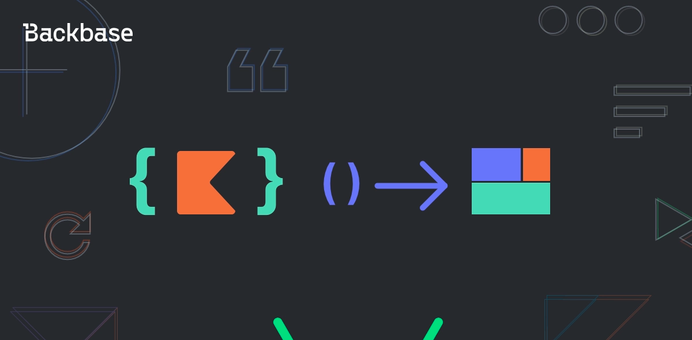
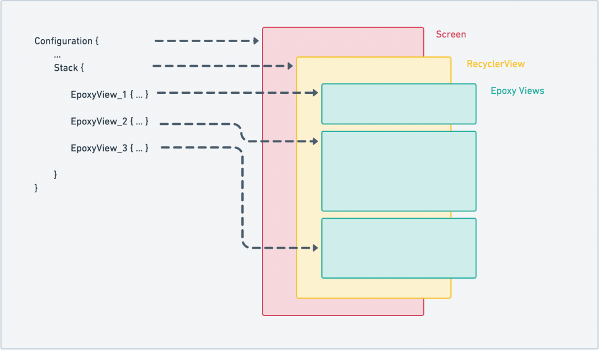
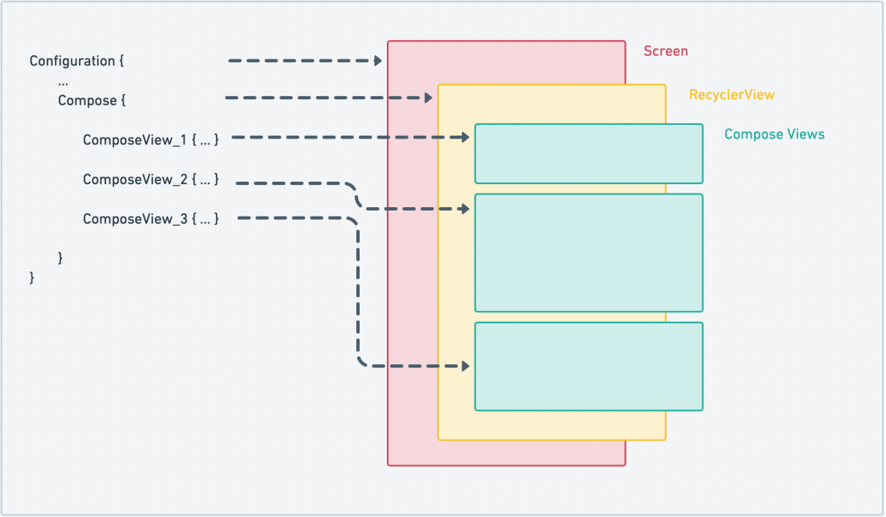

# Configuration Driven UI from Epoxy to Compose

This is a story of how we came up with the solution for Configuration driven UI (a level below server-driven UI) in Android at Backbase

Authors: Hari Vignesh Jayapalan
Date: 2020-08-14
Category: mobile

tags: mobile,android,jetpack,epoxy

---

This is a story of how we came up with the solution for Configuration driven UI (a level below server-driven UI) in Android at Backbase. It’s not a super perfect system or not highly reactive as Jetpack compose, but it absolutely solves the use-case: to create a framework or library, where developers can create or replace view components via configurations.

## **Who should read?**

This is about a special Android library. This solution might not be useful for all the devs who write apps every day. But I guarantee that this is an interesting problem to think and solve.

## **Background & Requirements**

We need to deliver a library, where customers can build or configure UI components into our OOTB (out of the box) screen or collection of screens. They should also be able to do the following

1. Add new screens
2. Configure OOTB UI components - Create quickly and add new UI components.

All above should be possible via **the configurations**

## **Which configurations?**

Configurations can mean anything. It can be a simple class with properties, JSON object (local or remote). Here, we’ll be working with Kotlin DSLs.

Why? they are type-safe, IDE intelli-sense support, manageable in terms of upgrading and maintaining the source and binary compatibility (how? more below). Even if we need to do it remotely (Server driven UI), we can receive a JSON object and map them to DSL.

## **The big picture**

Not really that big, but here’s how this is achieved:

* A Screen is nothing but a fragment and it just contains the list, here RecyclerView. I believe that this is what **Airbnb** app consists of - each screen is a RecyclerView with different views.

* The screen gets the configuration injected via DI or Service locators such as Koin.

* Using this DSL configuration, the [Epoxy](https://github.com/airbnb/epoxy) populates all the views in our RecyclerView.

* We are also using **Navigation Component** here, to use the same screen with multiple instances working together to solve this (a) task.

# **Why Epoxy?**

As per the requirements, we need to provide an accelerator solution, where developers should be able to create view components quickly. Using traditional methods might burn a bit more time. Epoxy, on the other hand, manages this complexity very well with a very little learning curve and with DSLs as output, it makes the configuration seamless.

# **Configuration-driven UI with Epoxy**

For a better explanation, why not show code? Let’s build a simple payment transfer screen, which will allow users to choose an account, a contact, enter the amount and hit pay!

In this screen, there are 2 configurable/customizable/replaceable components - and room for more!

* **Account selector**: Allows users to select the originator account and a destination account which opens up a bottom sheet and gets the result back.

* **Amount view**: Allows users to enter the amount.

> **Note**: Here, the button is part of the screen for a reason, not important to know 😛

## **The Configuration**

To better explain, let’s take a look at the actual configuration that brings out this screen to life.

1. **Navigation Graph**: In this example, we are dealing with one screen. If there is an use-case for multiple screens, navigation graph would be a good choice (optional).

2. **Step**: This represents a screen. Multiple steps mean many screens, which can be wrapped using a list of steps (bad naming?).

3. **Layout**: A sealed class entity, that supports different layouts. Here, a stack of views. Purely business-case oriented (`FormLayout`, `ListLayout` etc.).

4. **Stack**: Here, to stack up the views takes in a list of Epoxy Views.

5. **Epoxy View**: View components created using epoxy.

**AccountSelectorView** uses a few interesting functional callbacks to open up a bottom-sheet dialog and get the result back.

For a more detailed implementation, please refer the [Configuration Driven UI](https://github.com/Hariofspades/configuration-driven-ui) repository.

# **Moving from Epoxy to Composable functions**

Let's try this interesting experiment. If you wonder why epoxy was the first choice is that the API was very stable, it provided a very quick way to create UI components with DSL wrapper - **which was seamless with the whole configuration-driven UI concept**.

I happened to try Jetpack compose and it was quite promising. It was very close to the Flutter experience. But let’s check the reality on this date (Oct 2020):

* Still in alpha

* A lot of breaking changes

* Not super good with existing projects (Adding compose to existing Kotlin synthetic binding projects causes build failure, probably be fixed at the time of stable release)

* More features to come

Considering all these, epoxy is still a stable option for the above-mentioned date. But I’m curious about the migration strategy to this promising library.

What if Compose becomes the default way to create UI components in Android? (Maybe!) and it’s already a part of **Modern Android Development (MAD)** marketing tag! So, this library should be able to cater or move to the new solution.

## **Configuration-driven UI with Jetpack Compose**

* To migrate from epoxy, our Sealed class implementation of the layout is the key. Instead of using `StackLayout` we add a new implementation in place - `ComposeLayout`.

* Also, we replace `RecyclerView` with `ComposeView`.

Here’s the full configuration:

 

## **Adding ComposeLayout to StepLayout**

A New class gets to be a part of the Step layout - `ComposeLayout`.

**Note**: We are creating DSLs this way - to cater for binary compatibility. You can generate DSLs that are binary-safe way + support Java interoperability using this Android Studio plugin - [DSL API Generator - Plugins \| JetBrains](https://plugins.jetbrains.com/plugin/14386-dsl-api-generator).

 

## **Implementation of Account selector**

Compose version: `1.0.0-alpha04` 
Refer to this code on [Github](https://github.com/Hariofspades/configuration-driven-ui/blob/compose/app/src/main/java/dev/harivignesh/configuration/ui/compose/ComposeAccountSelector.kt).

For the full implementation of compose components and layout, please refer to the ["compose" branch](https://github.com/Hariofspades/configuration-driven-ui/tree/compose).

## **Challenges faced**

We did not migrate the actual repository yet. But here are some of the challenges that I faced working on this small repo:

1. Compose hates Kotlin Synthetic binding? when I added all the necessary dependencies, I faced build errors around Kotlin synthetic view binding. Folks in Stackoverflow have suggested moving to `ViewBinding` or simply use the `findViewById` approach - may be fixed in the future?

2. A bit of learning curve for the new state management around Compose - which was expected. My little Flutter knowledge made it better (considering that the above repo was created in 3 hours).

## **Final thoughts**

If you have reached till here, I’d appreciate your time for reading this post. Configuration driven UI might not be for everyone, it’s simply one of the business case and a very interesting problem to solve in terms of the architecture and public APIs. Hope you are taking something home :)

Thank you and see you on another post!
