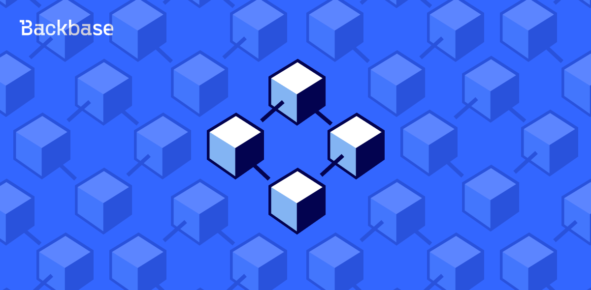

# Hello, Blockchain

Create a "Hello, world!"-style React app that reads and displays data from the Joystream blockchain



Authors: Alexey Buistov
Date: 2021-09-10
Category: frontend

tags: blockchain,react,joystream

---

This tutorial walks you through the process of creating a very minimal "Hello, world!" - style React app that reads and displays data from the Joystream blockchain. Along the way, I comment a thing or two about scaffolding React applications, JSON-RPC APIs and about the blockhain itself. 


## Blockchain? Really?

It might seem a bit silly to write an introduction into blockchain in 2021, but the fact is: it wasn't before 2020, "the Corona year," that this technology appealed to me. 

The highly centralized fintech world where I'm coming from is very very different to what blockchain is, and in way is much easier to grasp. A blockchain is a distributed software network that functions both as a digital ledger and a mechanism enabling the secure transfer of assets without an intermediary. In addition to such secure transfers, blockchain technology provides a permanent cryptographic record of transactions and a single version of the truth - a network state that is fully transparent and displayed in real time for the benefit of all participants.

This transparency comes at a price, though. One thing I've realised about the blockchain is that it resembles a super slow database. Why? Without "The Central Server®" or "The Master Database™," when nodes in your network are all the same, meaning structurally and architecturally there's no hierarchy at play whatsoever, how would you achieve the concensus about even such simple things as knowing your account balance? 

If hierarchy is removed from the system design, that is, in decentralised systems, network consensus suddently becomes a very hard computer science problem known as Byzantine Consensus. I will not pretend I understand how blockchain architectures address this problem, but apparently they're very good at it. And because they're very good at it, they're also typically much less convenient to use and performant than traditional centralized systems. 

With this intro in mind, let's jump into the code.

## Hacking Time

#### Environment setup

If you haven't got any Node, npm, yarn installed, or in case you're a Java backend developer not knowing a thing about front-end stuff, don't worry and read on. Installing these tools on Mac via `brew` is smooth and easy process. 


First, get npm if you haven't got it already. In your Terminal app, run 
```bash
brew install npm
``` 
It happened to me that the above command crashed with the error: `Error: Interrupted system call @ rb_sysopen - /usr/local/Cellar/nghttp2/1.44.0/bin/nghttp`. This error is usually caused by your antivirus software. The good news is: you don't even have to care about it. Simply go ahead and execute the exact same command several more times. After a few attempts, `npm` will install just fine. 


Instead of working from scratch, let us quickly scaffold a blank React application. For those of you who have, like me, never coded in Typescript or React, zero configuration scaffold tool called [create-react-app](https://github.com/facebook/create-react-app) is a true life-saver. Simply execute
```bash
npx create-react-app hello-blockchain-react --template typescript
```

On first run, you will be prompted to add `create-react-app` and all its depencencies. Be patient, this process may take a while, but in the end it will give you a fully set-up runnable React application. 

Now go to the newly created application folder and run the app:

```bash
cd hello-blockchain-react && npm start
```

Your browser should show you the welcome page. You're all set the for the most interesting part of the exercise now. 

#### Building the React Component

The particular blockchain we will be connecting to and reading data from is called [Joystream](https://www.joystream.org/). Joystream is a decentralized video platform with big ambitions (think Youtube with no Google involved). Being built on [Polkadot](https://polkadot.network/technology/), it requires us to install some additonal Polkadot dependencies. Here's how you do it:

```bash
npm add @polkadot/api@4.2.1
```
Validate that the package has been installed by inspecting the file `package.json`:
```bash
less package.json | grep polkadot
    "@polkadot/api": "^4.2.1",
```

Lastly, let's install custom Joystream type definitions that are used to describe data inside the blockchain.
```bash
npm add @joystream/types
```
Validate that the package has been installed by inspecting the file `package.json`:
```bash
less package.json | grep joy
    "@joystream/types": "^0.16.1",
```

Awesome. Now it's the right time to add a custom React component to our app. We might do this from scratch, but scaffolding is way cooler, isn't it? To generate a skeleton of our Joystream component, let's run
```bash
npx generate-react-cli c Joystream
```
First time, the code generator tool asks you some questions to be able to self-configure itself. Keep pressing Enter to give the default answers, until the component file will get generated (plus some other stuff we are not going to use in this tutorial, like tests or styles). 

The function component code produced by the scaffolding tool looks like this:
```javascript
import React from 'react';
import styles from './Joystream.module.css';

const Joystream = () => (
  <div className={styles.Joystream} data-testid="Joystream">
    Joystream Component
  </div>
);

export default Joystream;
```

In your browser what you'll get out of this code is just an HTML `<div>` with a static text, and yet there's something I'd like to highlight. What might look as an HTML snippet (lines 5-7), isn't a real HTML, but a thing called JSX. JSX is simply a syntax extension of JavaScript. It allows us to directly write HTML in React (within JavaScript code). It is easy to create a template using JSX in React, but it is not a simple template language instead it comes with the full power of JavaScript. It is faster than normal JavaScript as it performs optimizations while translating to regular JavaScript. Instead of separating the markup and logic in separated files, React uses *components* for this purpose.

To include our new function component into the app, we need to update the main file `App.tsx`:

* Import the component 

```javascript
import Joystream from './components/Joystream/Joystream';
```

* Place the component in the DOM by replacing the paragraph `<p>` element:

```markup
  <code>
    <Joystream/>
  </code>
```

Save your edits and reload the browser. Your component text (Joystream Component) should be now visible. 

#### Accessing the blockchain API

Now let's go back to the function component and start hacking. Import the API client from Polkadot and custom Joystream types:

```javascript
import { WsProvider, ApiPromise } from "@polkadot/api";
import { types } from "@joystream/types";
```
Then define the connection URL
```javascript
const wsLocation = 'wss://rome-rpc-endpoint.joystream.org:9944'
const provider = new WsProvider(wsLocation)
```
For the sake of this tutorial, we'll use the URL of a remote Joystream node located in Rome, Italy. Note: this doesn't mean our app would read the data from some sort of "Central Server ®" As an alternative, we could have spin up our own Joystream node on local laptop, let it get up to speed with the rest of the nodes in the network (this process is called synchronisation and takes quite some time), and read the same data from it. But one tutorial can't fit everything :) I'll show you how to do it in future installments.

Now let's refactor the code of the component to allow further additions
```javascript
const Joystream = () => {
  return (
    <div className={styles.Joystream} data-testid="Joystream">
      Joystream Component
    </div>
  )
};
```
It's just a refactoring, so functionally it stays the same. Double-check this by refreshing your browser page. What is allows us to do is to define our function components' state like this:
```javascript
  const [lastBlock, updateLastBlock] = useState(0)
  const [connected, updateConnected] = useState(false)
```
Note: `useState` needs to be imported, too:
```javascript
import {useState, useEffect} from 'react';
```
And the main thing - a new React Effect that connects to the API:
```javascript
  useEffect(() => {
    ApiPromise.create({ provider, types }).then((api) =>
      api.isReady.then(() => {
          console.log(`Connected to ${wsLocation}`);
          api.derive.chain.bestNumber().then((finalizedHeadNumber) => {
            updateLastBlock(finalizedHeadNumber.toNumber())
            updateConnected(true)
          }
        )
      })
    );
  }, [lastBlock, connected]);

```
A lot of things are going on here, but what's essential for the purpose or our exercise is to understand only the basics. The *Effect Hook* lets you perform side effects in function components. Data fetching, setting up a subscription, and manually changing the DOM in React components are all examples of side effects. 

Our side effect does several things:
1. Instantiates the API client
2. Connects to the node URL using Websocket
3. Once the connection is established, it calls the API method and reads the data returned by it
4. Updates the internal component state

All we have to do now is to take advantage of the internal state and include it in the JSX which the Joystream component produces:
```javascript
  return (
    <div className={styles.Joystream} data-testid="Joystream">
      {!connected? 'Connecting to blockchain...' : 
      `Connected! Latest block is: ${lastBlock.toLocaleString()}`}
    </div>
  )
```

Note how the front-end experience has changed. First, you see the text 'Connecting to blockchain...' because the component is busy establishing the connection (which may take a second or two), but then the text magically changes to a different one, showing the number of the last produced block that was sent by the Joystream API. Look at the code we've written so far and try to understand how does this conditional behavior work. 

#### Subscribing to updates from the API

What we've built so far looks good, but let us breathe a little dynamism in our app by making the last block information updated *as the blockchain produces new blocks* (on Joystream, the average time to produce one block is [six seconds](https://testnet.joystream.org/#/explorer). What's needed to achieve this is the subscription mechanism instead of a one-off API call: 

```javascript
  api.rpc.chain.subscribeNewHeads((header) => {
    console.log(`Chain is at block: #${header.number}`);
    
    if(!connected) {
      updateConnected(true);
    }

    if(header.number.toNumber() !== lastBlock) {
     updateLastBlock(header.number.toNumber());
    }
  })
```

Since we are dealing with a subscription, we now pass a callback into the `subscribeNewHeads` function, and this callback shall be triggered on each block (header), as they are imported. 


That's it, folks. If you've enjoyed this little journey, the best way of saying 'thank you' is sending some coins to my ETH address `0xe654F6D40e2b9eBFf62b02a23129E9C81ce26a88`. By the way, I've also prepared a [Github repo](https://github.com/singulart/hello-blockchain-react) with all the code from this trail is nicely divided into several commits for easier usage. Consider checking out the [branch](https://github.com/singulart/hello-blockchain-react/tree/css-transition) where you'll find a simple CSS Transition to animate our "Hello, Blockchain!" app. 


