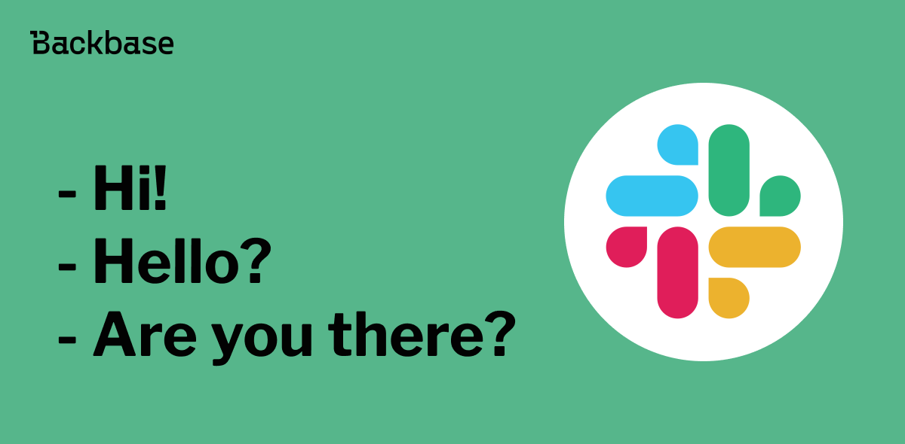
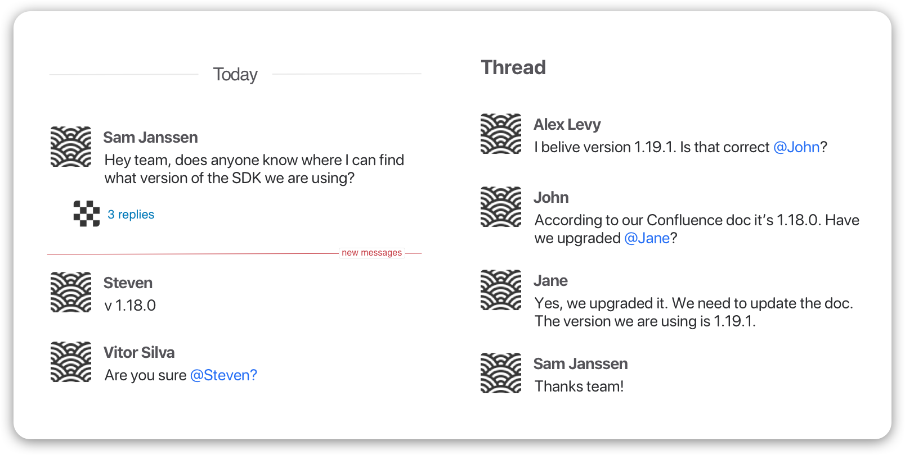
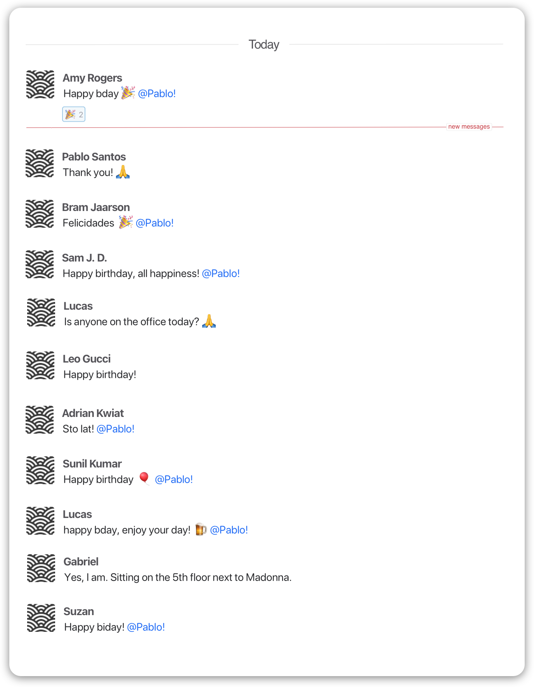
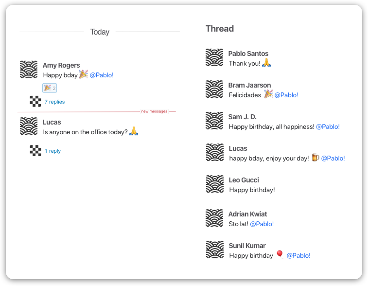
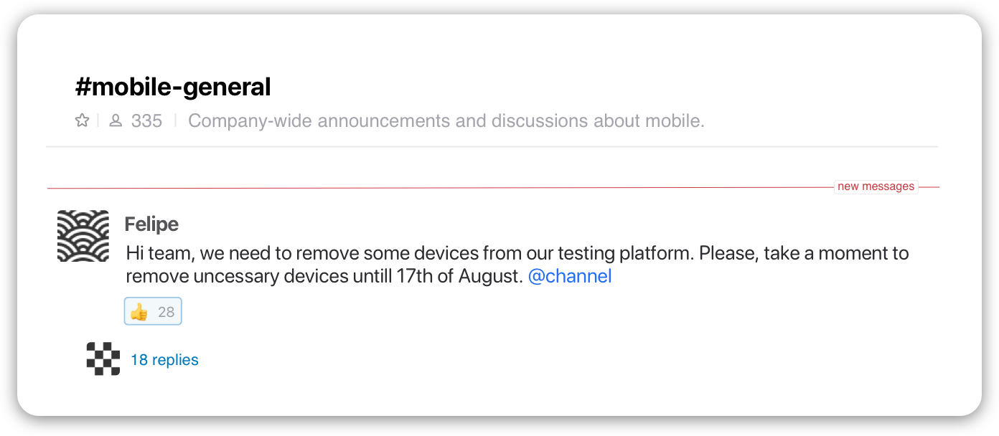
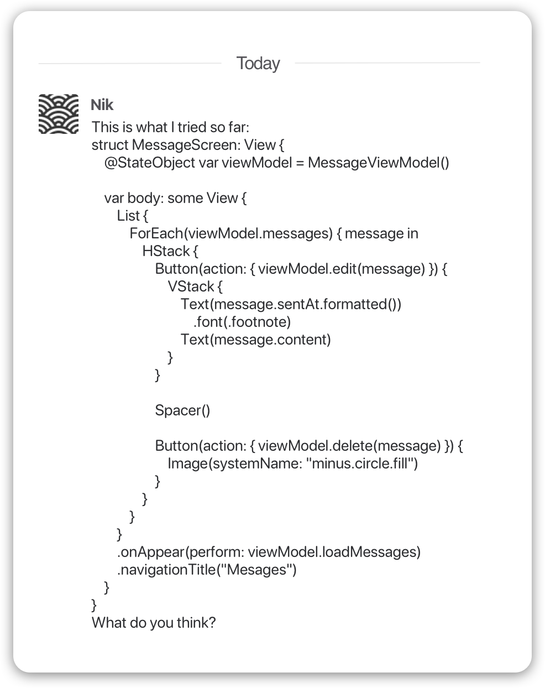

# The ultimate guide to Slack etiquette

Etiquette refers to a customary polite behaviour. When used properly, I believe it can improve one's performance. Are you being polite towards your colleagues?

Authors: Rafael Nascimento
Date: 2021-12-01
Category: tech-life

tags: slack,remote work,etiquette

---

We all know that COVID changed the world we live in today. It also changed the way most people work. Although remote work is nothing new for a lot of people, many of us had to adapt to it. Before, we could simply have a coffee with our team mates and discuss things face to face, but now messaging tools (for example [Slack](https://youtu.be/qUkYkm9bWak)) take a very important role in a "the less useless meetings the better" remote work strategy.

Slack is a messaging app for business that connects people to the information they need. It has several features that makes remote cooperation *"an easier, more organized way to work"* (as they promote on their website). Slack team is so kind that they even give you some [etiquette tips](https://slack.com/blog/collaboration/etiquette-tips-in-slack) of how to collaborate with kindness (I recommend the read, as I don't plan to repeat all of them here). However, I want to take this a step further.

When coming up with this guide, it touches upon the concept of what etiquette is:

*"Etiquette is the customary code of polite behaviour in society or among members of a particular profession or group."*

I believe that challenging habits in order to achieve a more "polite behaviour" in the workplace is a healthy exercise. Especially now that it is more important than ever to be able to collaborate with others in a remote environment. Note that it's not my intention to dictate your way of working, but I would like to challenge some of your current habits. Please bear with me.

# [1. No hello](https://nohello.net/)

 I know this might look a bit controversial at first: *how am I looking to improve polite behaviour telling you not to say hello?* However, this is not what this is about. The "no hello" approach is all about practicality. It still motivates you to say hello to your colleagues, but also includes the actual message you wanna send. I'd recommend you to have a look on [their website](https://nohello.net/), where they illustrate with very good examples. And, please, don't keep your colleagues waiting.

# 2. Use threads. Seriously, use threads.

 I know that this is already one of the items under the [Slack etiquette tips post](https://slack.com/blog/collaboration/etiquette-tips-in-slack), but I can't help it to emphasize this more. For some, this might seem just as some annoying formality. One might even say *"why would I use threads?"* Well, I'm glad you asked. The non thread usage can cause many variations of issues. One classic example is the "split discussion".

## **❌ Don't do this**

 

 Instead, **always answer on the thread**. This habit avoids duplication of information and confusion in the discussion. Another interesting variation of this issue causes what I like to call the "birthday channels". I'm sure you have been there, and I'm sure, at some point, you were persuaded to do the same as everyone else: *"happy birthday, Pablo."*

## **❌ Don't do this**

 

 Here you can see how the non-usage of thread pollutes the channel and makes parallel discussions a nightmare to follow.

## **✅ Instead, do this**

 

# 3. Use **@here** or **@channel** only when really necessary

*"When writing a message in a channel, if you use **@here** you will notify everyone online on the channel. If you **@channel** you will notify everyone in the channel."*

Being part of several different channels is a concern for some. At Backbase we have different channels that can keep you updated on different topics. For example, **#belongatbackbase** aims to discuss, share resources and work towards a more diverse, inclusive and equitable Backbase, **#s-retail-mobile** is for journeys and productised app support, and **#ski-2022** is for discussing and coordinating the ski trip. Most of those channels have over 100 people (some even over 300). 

Now, imagine you have to ask a question on the retail mobile support channel. Your client is pressuring you to deliver this as soon as possible. You might be tempted to **@here** or **@channel**, but let's think this through. Is your question relevant for Andy, the CTO of the company who is in the channel as well? What about John, iOS Developer from Hyderabad who works in a different project?

## **❌ Don't do this**

 

 In the next example, the message was relevant for most people in the channel, so usage of **@channel** or **@here** is advised in order to reach everyone.

## **✅ Instead, do this**

 

# 4. Format your code

This one might only be relevant for developers, and I will keep it short: please, format your code. Slack normal text is not meant to accommodate longer lines of code. It becomes messy and illegible.

## **❌ Don't do this**

 

## **✅ Instead, do this**

 

# 5. Fill in your profile

Imagine the following scenario: you just received the following message: *"Hi, could you give me access to this repository?"* Your immediate reaction is to look at the sender's name, and you see "Arya", no surname. Then you wonder *"which Arya is it?"*, *"do I even know anyone called Arya?"* Then you try to look at the person's profile picture, but they only have the default avatar. Alright, maybe looking at their position you might know how to help them. But no, that is not filled in either. *Are they from the US Hub? Or maybe the UK? How should you answer them? Is "who are you?" rude? Is the security team testing me here now? Maybe I should not answer at all…*

*Thank you, Tolu, for the amazing reference.*

Alright, that was a bit exaggerated, I agree. But you get the idea. It seems obvious, but it's surprising how many people don't really think about it. Having a full name, profile picture, position, time zone, are essential things when working remotely.

# Conclusion

As I said, my intention was not to tell you how you should do your work, but to challenge some of your current habits. Next time you see some of these happening, in an active or passive way, maybe ask yourself *"am I being kind to my coworkers?", "am I enabling everyone to work in an easier and more organized way?"* If those are some of your priorities, then following those rules will make you and your team improve cooperation 100% guaranteed. Or your money back.