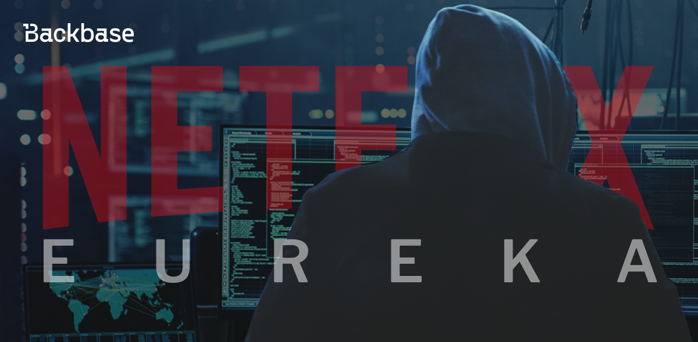
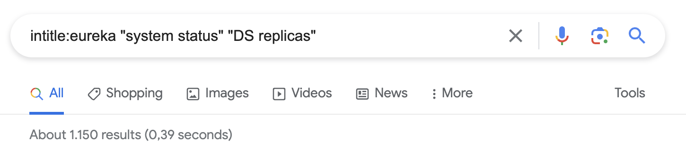
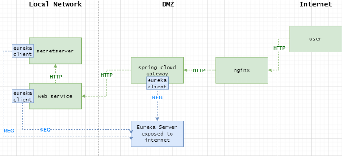
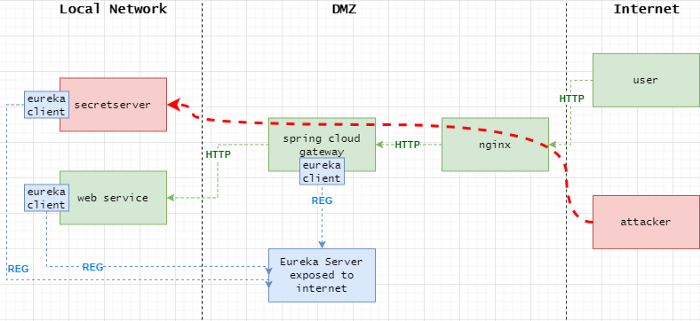
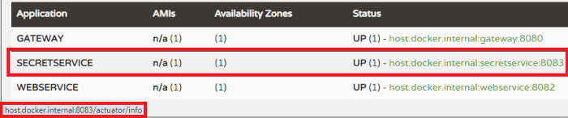
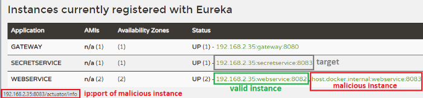
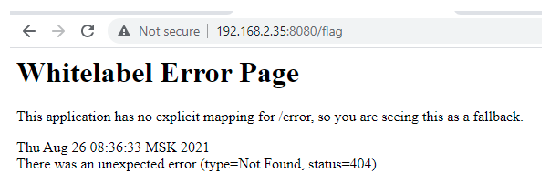
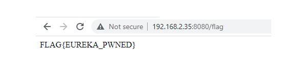
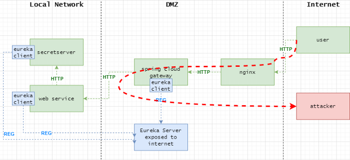
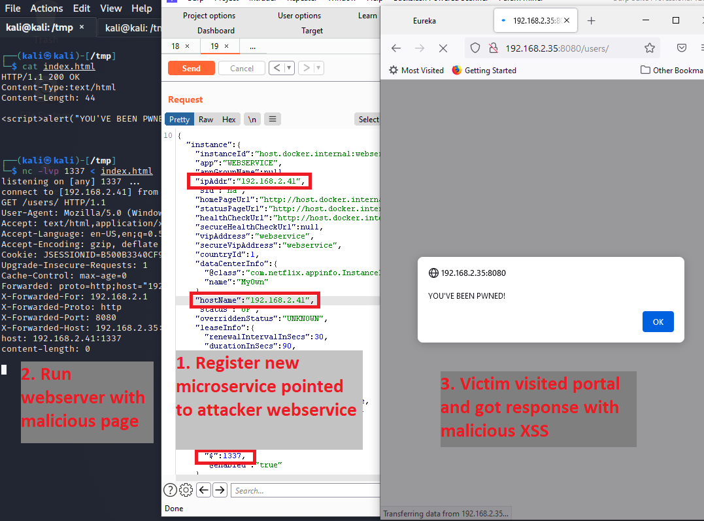

# Hacking Netflix Eureka

Found exposed Eureka server and don't know what to do?



Authors: Maxim Tyukov
Date: 2023-05-16
Category: devops

tags: eureka,security

---

Eureka is a service registry used to make micro-services to find each other. What can go wrong if the registry server becomes available from the internet? What if a malicious user registers his new micro-service?

It looks like the registry can become a point of failure from a security point of view. So that means we should properly secure it. But unfortunately, it is not always the case.

In this short research, you will look at Eureka from the attacker’s perspective and learn how to exploit SSRF and hijack internal infra’s or victims’ traffic. Both attack vectors are performed on the application layer. That means we can easily mitigate it on network and transport layers. We will talk about defense at the end.

##  *Whose Registry is this?*

The official description for Netflix Eureka, as per their [GitHub repository](https://github.com/Netflix/eureka):

*"Eureka is a RESTful (Representational State Transfer) service that is primarily used in the AWS cloud for the purpose of discovery, load balancing and failover of middle-tier servers. It plays a critical role in Netflix mid-tier infra."*

## What is out there

Talking to the pentester’s community, it seems quite common to encounter the registry service “outside”, which is a common potential security misconfiguration.

Now, checking how many Eureka servers can be found by Google (you probably can improve this dork):



## Find me a microservice!

Let’s start with some basics to understand how it works based on test lab example:



Suppose we have the following:

1. Two services on the backend inside the local network, **webservice** and **secretservice**
2. Spring Cloud Gateway (further referred to as **gateway**) configured to route all HTTP requests to **webservice**
3. There is no HTTP route from the **gateway** to **secretservice**
4. Registry **eureka server** is in DMZ (suppose that it is exposed by mistake)
5. and user/attacker is on the internet.

On startup, each micro-service will send a REGISTER request to the Eureka server (and later will send a STATUS update every N seconds - 30s by default). Based on this information the **registry** knows how many instances of a particular micro-service are currently up and running and their addresses (address can be both DNS or IP).

But the registry itself is not a proxy. It is “passive” storage and contains info about currently running instances of particular services. They call it a mid-layer proxy.

To balance and proxy HTTP requests, we use **[Spring Cloud Gateway](https://spring.io/projects/spring-cloud-gateway)**. Gateway collects the same information from the Eureka server to know where it should balance requests. In the test lab, the gateway handles only one route to **webservice**:

```java
.route("webservice",
    r -> r.path("/**")
        .uri("lb://WEBSERVICE"))
```

That means every path `"/\*\*"` (which is not registered on **gateway** separately) will be balanced ( `"lb://WEBSERVICE"` ) to the micro-service with the name **webservice**. There is no HTTP route to **secretservice**, so it is not supposed, by design, that the user will communicate with secretservice directly.

```java
@RequestMapping(value = "/")
public class InternalService {

    @RequestMapping(value = "/flag")
        public String available() {
            return "FLAG{EUREKA_PWNED}";
    }
}
```

Here **webservice**, on its turn, communicates with **secretservice** internally with the following code:

```java
Application application = eurekaClient.getApplication("secretservice");
InstanceInfo instanceInfo = application.getInstances().get(0);
String url = "http://" + instanceInfo.getIPAddr() + ":" + instanceInfo.getPort() + "/list/";
Collection<User> users = restTemplate.getForObject(url, Collection.class);
```

Eureka client keeps all info collected from the Eureka server in memory and updates it once per N seconds (i.e.: 30s by default).

## Exploitation

The main idea for attack vectors is changing HTTP routing with some profit for exploitation.

Getting access to the registry **we can register fake service** and try to access this service through **Spring Cloud Gateway**. After the fake service is registered, the **gateway** begins to balance requests to this service if we register the right service name.

At this point, multiple security issues arise.

* If an attacker registers a new instance of an existing micro-service and maps it to some internal micro-service, which doesn’t have a public HTTP route, the attacker can send HTTP requests to this service, which is about SSRF (Server Side Request Forgery)
* **OR**, if the attacker registers his malicious service outside, both gateway and internal services will send requests to fake service outside, which means it is possible to hijack victim's traffic (+exploit XSS) or hijack internal services connections.


### Attack Vector 1: Server Side Request Forgery



For successful exploitation, we need to find a service mapped to root URL `“/”` (which is not really a requirement but provides more freedom in path walking). For the lab environment, *Spring Cloud Gateway* already maps `“/”` to *webservice*.

At first, find the address of the targeted micro-service to get access to (**secretservice**), you can find it on the registry:


Then register new microservice with name **webservice** but with `_address:port_` of **secretservice** (to do this change `ipAddr`, `hostName` and port parameters in eureka registration request):



Now there are 2 instances of **webservice**. After **gateway** synced information from the **registry**, it begins to balance attacker requests between 2 instances of **webservice**. And due to one of the instances points to **secretservice** now, we bypass route restriction on HTTP layer and successfully perform SSRF attack.

In case of a successful attack, you will see 2 different pages during multiple requests, 404 error (because there is no route for `_/flag_` on legit **webservice**) and `"FLAG{EUREKA_PWNED}"`:




### Attack Vector 2: Traffic Hijack and XSS



In another scenario, what if an attacker will register an instance of **webservice** and point it to the malicious server? In this case, the **gateway** will begin to route HTTP traffic to the attacker-controlled server. This leads to secrets leakage (i.e.: `token` or `sessionId`) and XSS. For the browser, because the communication with the malicious server is performed in the backchannel, it looks like an official site (TLS on Gateway doesn’t help).

 

We can do the same trick by hijacking internal services calls, leading to information leaking or even more critical vulnerabilities.

## How to Communicate with Eureka

We'll attempt to communicate with Eureka with the following request

```
POST /eureka/apps/WEBSERVICE HTTP/1.1
Accept: application/json, application/*+json
Accept-Encoding: gzip
Content-Type: application/json
User-Agent: Java/11.0.10
Host: 127.0.0.1:8088
Connection: keep-alive
Content-Length: 1015

{"instance":{"instanceId":"host.docker.internal:webservice:8082","app":"WEBSERVICE","appGroupName":null,"ipAddr":"192.168.2.1","sid":"na","homePageUrl":"http://host.docker.internal:8082/","statusPageUrl":"http://host.docker.internal:8082/actuator/info","healthCheckUrl":"http://host.docker.internal:8082/actuator/health","secureHealthCheckUrl":null,"vipAddress":"webservice","secureVipAddress":"webservice","countryId":1,"dataCenterInfo":{"@class":"com.netflix.appinfo.InstanceInfo$DefaultDataCenterInfo","name":"MyOwn"},"hostName":"host.docker.internal","status":"UP","overriddenStatus":"UNKNOWN","leaseInfo":{"renewalIntervalInSecs":30,"durationInSecs":90,"registrationTimestamp":0,"lastRenewalTimestamp":0,"evictionTimestamp":0,"serviceUpTimestamp":0},"isCoordinatingDiscoveryServer":false,"lastUpdatedTimestamp":1630906180645,"lastDirtyTimestamp":1630906182808,"actionType":null,"asgName":null,"port":{"$":8082,"@enabled":"true"},"securePort":{"$":443,"@enabled":"false"},"metadata":{"management.port":"8082"}}}
```

**However, this might fail.** If the protocol has changed somehow since this publication, the easiest way to extract the correct request is to run simple eureka client+server locally and use **Wireshark** (which takes ~10mins).

Check any tutorial about registry, e.g. [service-registration-and-discovery](https://spring.io/guides/gs/service-registration-and-discovery/)

## Defense is boring, but we have to…

Bear in mind that keeping Eureka **not** exposed to the internet must not be considered the main defense because it happens.

Security has to be implemented with a multi-layer approach, which guarantees that if one of the layers fails due to 0day or misconfiguration, other layers still keep you safe.

### Keep it safe on Application Layer

Eureka supports basic HTTP authentication; use it. Yes, basic authentication is not the best practice, and you have to share one password between multiple micro-services. But it still saves you some time after the attacker finds an exposed registry.

### Keep it safe on Presentation Layer

**mTLS** between micro-services will help against registering malicious service outside (against traffic hijack).

### Keep it safe on Transport/Network Layers

And, of course, micro-segmentation and strict firewall rules. There is no need to have network connectivity between the **gateway** and **secretservice** - it will safe from SSRF. As well as an uncontrolled outbound network connection to public networks must be prohibited - it will save from traffic hijacking (and from reverse shell :p).

Thanks for reading and stay safe!


