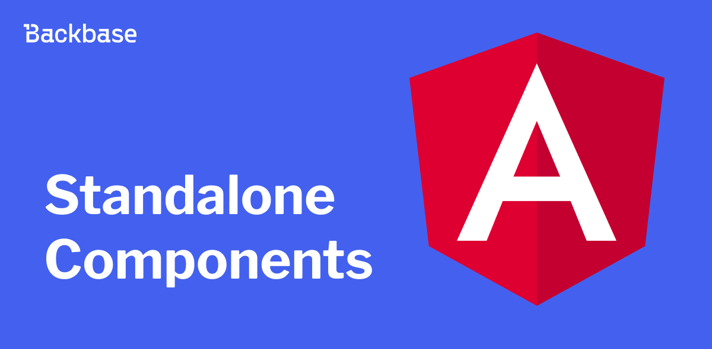
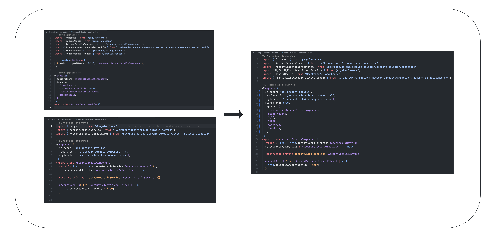
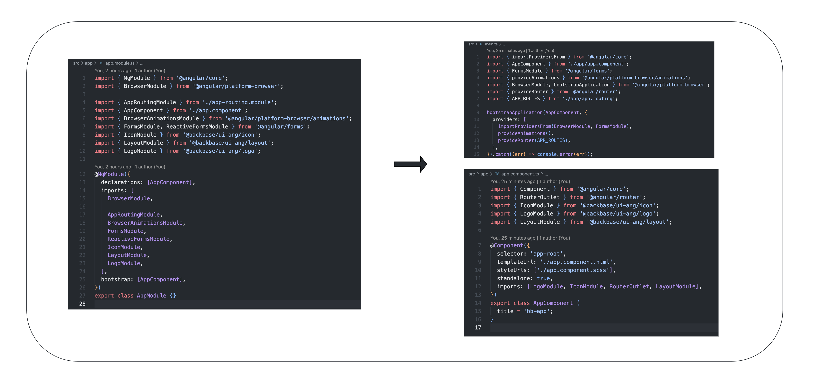
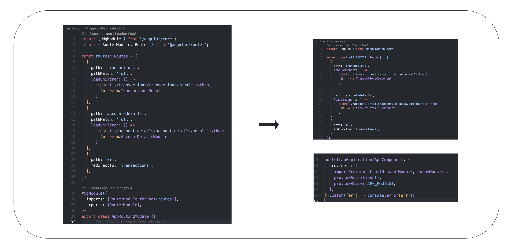
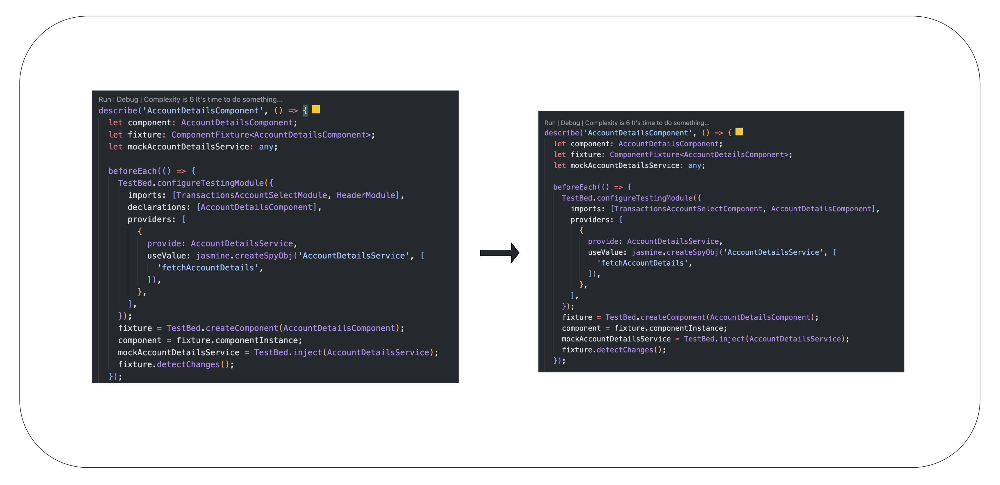

# Angular standalone components

A simplified way to build Angular applications



Authors: Ankit Pant
Date: 2023-07-03
Category: frontend

tags: web,angular,standalone,frontend

---

## Introduction

Until now, developers have been using NgModules to specify the components, directives, pipes, etc that are available for use in templates, however, after the release of Angular [standalone components](https://angular.io/guide/standalone-components "https://angular.io/guide/standalone-components"), you don't need to do this anymore in the NgModules.
Angular standalone feature was fully released with Angular v15. Angular [standalone components](https://angular.io/guide/standalone-components "https://angular.io/guide/standalone-components") are independent and self-contained building blocks in an Angular app which can be used to independently import the dependencies required for its functionality.
Although the standalone components are not mandatory, and there are no strict rules for using them, Angular architects recommend using the Standalone feature for the newly created Angular components.

To designate a component, directive, or a pipe as a standalone component, you must mark it as `standalone: true`. The component does not have to be declared or imported in `NgModule`, and you can import all the dependencies directly in the component itself, thus eliminating the use of `NgModule` entirely.

 ```typescript
 @Component({
   selector: '...',
   templateUrl: '...',
   styleUrls: ['...'],
   standalone: true,
   imports: [
     NgIf,
     NgFor,
     AsyncPipe,
     ...
   ],
 })
 export class FooBarComponent {
```


## Generate a standalone component via the Angular CLI

```bash
ng generate component --standalone account-statements
```

A component generated with `--standalone` flag is not added to `NgModule` and contains default imports such as `CommonModule` to get started with the component right away.

## Adopt standalone components incrementally

Standalone components can be seamlessly combined with existing modules. They are easy to implement, and can be adopted incrementally into an app. A `standalone` component, pipe or directive can also be imported into an existing `NgModule` configuration, applied incrementally for complex apps, so that you can ensure that there are no breaking changes.

 ```typescript
 @NgModule({
   declarations: [...],
   exports: [...]
   imports: [
     AccountDetailsComponent, // This is a standalone component
     CommonModule,
     RouterModule.forChild(routes),
     .....
   ],
 })
```

## Migrate a component to a Standalone

You can convert a component in one of the following ways:

* Using the [schematics](https://angular.io/guide/standalone-migration#migrate-an-existing-angular-project-to-standalone "https://angular.io/guide/standalone-migration#migrate-an-existing-angular-project-to-standalone")

* Manually

### Migrate to Standalone via schematics

To migrate standalone components, you must satisfy the [prerequisites from Angular](https://angular.io/guide/standalone-migration#prerequisites).
Angular provides a [schematic to migrate](https://angular.io/guide/standalone-migration#migrate-an-existing-angular-project-to-standalone "https://angular.io/guide/standalone-migration#migrate-an-existing-angular-project-to-standalone") existing Angular apps that use Angular `v15` or later, to use the standalone features.


```bash
ng generate @angular/core:standalone
```

`ng generate @angular/core:standalone` should be executed at the root of the project.

Use this as follows:

1. Run `ng generate @angular/core:standalone` to convert all components, directives and pipes to standalone. This will try to convert and migrate all the files to use standalone features.

2. Run `ng generate @angular/core:standalone` again to remove unnecessary NgModule classes. Empty `NgModules` are searched for removed them from the app.

3. Run `ng generate @angular/core:standalone` a third time to bootstrap the project using standalone APIs. The schematics change how the app is bootstrapped in the `main.ts` file.

_**Note:**_

* To avoid any breaking changes to an app with the standalone feature, in Angular, most of the `NgModule` or other files, so you might have to remove and migrated some of the files manually.

### Migrate a component manually
The steps below shows how to migrate an existing component to a standalone component

1. Mark the component as standalone by adding `standalone: true` as the meta data in the `@Component` directive.

     ```typescript
     @Component({
       ...
     +  standalone: true,
    ```

2. Import all the `dependencies` in the standalone component from `ngModules`

     ```typescript
     @Component({
       ...
       standalone: true,
     +  imports: [
     +   TransactionsAccountSelectComponent, //another standalone component
     +   HeaderModule, // non-standalone component can be imported like this
     +   NgIf,
     +   NgFor,
     +   AsyncPipe,
     +   JsonPipe,
     +  ]
     })
    ```

3. If the component has [child routes](https://angular.io/guide/standalone-components#providing-services-to-a-subset-of-routes "https://angular.io/guide/standalone-components#providing-services-to-a-subset-of-routes"), create and export `routing.ts`.

4. Delete the `NgModule` and the routing configurations.




## Differences between using NgModules and Standalone feature

### Bootstrapping an app

Once the `AppComponent` is standalone you can get rid of the `AppModules` completely and use  
[bootstrapApplication](https://angular.io/api/platform-browser/bootstrapApplication "https://angular.io/api/platform-browser/bootstrapApplication") API to bootstrap the application in `src/main.ts` file and import the dependencies directly in the `AppComponent`, for more information see [here](https://angular.io/guide/standalone-components#bootstrapping-an-application-using-a-standalone-component "https://angular.io/guide/standalone-components#bootstrapping-an-application-using-a-standalone-component").



### Changes in the Routing configuration

With standalone feature in place, `NgModule` is no long required for many lazy loading scenarios.
You can simply lazy load a standalone component by exporting the routes and using `loadComponent` instead of `loadChildren` and include them in `src/main.ts` files using `provideRouter()` from `@angular/router` as follows.



### Specs for Standalone components

The TestBed configuration now doesn't needs to import all the dependencies used by the component  
you are testing and hence reduces the boilerplate code in the spec file.



_**NOTE:**_ After the migration the specs might be broken and might need manual fixes

## Improvements on performance using standalone feature

Here are a few ways in which Angular standalone components can contribute to performance improvements:

* **Reduced bundle size:** You can reduce the overall bundle size of your app by using Angular's standalone feature and eliminating NgModules and the boilerplate code that comes with it.

* **Isolation and lazy loading:** You can enhance the performance by encapsulating functionality within standalone components which helps to load all the resource only when it is lazy loaded.

* **Reusability:** Angular standalone components are self-contained, independent, and can be re-utilized across the app.

## Bundle size

The actual impact on bundle size will depend on the complexity and size of your Angular component as well as the specific dependencies it requires. The difference in bundle size was not that huge (about 8.5 kb) for a small app which is also mentioned in the table below, but it might make a big difference with the large apps. While using Angular standalone components can reduce bundle size, other factors such as code optimization, tree shaking, and lazy loading can also play a role in optimizing bundle size.

| App type            | Bundle size   |
| ------------------- | ------------- |
| Non Standalone app  | 7648528 bytes |
| Standalone app      | 7640882 bytes |
