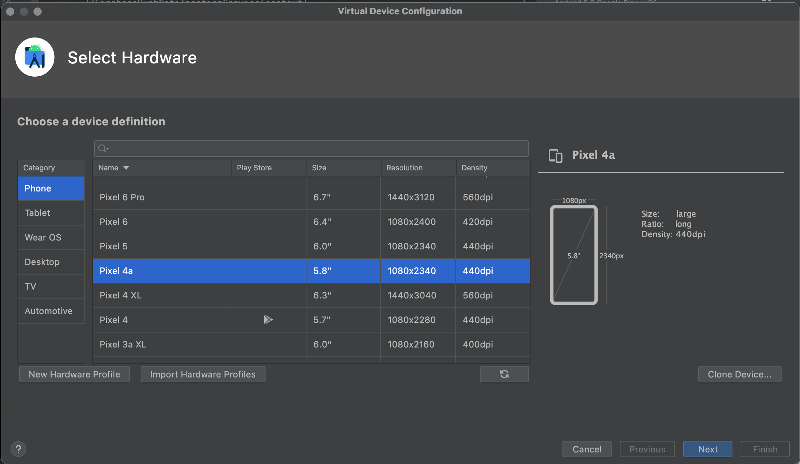
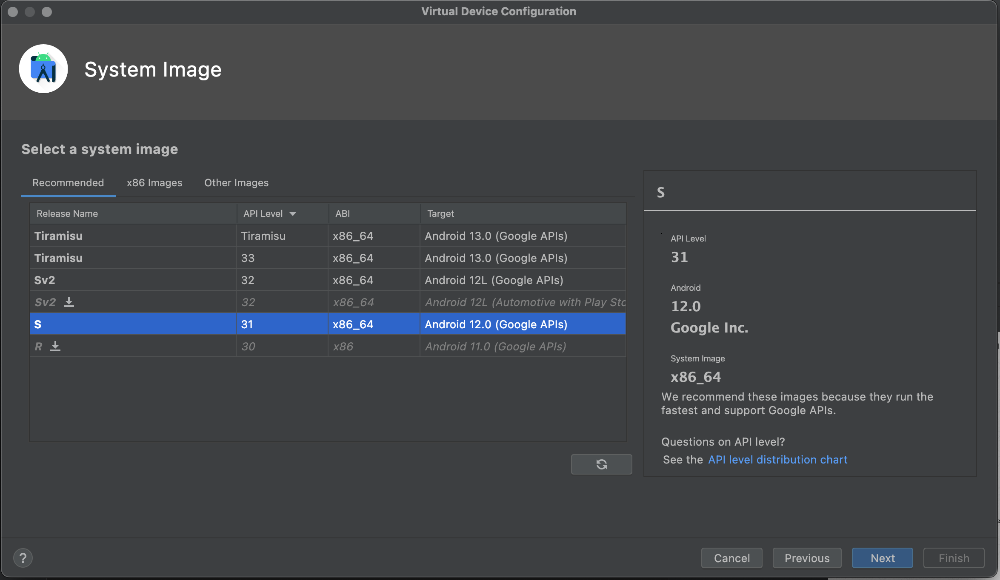
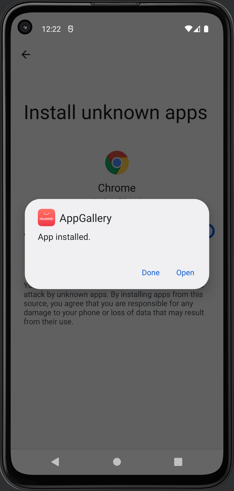
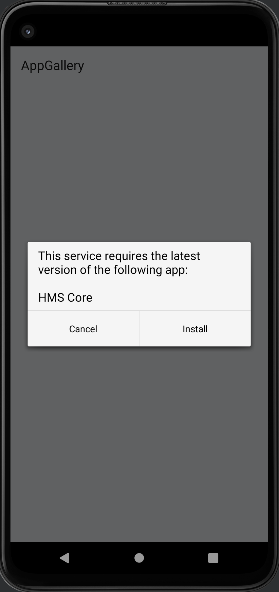
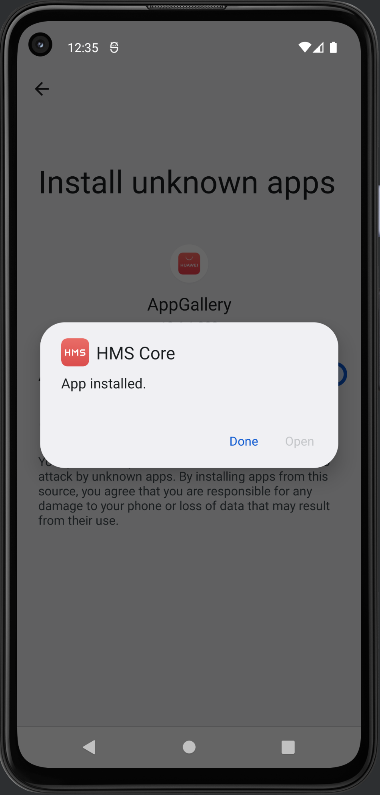
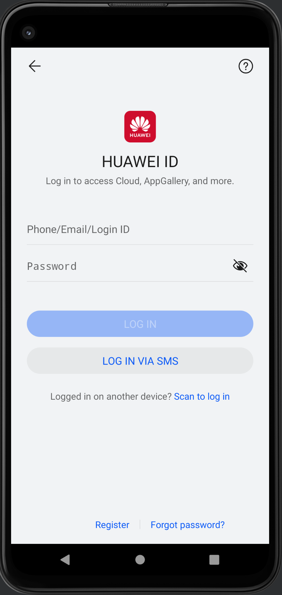
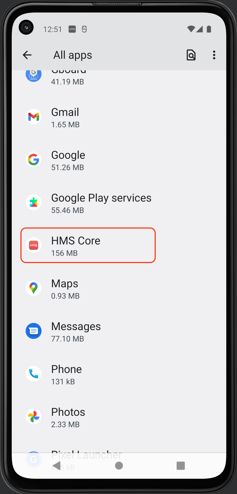

# Installing HMS Core in Android Studio Emulator

If you want to test your HMS implementation and you do not have a Huawei device, it is easy to mock it and test these services in the Android Studio emulator

Authors: Edgar Garcia Barragan
Date: 2023-09-30
Category: mobile

tags: mobile,android,huawei,hms

---

## Introduction

This is a quick guide with few and simple instructions on installing HMS Core in Android Studio Emulator. If you want to test your HMS implementation and you do not have a Huawei device, this is your best option.

## Steps

**1.** Create a new device with only Google APIs, no Play Store. For this example, a Pixel 4a with API 31 is being used.

Choose a device without Play Store.

Choose a version of Android with Google APIs.

**2.** Install the Huawei AppGallery APK

You can either Google or install it from the [Huawei Consumer website](http://consumer.huawei.com/en/mobileservices/appgallery/).

Download the AppGallery APK.

Allow installing unknown apps in Chrome browser and install the app.

**3.** Install HMS Core.

Open the AppGallery, you will be prompted to install HMS Core. Proceed with the installation.

**4.** Allow the installation of unknown apps.

Once the HMS Core has been downloaded, you need to allow installing unknown apps from AppGallery to install it.

**5.** Verify it all went well.

Press “Done”, then press the back button, you will see the AppGallery login screen.

Verify that the HMS Core app is installed.

## Conclusion

Installing HMS Core in Android Studio Emulator is straight forward and now you can use its rich array of open device and cloud capabilities. 
