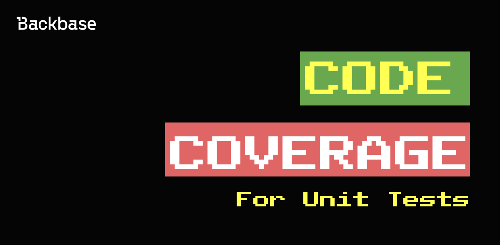

# Code Coverage for Unit Tests

Code coverage helps in the easy maintenance of the codebase, exposure of bad code, and results in faster time to market

Authors: Rafael Nascimento
Date: 2023-10-06
Category: qa

tags: qa,mobile,android,iOS,tests,testing,web,unit testing

---

# Introduction

Code coverage is the percentage of lines of your code that is being executed by your tests. This is an indicative of how safe your code is and how bug proof it can be while refactoring or adding new features. Code coverage helps in the easy maintenance of the codebase, exposure of bad code, and results in faster time to market. 

# How do we measure it?

The formula to calculate code coverage can vary. [Sonar](https://www.sonarsource.com/) does calculate it as:

`Coverage = (CT + CF + LC)/(2*B + EL)`

Where:
* CT = conditions that have been evaluated to 'true' at least once
* CF = conditions that have been evaluated to 'false' at least once
* LC = covered lines = lines_to_cover - uncovered_lines
* B = total number of conditions
* EL = total number of executable lines (lines_to_cover)

It can also be much simpler, such as:

`Coverage = (LC / EL) * 100`

# Coverage Criteria

To measure the lines of code that are actually exercised by test runs, various criteria are taken into consideration. We have outlined below a few critical coverage criteria that companies use.

1. **Function Coverage**: The functions in the source code that are called and executed at least once.

2. **Statement Coverage**: The number of statements that have been successfully validated in the source code.

3. **Path Coverage**: The flows containing a sequence of controls and conditions that have worked well at least once.

4. **Branch or Decision Coverage**: The decision control structures (loops, for example) that have executed fine.

5. **Condition Coverage**: The Boolean expressions that are validated and that executes both TRUE and FALSE as per the test runs.

# What to test?

When making your test strategy you should aim to set up your team for success by understanding what is important to test in your project and what is not. This should be discussed before undertaking any new feature work, and should be part of the DoD (definition of done) of a user story.

**Keep in mind the following:**

> You should write unit test to all the business logic of features developed by your team, such as view model methods, use cases and utility classes should be tested. Etc.

# Setting a code coverage target

It’s worth to start by mentioning that 100% of code coverage is most of times both an unrealistic and pointless goal. Often meeting this target would not be possible because of time constraints, as well as due to the fact that there are components that simply cannot be tested (private components or elements would be tested on UI test). And, spending time and effort on ways to achieve a 100% coverage would not add to the project quality. **Having 100% covered code doesn’t mean you have 100% secure tested code.** You should take in consideration the quality of the test being added.

When setting a code coverage target it is important to take into account benefit vs effort. This means that you choose the target to improve the quality of the codebase, not to please a certain metric. Discuss with your team some of the following questions.

* _Is it worth the effort of aiming for a high code coverage?_
* _Does the client have the time allocation for implementing those tests?_
* _What code coverage criteria make sense to my team?_

With that in mind, we recommend you to follow a guideline rather than a specific number.

| Code coverage (%) | Guideline      |
| ----------------- | -------------- |
| 0 - 20            | Not acceptable |
| 40-60             | Normal         |
| 60-80             | Good           |
| 80-100            | Outstanding    |