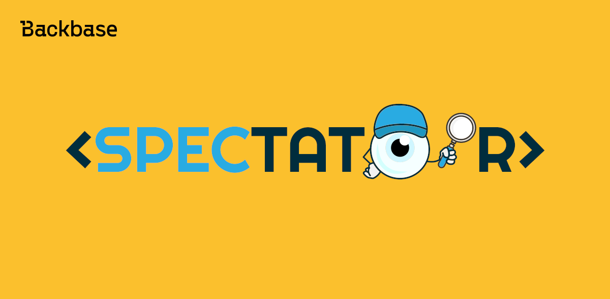

# Angular Unit Testing with Spectator

A robust testing library for unit testing



Authors: Utku
Date: 2023-10-25
Category: frontend

tags: web,angular,testing,test,unit testing,frontend

---

## Introduction

Spectator is a powerful testing tool designed to simplify Angular testing. It is built on top of the TestBed API and effectively reduces the boilerplate code associated with the built-in TestBed API. By doing so, Spectator delivers a more efficient and developer-friendly testing experience. In this article, we discuss Spectator test cases, installation, testing components and services, advantages, drawbacks, and migrating to Spectator.

## Understanding Spectator Test Cases

Spectator supports three main types of test cases:

1. **Isolated unit tests**:
   Corresponding to [**Component class testing**](https://angular.io/guide/testing-components-basics#component-class-testing) mentioned in Angular.io.
   These tests focus on testing component, directive, pipe, and service classes in isolation. Additionally, Spectator supports writing tests for routing and HTTP communication. It is essential to mock dependencies to ensure tests are isolated.

2. **Shallow component tests**:
   Corresponding to [**Component DOM testing**](https://angular.io/guide/testing-components-basics#component-dom-testing) mentioned in Angular.io.
   Shallow component tests focus on testing a component with a template, but ignoring the rendering of child components. By passing the 'shallow: true' option into the configuration, we can achieve this quite easily with Spectator.

3. **Integration tests**:
   Corresponding to [**Component DOM testing**](https://angular.io/guide/testing-components-basics#component-dom-testing) mentioned in Angular.io.
   Integration tests focus on testing how two or more components work together. These tests are particularly useful when components depend on each other.

In the following sections, we delve deeper into the installation process, testing components and services, and the advantages and drawbacks of using Spectator.

### Installing Spectator

To install Spectator, you can use either yarn or npm:

`yarn add @ngneat/spectator --dev`

`npm install @ngneat/spectator --save-dev`

Spectator uses **Jasmine** by default, but it supports **Jest** as well.
To be able to use it with Jest, make sure to target your imports from `@ngneat/spectator/jest` instead of `@ngneat/spectator`.

## Testing Components with Spectator

When testing components with Spectator, the first step is to create a component factory using the `createComponentFactory` function and pass the component class you want to test. This factory function returns a new component for each test block. Spectator offers various options for the `createComponentFactory` function, allowing you to customize your testing environment.

```typescript
import { Spectator, createComponentFactory } from "@ngneat/spectator";
import { ButtonComponent } from "./button.component";

describe("ButtonComponent", () => {
  let spectator: Spectator<ButtonComponent>;
  const createComponent = createComponentFactory(ButtonComponent);

  beforeEach(() => (spectator = createComponent()));

  it("should have a success class by default", () => {
    expect(spectator.query("button")).toHaveClass("success");
  });

  it("should set the class name according to the [className] input", () => {
    spectator.setInput("className", "danger");
    expect(spectator.query("button")).toHaveClass("danger");
    expect(spectator.query("button")).not.toHaveClass("success");
  });
});
```

The `createComponentFactory` function can optionally take the following options which extends the basic Angular Testing Module options:

```typescript
const createComponent = createComponentFactory({
  component: ButtonComponent,
  imports: [],
  providers: [],
  declarations: [],
  entryComponents: [],
  componentProviders: [], // Override the component's providers
  componentViewProviders: [], // Override the component's view providers
  overrideModules: [], // Override modules
  mocks: [], // Providers that will automatically be mocked
  componentMocks: [], // Component providers that will automatically be mocked
  componentViewProvidersMocks: [], // Component view providers that will be automatically mocked
  detectChanges: false, // Defaults to true
  declareComponent: false, // Defaults to true
  disableAnimations: false, // Defaults to true
  shallow: true, // Defaults to false
});
```

After creating the component factory, you can use the `createComponent` function to test different aspects of your component, such as setting inputs, testing outputs, or running detectChanges().

The `createComponent` function optionally takes the following options:

```typescript
it("should...", () => {
  spectator = createComponent({
    // The component inputs
    props: {
      title: "Click",
    },
    // Override the component's providers
    providers: [],
    // Whether to run change detection (defaults to true)
    detectChanges: false,
  });

  expect(spectator.query("button")).toHaveText("Click");
});
```

The `createComponent()` method returns an instance of `Spectator` which exposes the following properties:

- `fixture` - The tested component's fixture
- `component` - The tested component's instance
- `element` - The tested component's native element
- `debugElement` - The tested fixture's debug element

And the following methods:

- **inject()**
  <br>
  Provides a wrapper for Ivy's `TestBed.inject()`:

  ```typescript
  const service = spectator.inject(QueryService);
  const fromComponentInjector = true;
  const service = spectator.inject(QueryService, fromComponentInjector);
  ```

- **detectChanges()**
  <br>
  Runs `detectChanges` on the tested element/host:

  ```typescript
  spectator.detectChanges();
  ```

- **setInput()**
  <br>
  Changes the value of an `@Input()` of the tested component:

  ```typescript
  it("should...", () => {
    spectator.setInput("className", "danger");

    spectator.setInput({
      className: "danger",
    });
  });
  ```

- **output()**
  <br>
  Returns an observable `@Output()` of the tested component:

  ```typescript
  it("should emit the $event on click", () => {
    let output;
    spectator.output("click").subscribe((result) => (output = result));

    spectator.component.onClick({ type: "click" });
    expect(output).toEqual({ type: "click" });
  });
  ```

- **tick(millis?: number)**
  Run the fakeAsync `tick` function and call `detectChanges()`:

  ```typescript
  it("should work with tick", fakeAsync(() => {
    spectator = createComponent(ZippyComponent);
    spectator.component.update();
    expect(spectator.component.updatedAsync).toBeFalsy();
    spectator.tick(6000);
    expect(spectator.component.updatedAsync).not.toBeFalsy();
  }));
  ```

## Testing Services with Spectator

To test services with Spectator, import the `createServiceFactory` and `SpectatorService` functions, and then create a service factory using the `createServiceFactory` function.

```typescript
import { createServiceFactory, SpectatorService } from "@ngneat/spectator";

import { AuthService } from "auth.service.ts";

describe("AuthService", () => {
  let spectator: SpectatorService<AuthService>;
  const createService = createServiceFactory(AuthService);

  beforeEach(() => (spectator = createService()));

  it("should not be logged in", () => {
    expect(spectator.service.isLoggedIn()).toBeFalsy();
  });
});
```

The `createService` function returns `SpectatorService` with the following properties:

- `service` - Get an instance of the service
- `inject()` - A proxy for Angular `TestBed.inject()`

**For detailed examples, further information and other use cases, please refer to the official Spectator documentation:** [https://github.com/ngneat/spectator](https://github.com/ngneat/spectator/)

## Generating Spec Files with Angular CLI and Spectator Schematics

Creating spec files with Spectator configuration is made simple with the provided schematics.

To generate spec files:

For a component spec, run: `ng g cs example-component`

For a service spec, run: `ng g ss example-service`

For a directive spec, run: `ng g ds example-directive`

## Advantages of Using Spectator

Testing can sometimes be more challenging and time-consuming than the actual implementation. Configuring TestBed correctly may even take longer than writing the tests themselves. Spectator significantly improves the developer experience by making it easier and faster to write tests. As a result, it helps overcome the tendency to skip writing tests. Spectator achieves this by:

- Simplifying test spec configuration by providing readable and concise API which helps to reduce boilerplate code.
- Improving readability and maintainability by providing a set of expressive and easier to understand custom matchers and assertions.
- Making mocking and spying easier.

## Drawbacks of Using Spectator

- Learning curve might be considered steep.
- Official documentation might be considered relatively limited.
- Compatibility issues may arise with newer Angular version even though it might be temporary.

## Migrating

Spectator can be adopted gradually since it is not a complete replacement rather an enhancement. Whenever Spectator test suits are started to be written, these test suits can be kept in a separate file with `spectator` suffix. For example, `transactions.component.spectator.spec.ts`. Once the project is fully migrated to spectator, the `spectator` suffix can be omitted from all test file names.

For integration tests, there is also an approach that to create a separate test file with `integration` suffix to keep integration tests separate from rest of the test suites. For example, `transactions.component.integration.spec.ts`.

With a proper migration plan in place, developers can smoothly transition from their existing testing setup to Spectator without disrupting the project.

## Conclusion

By leveraging the power of Spectator, developers can enjoy a more efficient and user-friendly testing experience. With its simplified test spec configuration, improved readability, and enhanced mocking capabilities, Spectator is a valuable addition to any Angular project. Although it comes with a learning curve, the advantages it offers make it a worthwhile investment for improving your testing workflow. For developers looking to streamline their Angular testing process, Spectator is a powerful and versatile tool that can help you achieve your goals.

## References and Additional Resources

- [Spectator Documentation](https://github.com/ngneat/spectator)
- [testing-angular.com](https://testing-angular.com/testing-components-with-spectator/#testing-components-with-spectator)
- An in depth comparison between regular test specs and spectator test specs can be found in this open-source project: [https://github.com/9elements/angular-workshop](https://github.com/9elements/angular-workshop). <br> Each test spec in this project has a jasmine and a spectator alternative allowing to make comparison as well as serving as a reference for additional use cases.