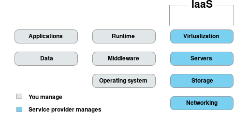
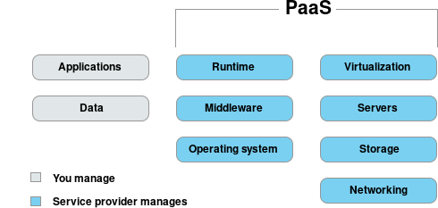
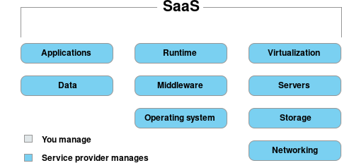
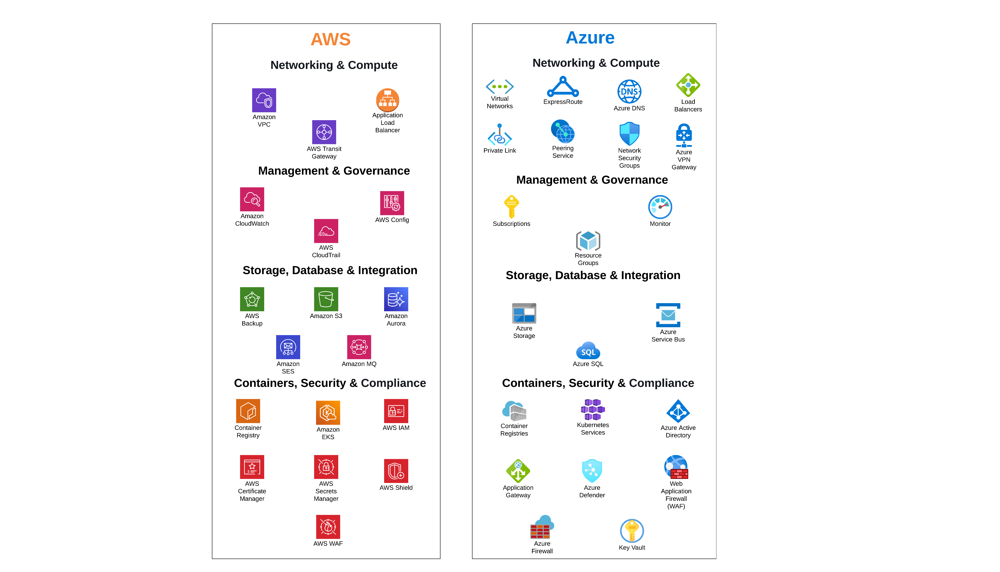

# A New Chapter: Exploring Azure Resources

Azure’s limitless potential sets the stage for a promising journey, where opportunities abound on the horizon.

Authors: Sri Balaji,Ashish Arora
Date: 2023-11-21
Category: devops

tags: azure,devops,system engineering,cloud

---

## **Demystifying Cloud Computing: A Quick Introduction**

**Introduction to Cloud Computing**
- Cloud computing is a transformative technology that delivers various services over the internet. 
- Instead of relying on local servers or computers, hosts these services remotely in data centers, commonly referred to as "the cloud."    
- This model offers benefits like scalability, accessibility, and cost-efficiency. 

**What is Cloud Computing** 
- Cloud computing delivers on-demand computing services over the internet and enables you to pay for what you need. 
- It includes several different deployment types and service models so that you can find the solution that best meets your business needs. 

## **Types of cloud services**
**Cloud computing has three main service models:** 

- **Infrastructure as a Service (IaaS):** Virtualized computing resources, allowing users to build and manage their own IT infrastructure.
 
    Example: amazon web services, microsoft azure, and google compute engine

- **Platform as a Service (PaaS):** A platform with development tools, databases, and runtime environments, simplifying application development and deployment.

- **Software as a Service (SaaS):** Ready-to-use software applications accessible via the internet, eliminating installation and maintenance hassles.

**Benefits of Cloud Computing:**
  - Cloud computing offers cost efficiency, scalability, accessibility, and reliability. 
  - It reduces IT costs, allows flexible resource scaling, promotes remote work, and ensures high uptime. 

## **Cloud Showdown: Visualizing AWS and Azure Resources**

## **Exploring Azure Services: A Journey into Cloud Innovations**

In the dynamic landscape of Cloud Technology, the transition to Microsoft Azure has paved the way for enhanced performance, scalability, and innovation. 

**Azure Kubernetes Service (AKS)** 
-   AKS is a managed Kubernetes service provided by Microsoft Azure. 
-   AKS simplifies the process of deploying and managing containerized applications using Kubernetes. 

    **Key aspects of Azure Kubernetes Service:** 

    - **Managed Kubernetes:** 
        AKS provides a fully managed Kubernetes cluster, abstracting away the complexities of managing the underlying infrastructure. 

    - **Scalability:**
        AKS supports the automatic scaling of applications based on demand. 

    - **Integration with Azure Services:** 
        AKS allows you to easily connect your containerized applications to services such as Azure Active Directory, Azure Monitor, and Azure Container Registry. 

    - **DevOps Integration:** 
        AKS integrates with popular DevOps tools, including Azure DevOps, Jenkins, and others, facilitating a streamlined continuous integration and continuous deployment (CI/CD) pipeline for containerized applications. 

    - **Monitoring and Diagnostics:** 
        Azure Monitor provides monitoring and allows you to gain insights into the performance, health, and behavior of your containerized applications. 

    - **Security:**
        AKS includes security features such as Azure Active Directory integration for identity and access management, network policies for controlling the flow of traffic between pods.

**Azure Active Directory (Azure AD)** is Microsoft's cloud-based identity and access management service. 
 
**Azure SQL** is Microsoft's managed relational database service on Azure.

**Azure Container Registry (ACR)** is a secure, private Docker registry on Microsoft Azure. 

**Azure Service Bus** is a fully managed message broker service in Microsoft Azure that enables applications to communicate asynchronously. 

**Azure Key Vault** is a secure cloud service in Microsoft Azure for storing and managing sensitive information like secrets, encryption keys, and certificates. 
 
**Azure Storage** is a scalable cloud storage service by Microsoft Azure, offering solutions for various data types.
 
- Blob Storage - Storing unstructured data 
- File Storage - File sharing 
- Table Storage - NoSQL data 
- Queue Storage - Used for messaging

Azure provides a range of network components that enable the creation of secure, scalable, and well-connected applications and services.

**Azure network components:** 

- **Virtual Network (VNet)** is the fundamental building block for your private network in Azure. 

- **Azure Virtual Network (VNet) Peering** is a feature that enables connecting Azure virtual networks seamlessly. 

- **Subnet** enables you to segment and organize resources within a VNet. 

- **Network Security Group (NSG)** is a set of rules for controlling inbound and outbound network traffic to network interfaces, VMs, and subnets. 

- **Azure Firewall** is a fully managed, scalable firewall service that provides network-level protection for resources within a virtual network. 

- **Azure Load Balancer** distributes incoming network traffic across multiple servers to ensure no single server is overwhelmed, optimizing availability and reliability. 

- **Azure VPN Gateway** connects your on-premises networks to Azure through site-to-site VPNs or point-to-site VPNs, creating a secure and private connection. 

- **Azure ExpressRoute** provides dedicated, private connections from on-premises data centers to Azure, offering more reliability and lower latency than internet-based connections.

- **Azure Application Gateway** is a web traffic load balancer that enables you to manage and scale applications. 

- **Azure DNS** is a scalable and reliable domain name system (DNS) hosting service. 

- **Azure Private Link** allows secure and private access to Azure PaaS services and your own services by establishing connections within your Azure Virtual Network. 

These components collectively allow you to build and manage complex network architectures in Azure, ensuring high performance, security, and connectivity for your applications and services. 

## **Conclusion: Navigating Azure's Potential**

Navigating Azure, we embark on a future defined by scalability, security, and optimized DevOps workflows. Azure’s flexibility, seamless integration, and collaborative ecosystem enhance efficiency, cost-effectiveness, and pave the way for continuous innovation. Azure’s limitless potential sets the stage for a promising journey, where opportunities abound on the horizon.
