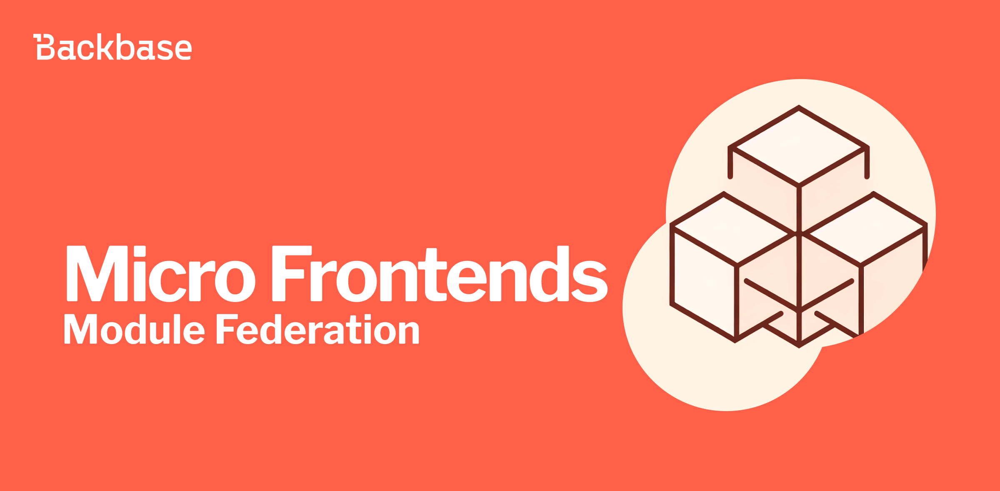

# Micro Frontends with Module Federation

Micro Frontends is an architectural pattern to divide a web app into smaller modules and Module Federation makes implementing them much easier.

Authors: Harsh Julka, Pablo Villoslada Puigcerber
Date: 2023-12-13
Category: frontend

tags: angular,frontend,micro-frontends,module-federation,web

---

## What are Micro Frontends?

Micro Frontends is an architectural pattern to divide a web app into smaller modules; like the backend concept of microservices, breaking a monolith app into smaller services.

It allows for greater flexibility as each team can own a different module and deploy it independently, thus reducing complexity. And there are no limits on the size or scope of each module, ranging from complete pages to just fragments or components.

## Module Federation

Module Federation makes implementing Micro Frontends much easier as it allows developers to share code between different projects in a decentralized way.

### Webpack Module Federation

Webpack 5 (2020) introduced [Module Federation](https://webpack.js.org/concepts/module-federation/) as a [plugin](https://webpack.js.org/plugins/module-federation-plugin/) to form a single app from separate builds.

It permits you to dynamically load code from another app inside the main JavaScript app while sharing modules and dependencies.

### Native Federation

[Native Federation](https://www.angulararchitects.io/en/blog/announcing-native-federation-1-0/) is a tooling-agnostic implementation of Module Federation.

With the new build system in Angular 17 (2023) using Esbuild, there was a need to implement Module Federation independently of Webpack, so Native Federation relies on modern technologies like EcmaScript Modules and Import Maps to allow the use of other build tools such as Esbuild or Vite.

### Module Federation 2.0

[Module Federation 2.0](https://module-federation.io/blog/announcement.html) builds upon the learnings from Webpack Module Federation.

It decouples itself from Webpack allowing other tooling such as Rspack; adds types hinting to ensure safety; and a manifest that simplifies integration with deployment platforms.

## Types of Micro Frontends

Two or more applications compose the Micro Frontends architecture:
* Shell/Host/Container app
* One or more remote applications
  

### Same framework

The most common use case for Micro Frontends involves splitting a large app into smaller applications that you deploy independently. 

This can reduce the build time of the app and allow teams to work autonomously. You can deploy a remote app without the need to redeploy the entire app.

### Different frameworks

Backbase builds its frontend software with Angular, but some customers would like to use other frontend frameworks like React or Vue.js.

Micro Frontends allows, not without its challenges, to load remotes written with different frameworks. 

For example, a bank could keep its React app while progressively integrating Backbase capabilities written in Angular and loaded as remote modules.

### Different versions of the same framework

During the year 2022, Backbase changed the frontend architecture from widgets to journeys for different beneficial reasons. Those widgets and their dependencies stayed in Angular 12, while the new journeys kept updating the Angular version.

As of now, some clients are still using the so-called widgets and would like to adopt the new journeys. But Angular and other frameworks are not built to have different versions running together in the browser.

For this use case, Micro Frontends is the perfect approach to keep the legacy code working while progressively migrating to use the new features provided in newer versions of the software. 

## Module Federation with Angular

For Angular 12 to 16, the [@angular-architects/module-federation](https://www.npmjs.com/package/@angular-architects/module-federation) package transforms your app into powerful Micro Frontends and configures Webpack Module Federation.

From Angular 16.1 the [@angular-architects/native-federation](https://www.npmjs.com/package/@angular-architects/native-federation) helps with the Micro Frontends implementation independently of the building tool.

Ultimately, for using several frameworks and/or versions it's a good idea to wrap your Micro Frontends as Web Components using [@angular/elements](https://angular.io/guide/elements).

## Downsides

Although Micro Frontends offer tremendous flexibility and scalability, you need to consider the disadvantages:

* Increased bundle size, moreover when using more than one framework or version
* Increased complexity as you have to manage different applications, versions, and deployments
* Inconsistent UI/UX; although remotes inherit their styles from the shell app, they can have their own making it harder to keep a consistent look and feel

## References

- [The Microfrontend Revolution: Module Federation in Webpack 5](https://www.angulararchitects.io/blog/the-microfrontend-revolution-module-federation-in-webpack-5/)
- [Consequences of Micro Frontends: Survey Results](https://www.angulararchitects.io/en/blog/consequences-of-micro-frontends-survey-results/)
