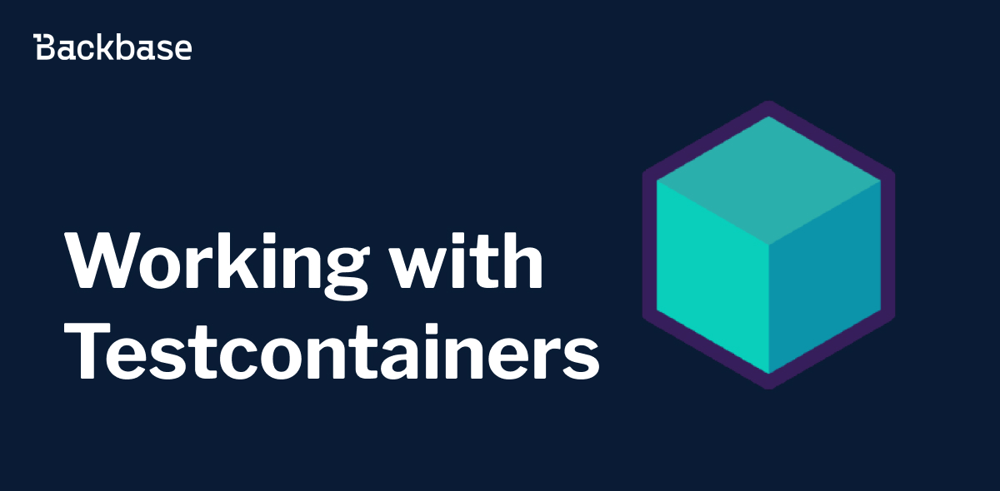
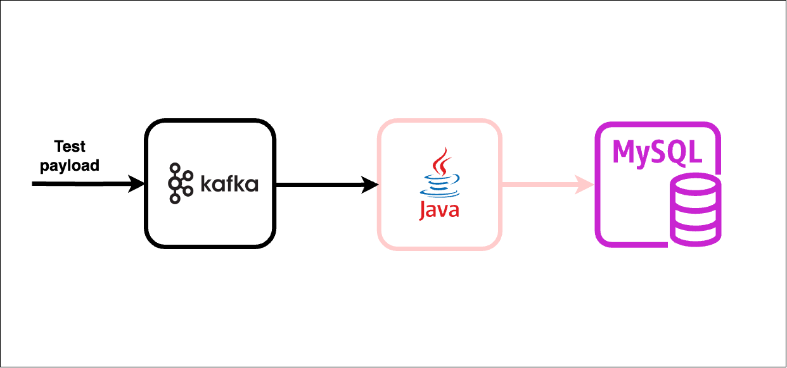

# Working with Testcontainers


Framework that simplifies the process of setting up, managing, and tearing down containerized environments for integration testing.





Authors: Yauheni Navosha
Date: 2024-05-06T09:25:16.083Z
Category: backend


tags: backend, tests, testing, integration testing, docker, containers

---

## What is Testcontainers?

Testcontainers is a testing library integration tests with real services wrapped in Docker containers. Using Testcontainers, you can write tests by directly interacting with the same kind of services utilized in production, without relying on mocks or in-memory services.

## When to use it?

Testcontainers simplifies running of integration tests that involve external dependencies such as databases, message queues, etc., by providing a convenient way to spin up disposable instances of these dependencies within your test environment.

## Why should you use testcontainers instead of mocked and in-memory services?

  - **In-memory services may lack functionalities present in your production service.** For example: to enable integration testing with Postgres/Oracle databases, one might use an in-memory H2 database. But H2 might not support some MySQL/Oracle specific features. That might lead to worse quality of tests and forcing to consider using of the feature at all.
  - **In-memory services and mocks might delay the feedback cycle.** For example: despite successful testing with an H2 database, you may not discover unexpected issues with the SQL query syntax before deployment. It might happen with mocking APIs, when it does not reflect real-world compatability.

## What are drawbacks?

  Each technology has benefits and drawback and Testcontainers is not an exception. Creation of containerized service is more expensive from the perspective of startup time and resources required for running the service
  in comparison to in-memory and mocking solutions. Therefore, time for integration test execution may be increased. Also, running of the tests may require additional CPU and RAM for a continuous integration node.

## How to use it?

This example demonstrates an integration test utilizing Testcontainers with MySQL and Kafka.

Let’s consider the following scenario:
a product resides in the MySQL database. A service consumes Kafka message, processes it and update the product in MySQL database according to the message payload.



### Getting started
Firstly, installing, and configuring a Docker runtime [supported](https://java.testcontainers.org/supported_docker_environment/) by Testcontainers is necessary.

Next, you need to add some dependencies to use Testcontainers:

```xml
<dependency>
    <groupId>org.springframework.boot</groupId>
    <artifactId>spring-boot-testcontainers</artifactId>
    <scope>test</scope>
</dependency>


<dependency>
    <groupId>org.testcontainers</groupId>
    <artifactId>junit-jupiter</artifactId>
    <scope>test</scope>
</dependency>
```

Also, dependencies for using Testcontainers with MySQL and Kafka:

```xml
<dependency>
    <groupId>org.testcontainers</groupId>
    <artifactId>kafka</artifactId>
    <scope>test</scope>
</dependency>
<dependency>
    <groupId>org.testcontainers</groupId>
    <artifactId>mysql</artifactId>
    <scope>test</scope>
</dependency>
```

Some ready-to-use testcontainers are available (Mysql, Kafka,…) but if you can’t find your desired module you can use any custom image that you want.

You can find ready-to-use modules on the [Testcontainers website](https://testcontainers.com/).


### Write the integration test


```java
@SpringBootTest
@TestPropertySource(
 properties = {
   "spring.kafka.consumer.auto-offset-reset=earliest",
   "spring.datasource.url=jdbc:tc:mysql:8.0.32:///db",
 }
)
@Testcontainers
@ActiveProfiles("it")
@Slf4j
public class ProductPriceChangedEventHandlerTest {
 @Container
 static final KafkaContainer kafka = new KafkaContainer(
   DockerImageName.parse("confluentinc/cp-kafka:7.5.1")
 );


 @DynamicPropertySource
 static void overrideProperties(DynamicPropertyRegistry registry) {
   registry.add("spring.kafka.bootstrap-servers", kafka::getBootstrapServers);
 }


 @Autowired
 private EventEmitter<ProductPriceChangedEvent> productPriceChangedEventEventEmitter;


 @Autowired
 private ProductRepository productRepository;


 @BeforeEach
 void setUp() {
   Product product = new Product(null, "P100", "Product One", BigDecimal.TEN);
   productRepository.save(product);
 }


 @Test
 void shouldHandleProductPriceChangedEvent() {
   ProductPriceChangedEvent event = new ProductPriceChangedEvent();
   event.withPrice("14.50")
     .withCode("P100");


   productPriceChangedEventEventEmitter.sendMessage(event);


   await()
     .pollInterval(Duration.ofSeconds(3))
     .atMost(10, SECONDS)
     .untilAsserted(() -> {
       Optional<Product> optionalProduct = productRepository.findByCode("P100");


       assertThat(optionalProduct).isPresent();
       log.info("Product {}", optionalProduct.get());
       assertThat(optionalProduct.get().getCode()).isEqualTo("P100");
       assertThat(optionalProduct.get().getPrice())
         .isEqualTo(new BigDecimal("14.50"));
     });
 }
}
```


* `@SpringBootTest` load the complete Spring app context
* The Testcontainers special JDBC URL exists to spin up MySQL container and configure it as a DataSource with Spring Boot app context
* Testcontainers JUnit 5 Extension annotations @Testcontainers and @Container annotations spin up a Kafka container and register the bootstrap-servers location using DynamicPropertySource mechanism.
* Created a Product record in the database before running the test using the @BeforeEach callback method.
* During the test `EventEmitter` sends messages to Kafka.
* As Kafka message processing is an asynchronous process, the Awaitility library checks updates for the product price in the database to the expected value or not with an interval of 3 seconds waiting up to 10 seconds. If the message gets consumed and processed within 10 seconds, the test passes; otherwise, it fails.
* Also, notice that the property `spring.kafka.consumer.auto-offset-reset` has the value `earliest` so that the listener consume the messages even if the sender dispatches the message to the topic before the listener is ready. This setting is helpful for running tests.

## Conclusion
Testcontainers emerges as a powerful tool for ensuring reliable and robust testing environments. Unlike mocked and in-memory services, 
Testcontainers offers the advantage of real-world compatibility, accurately reflecting the behavior of external dependencies such as databases, APIs, message queues.
By utilizing Testcontainers, developers can identify compatibility issues in the development process at its outset, leading to more resilient software deployments, 
enhance the effectiveness of testing and improve the reliability of software apps.

## References
 - [Testcontainers official documentation](https://testcontainers.com/)
 - [Awaitility](http://www.awaitility.org/)
 - [An example of using testcontainers](https://github.com/Backbase/working-with-testcontainers)
