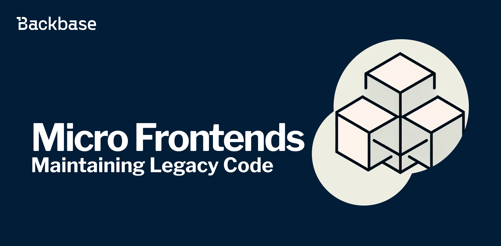
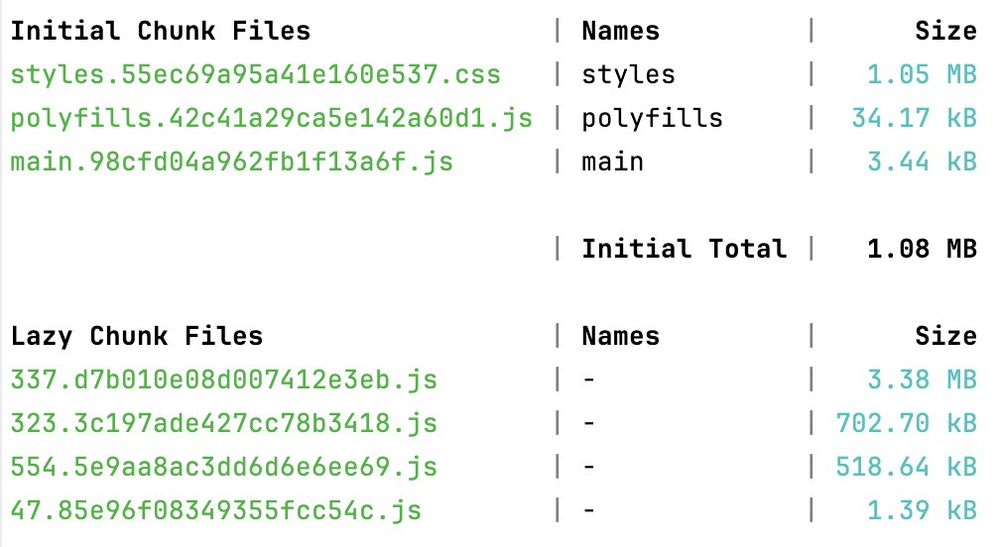
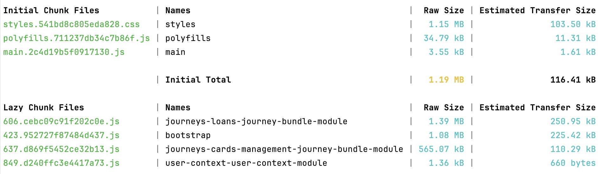
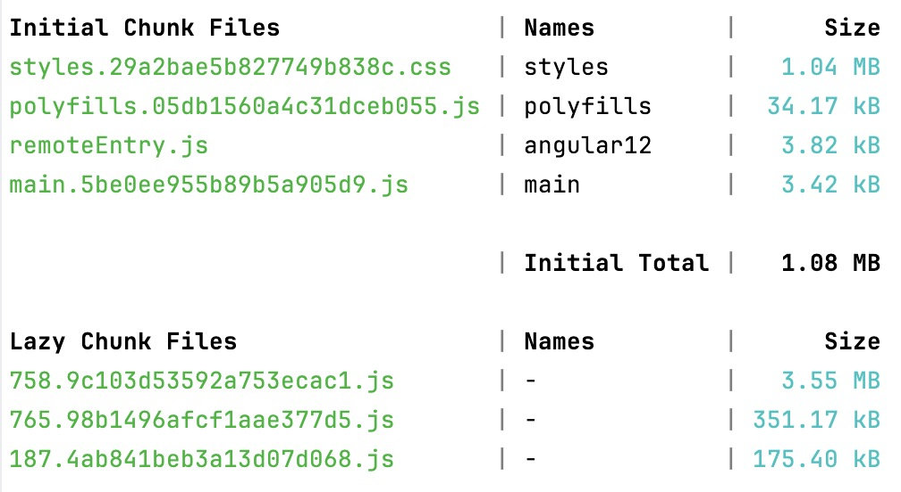

# Maintaining legacy code with Micro Frontends

Taking advantage of Micro Frontends with Module Federation to maintain legacy applications.



Authors: Pablo Villoslada Puigcerber
Date: 2024-05-15T13:51:39.651Z
Category: frontend

tags: angular,frontend,micro-frontends,module-federation,web

---

## Introduction

One of the possibilities for the Micro Frontends architecture is to maintain legacy code while introducing new features. It allows mixing different frameworks and versions using [Custom Elements](https://developer.mozilla.org/en-US/docs/Web/API/Web_components/Using_custom_elements).

During 2022, Backbase changed the frontend architecture from widgets to journeys for different beneficial reasons. This shift required a solution for customers who preferred a measured migration path and Micro Frontends emerged as the answer. It allows for the coexistence of both widgets and journeys within a single app, enabling customers to gradually phase out widgets while still benefiting from the latest features offered by journeys.

Widgets are, in essence, micro applications for a single banking feature like for example accounts overview, account details, or transactions table. One of the characteristics of the previous Backbase software was the ability to drag and drop widgets into a page and edit their properties through the Content Experience Platform to build a banking portal. The last version of widgets depends on Angular 12, but also on some internal dependencies that prevent further upgrades.

Journeys, for instance, are closer to a regular Angular app with fewer proprietary dependencies. They do cater to a full user interaction on the banking app such as accounts and transactions, card management, or payments. Journeys are configurable by the developer and contain diverse Angular components and services.

## From Monolithic app to Micro Frontends

You are going to combine two different applications built with Angular 12 and Angular 14.

### Create a remote app

1. Create a remote app using `npx` to avoid inconsistencies with your global Angular command-line tool.
```shell
$ npx @angular/cli@14 new remote-app
```

2. Add [@angular-architects/module-federation](https://www.npmjs.com/package/@angular-architects/module-federation) and use the version compatible with the targeted Angular version.
```shell
$ cd remote-app
$ npx @angular/cli@14 add @angular-architects/module-federation@14.3.14 --project remote-app --port 4201 --type remote
```

3. Add [@angular/elements](https://angular.io/guide/elements) to create custom components.
```shell
$ npm i @angular/elements@12.2.17
```

4. Add [@angular-architects/module-federation-tools](https://www.npmjs.com/package/@angular-architects/module-federation-tools) to reduce boilerplate code.
```shell
$ npm i @angular-architects/module-federation-tools@12.5.3
```

5. The plugin creates a Webpack configuration `webpack.config.js` which you need to adjust:
```js
const ModuleFederationPlugin = require('webpack/lib/container/ModuleFederationPlugin');

module.exports = {
  output: {
    uniqueName: 'remoteApp',
    publicPath: 'auto',
    scriptType: 'text/javascript',
  },
  optimization: {
    runtimeChunk: false,
  },
  plugins: [
    new ModuleFederationPlugin({
      name: 'remoteApp',
      filename: 'remoteEntry.js',
      exposes: {
        './web-components': './src/bootstrap.ts',
      },
    }),
  ],
};
```
Beginning with Angular 13, the Angular compiler outputs EcmaScript modules. But since the shell it's in Angular 12, you must opt out of using modules with `scriptType: 'text/javascript'`.

To accommodate using different framework versions, expose the entire app as a web component with `./web-components: ./src/bootstrap.ts`.

6. To provide a web component use Angular Elements. Remove `AppComponent` from the `bootstrap` array and add the `ngDoBootstrap` hook to your `AppModule`.
```typescript
import { Injector, NgModule } from '@angular/core';
import { createCustomElement } from '@angular/elements';
import { BrowserModule } from '@angular/platform-browser';
import { AppComponent } from './app.component';

@NgModule({
  declarations: [AppComponent],
  imports: [BrowserModule],
  providers: [],
  bootstrap: [],
})
export class AppModule {
  constructor(private injector: Injector) {}

  ngDoBootstrap() {
    const ce = createCustomElement(AppComponent, { injector: this.injector });
    customElements.define('remote-element', ce);
  }
}
```
### Convert the existing app

Add the plugin to the existing app in Angular 12 that acts as the shell.
```shell
$ npx @angular/cli@12 add @angular-architects/module-federation@12.5.3 --project yourProject
```
NOTE: Replace `yourProject` with the name of your project.

And adjust the resulting `webpack.config.js` as needed:
```js
const ModuleFederationPlugin = require('webpack/lib/container/ModuleFederationPlugin');

module.exports = {
  output: {
    uniqueName: 'yourProject',
    publicPath: 'auto',
  },
  optimization: {
    runtimeChunk: false,
  },
  plugins: [
    new ModuleFederationPlugin(),
  ],
}
```

### Routing between the shell and the remote

Routing needs to be specifically handled between both apps.

1. For the remote app, define routes as you would do in any Angular project.
```typescript
const routes: Routes = [
    {
      path: 'remote-app',
      children: [
        {
          path: 'transactions',
          loadChildren: () =>
            import('./journeys/transactions-journey-bundle.module').then((m) => m.TransactionsJourneyBundleModule)
        },
        {
          path: 'cards',
          loadChildren: () =>
            import('./journeys/card-management-journey-bundle.module').then(
            (m) => m.CardsManagementJourneyBundleModule
          )
        }
      ]
    }
]
```

2. To ensure that the inner Router recognizes route changes, use the `connectRouter` helper in the remote `AppComponent`.
```typescript
import { connectRouter } from '@angular-architects/module-federation-tools';
import { Component } from '@angular/core';
import { Router } from '@angular/router';

@Component({
  selector: 'app-root',
  templateUrl: './app.component.html',
})
export class AppComponent {
  constructor(private router: Router) {
    connectRouter(this.router);
  }
}
```
3. In the shell use the `WebComponentWrapper` to render the remote routes.
```typescript
import { WebComponentWrapper, WebComponentWrapperOptions } from '@angular-architects/module-federation-tools';

const remoteWrapperOptions = {
  remoteEntry: 'http://localhost:4201/remoteEntry.js',
  remoteName: 'remoteApp',
  exposedModule: './web-components',
  elementName: 'remote-element',
} as WebComponentWrapperOptions;

[...]

{
  path: 'remote-app/transactions',
  component: WebComponentWrapper,
  data: { ...remoteWrapperOptions },
}
```

### Share one Zone.js instance

To avoid issues with Change Detection, share a single instance of `Zone.js` using the `bootstrap` helper included in `@angular-architects/module-federation-tools`.

#### Shell bootstrap.ts

```typescript
import { bootstrap } from '@angular-architects/module-federation-tools';
import { AppModule } from './app/app.module';
import { environment } from './environments/environment';

bootstrap(AppModule, {
  production: environment.production,
});
```

#### Remote bootstrap.ts

```typescript
import { bootstrap } from '@angular-architects/module-federation-tools';
import { AppModule } from './app/app.module';
import { environment } from './environments/environment';

bootstrap(AppModule, {
  production: environment.production,
  appType: 'microfrontend',
});
```
NOTE: `appType` is available from Angular 14 and later.

## Legacy as shell or remote?

There isn't a straight answer to this, but [backbase-micro-frontends](https://github.com/Backbase/backbase-micro-frontends) explores both options implementing two full routes in each app, a consistent layout, and full authentication to have a sizeable example.

You can look at the example's source code or keep reading for some of the findings because the final decision is yours.

### Bundle size

One of the first questions was if there would be some differences when building the app. 

Although the initial load of the more modern app is a bit bigger, this is due to the CSS size and there are ways to optimize it. Thus based on the following screenshots, you could neglect the size difference.

#### Legacy as shell




#### Legacy as remote




### Routing issues

Using the `connectRouter` helper included in the `@angular-architects/module-federation-tools` solves the issue when navigating from the shell to the remote.

But navigating between the remote routes there were more issues with the inner Router. After some research and thanks to this [StackOverflow](https://stackoverflow.com/a/75354963/706246) answer, the `connectRouter` gets replaced with a new implementation making use of the [History API](https://developer.mozilla.org/en-US/docs/Web/API/History_API) .

```typescript
import { Component, OnDestroy, OnInit } from '@angular/core';
import { Router } from '@angular/router';

@Component({
  selector: 'app-root',
  templateUrl: './app.component.html',
})
export class AppComponent implements OnDestroy, OnInit {
  title = 'remote-app';
  
  constructor(private router: Router) {}

  ngOnInit(): void {
    const { pushState, replaceState } = window.history;

    window.history.pushState = function (...args) {
      pushState.apply(window.history, args);
      window.dispatchEvent(new Event('pushState'));
    };

    window.history.replaceState = function (...args) {
      replaceState.apply(window.history, args);
      window.dispatchEvent(new Event('replaceState'));
    };

    window.addEventListener('popstate', this.navigationHandler as (e: Event) => void, false);
    window.addEventListener('pushState', this.navigationHandler as (e: Event) => void, false);
    window.addEventListener('replaceState', this.navigationHandler as (e: Event) => void, false);

    this.navigationHandler();
  }

  ngOnDestroy(): void {
    window.removeEventListener('popstate', this.navigationHandler as (e: Event) => void, false);
    window.removeEventListener('pushState', this.navigationHandler as (e: Event) => void, false);
    window.removeEventListener('replaceState', this.navigationHandler as (e: Event) => void, false);
  }

  private navigationHandler = (): void => {
    const url = `${location.pathname.substr(1)}${location.search}`;
    if (url.includes(this.title)) {
      // Avoid conflicts with the browser navigation
      setTimeout(() => {
        this.router.navigateByUrl(url);
      }, 0);
    }
  };
}
```

### Styles

The Backbase [design system](https://designsystem.backbase.com/) evolves like the rest of the software; and while the version suited for widgets depends on Bootstrap 4, the newest relies on Bootstrap 5.

The remote apps inherit the styles from the shell, but due to the Bootstrap changes, there were some discrepancies. For this example, the decision was to fix the errors one by one.

The effort was similar for both apps; `.visually-hidden`, introduced in Bootstrap 5 replacing the `sr-only`, was the main culprit; and there were some small issues with the `.input-group`. Of course, in a bigger project, there might be more issues, and fixing them one by one won't be the fastest solution. 

Having access to change the legacy code would also help with styles, but this is not the case for the widgets, so keep that in mind for your choice.

## Conclusion

Micro Frontends solves the challenge of maintaining legacy code giving the final user an almost seamless experience. From the developer's perspective it requires a bit more planning and maintenance, but thanks to the mentioned libraries the set-up is quite straightforward.

As for what app to use as a shell it depends on the scenario. For the Backbase one, considering that the ultimate goal of a legacy app is to be fully migrated, having the journeys as the shell might speed up development making also easier the final switch when removing the last widget.

## References
- [Multi-Framework and -Version Micro Frontends with Module Federation: Your 4 Steps Guide](https://www.angulararchitects.io/blog/multi-framework-and-version-micro-frontends-with-module-federation-your-4-steps-guide/)
- [Multi-Framework and -Version Micro Frontends with Module Federation: The Good, the Bad, the Ugly](https://www.angulararchitects.io/blog/multi-framework-and-version-micro-frontends-with-module-federation-the-good-the-bad-the-ugly/)
