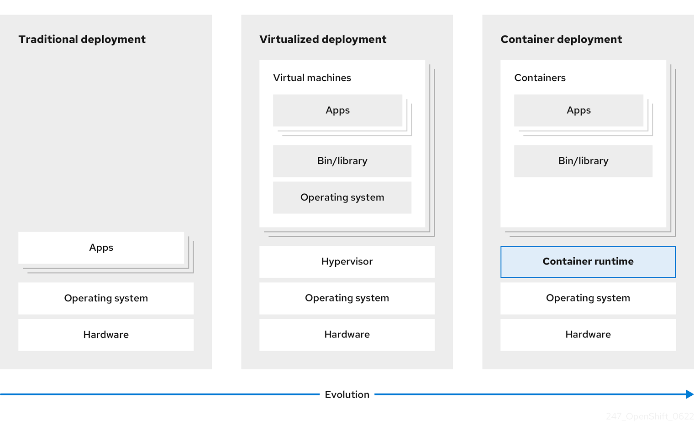
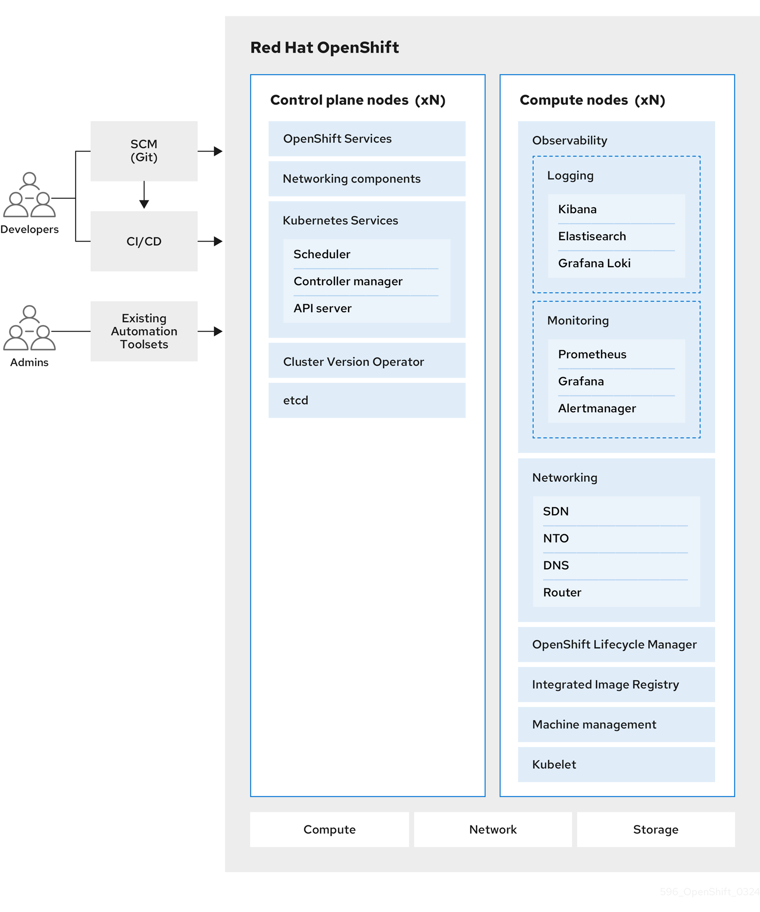
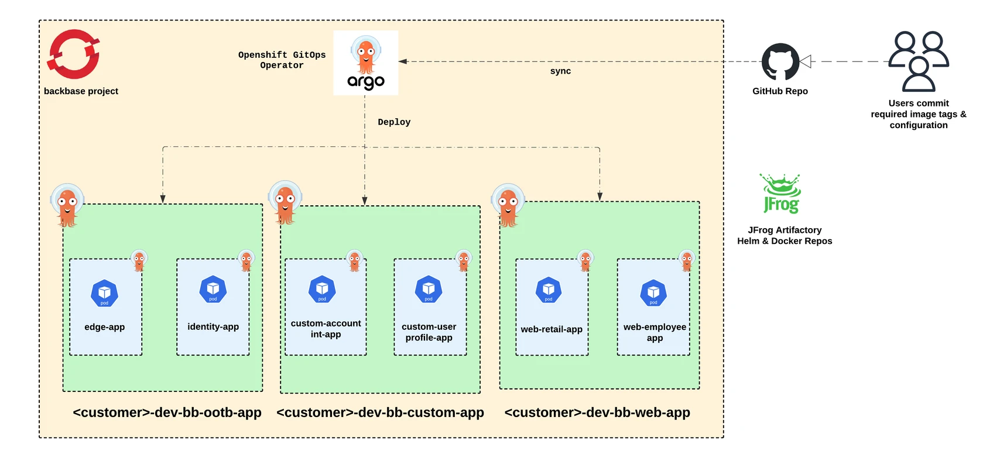
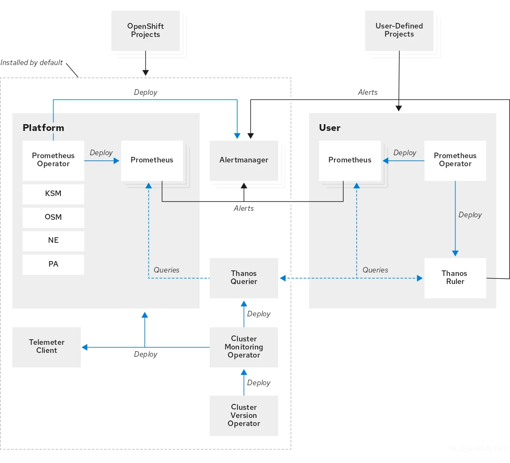

# OpenShift Unleashed

Explore the future of containerized applications with Red Hat OpenShift Container Platform: A guide to understanding the basics, nuances of the platform.


Authors: Akshay PK, Sriram Seshadri , Sri Balaji
Date: 2024-05-21
Category: devops

tags: openshift,devops,system engineering,cloud

---

## **Introduction**

OpenShift Container Platform is a cloud-based Kubernetes container platform. The foundation of OpenShift Container Platform is based on Kubernetes and therefore shares the same technology. It is designed to allow applications and the data centers that support them to expand from just a few machines and applications to thousands of machines that serve millions of clients.

OpenShift Container Platform enables you to do the following:

- Provide developers and IT organizations with cloud application platforms that can be used for deploying applications on secure and scalable resources.

- Require minimal configuration and management overhead.

- Bring the Kubernetes platform to customer data centers and cloud.

- Meet security, privacy, compliance, and governance requirements.

With its foundation in Kubernetes, OpenShift Container Platform incorporates the same technology that serves as the engine for massive telecommunications, streaming video, gaming, banking, and other applications. Its implementation in open Red Hat technologies lets you extend your containerized applications beyond a single cloud to on-premise and multi-cloud environments.

For more understanding of the RedHat Openshift Container Platform please refer to the following link : [OpenShift Container Platform overview | Getting started | OpenShift Container Platform 4.15](https://docs.openshift.com/container-platform/4.15/getting_started/openshift-overview.html) 

## **Kubernetes Overview**

**Problem Statement**

The below diagram explains as to how traditionally, applications were deployed on top of a single operating system. With virtualization, you can split the physical host into several virtual hosts. Working on virtual instances on shared resources is not optimal for efficiency and scalability. Because a virtual machine (VM) consumes as many resources as a physical machine, providing resources to a VM such as CPU, RAM, and storage can be expensive. Also, you might see your application degrading in performance due to virtual instance usage on shared resources.

<br>



**The Solution** 

To solve this problem, you can use containerization technologies that segregate applications in a containerized environment. Similar to a VM, a container has its own filesystem, vCPU, memory, process space, dependencies, and more. Containers are decoupled from the underlying infrastructure, and are portable across clouds and OS distributions. Containers are inherently much lighter than a fully featured OS, and are lightweight isolated processes that run on the operating system kernel.

To further more read about the components of Kubernetes : [Kubernetes overview | Getting started | OpenShift Container Platform 4.15](https://docs.openshift.com/container-platform/4.15/getting_started/kubernetes-overview.html#kubernetes-components_kubernetes-overview) 

## **Openshift Architecture Overview & Product Architecture**

The following pages help explain what the architecture overview is and the product architecture of the RedHat Openshift Container Platform : 

[Architecture overview | Architecture | OpenShift Container Platform 4.15](https://docs.openshift.com/container-platform/4.15/architecture/index.html)

[Product architecture | Architecture | OpenShift Container Platform 4.15](https://docs.openshift.com/container-platform/4.15/architecture/architecture.htmlpro)

On a very high level this following diagram present in the pages above describes the components of RedHat Openshift Container Platform. 




## **Backbase Deployment Topology**

Let’s consider that all the necessary infrastructure components are present for the deployment of Backbase microservices and development is in full swing with Secure SDLC practices, deployment on RedHat Openshift Container Platform would look something very similar to deploying Backbase on a cloud based platform such as AWS, Azure or GCP with certain nuances specific to RedHat Openshift Container Platform. The below diagram depicts an example for the same : 



In any traditional Kubernetes deployment, the Backbase product capabilities would be deployed to a namespace whereas in Openshift, they are called as Openshift projects. 

In the above diagram, GitHub and JFrog Artifactory are two tools that are used for source code management and artifact/binary management which are two specific examples of tools used. For more details on the same : 
 

[GitHub: Let’s build from here](https://github.com/)

[Artifactory - Universal Artifact Management](https://jfrog.com/artifactory/)

From an architecture standpoint, Openshift uses various operators to automate the creation, configuration, and management of instances of Kubernetes-native applications. To learn more about the same : [What are Red Hat OpenShift Operators?](https://www.redhat.com/en/technologies/cloud-computing/openshift/what-are-openshift-operators)

In the above diagram one such operator is mentioned which helps facilitate deployments to the Openshift project or even across projects or even across clusters : [https://www.redhat.com/en/technologies/cloud-computing/openshift/gitops](https://www.redhat.com/en/technologies/cloud-computing/openshift/gitops)

[About OpenShift GitOps | Understanding OpenShift GitOps | Red Hat OpenShift GitOps 1.12 ](https://docs.openshift.com/gitops/1.12/understanding_openshift_gitops/about-redhat-openshift-gitops.html)

The above operator comes bundled with all the niceties of [ArgoCD](https://argoproj.github.io/cd/) which is one of the most widely used tool in current times. 

## **Nuances - RedHat Openshift Container Platform**

This section describes the nuances and differences of working with the RedHat Openshift Container Platform and the deployment aspects of Backbase product capabilities.

### **Tightened Security**

By default, the Openshift container platform comes with security context constraints that’s described here : [Managing security context constraints | Authentication and authorization | OpenShift Container Platform 4.15 ](https://docs.openshift.com/container-platform/4.15/authentication/managing-security-context-constraints.html)

The Backbase product capability images are all secure, distroless, non-root images and therefore without any modification can be installed on the Openshift container platform. The web-base docker image used to run web applications is not compatible with the tightened security of the RedHat Openshift Container Platform under the restricted SCC : Managing SCCs in OpenShift  because of the way UID’s are allocated during the creation of an Openshift project and the way a UID is allocated from that range when a pod is created which is described in this page :

The Backbase product capabilities are all secure, [distroless](https://github.com/GoogleContainerTools/distroless), non-root images and therefore without any modification can be installed on the Openshift container platform. The [web-base](https://repo.backbase.com/ui/native/backbase-docker-releases/web-base/) docker image used to run web applications is not compatible with the tightened security of the RedHat Openshift Container Platform under the restricted SCC : [Managing SCCs in OpenShift ](https://www.redhat.com/en/blog/managing-sccs-in-openshift) because of the way UID’s are allocated during the creation of an Openshift project and the way a UID is allocated from that range when a pod is created which is described in this page : [A Guide to OpenShift and UIDs ](https://www.redhat.com/en/blog/a-guide-to-openshift-and-uids)

To overcome the problem mentioned in the above section we can modify the FE angular app’s Dockerfile which is based on the web-base docker image to modify root group permissions to those directories that contain the nginx installation process and the HTML statics folder because the arbitrary user assigned by Openshift will be part of the root group.

### **Kubernetes Ingress vs Openshift Route**

This page even though written 6 years back is still a great article to learn about the differences between a Kubernetes Ingress and an Openshift Route : [Kubernetes Ingress vs OpenShift Route](https://www.redhat.com/en/blog/kubernetes-ingress-vs-openshift-route)

In most projects that run Openshift on a client’s infrastructure the recommended object to use for routing is an Openshift route as it has more features than that of a Kubernetes Ingress which is described in the above page. 

_**Note:**_ For a Backbase web application with respect to Openshift, two Routes have to be created with the same hostname but different paths pointing to different backend services. For Example : A ‘/' path that points to the web application service and a '/api’ path that points to the edge service. 


Multiple ways exist to create a route through configuration where one such example is described below where a route template manifest is added to the templates/ folder of a helm chart with a condition to enable or disable the creation of the same. 

```yaml

{{- if .Values.route.enabled }}
apiVersion: route.openshift.io/v1
kind: Route
metadata:
  name: {{ .Values.route.name }}
  labels:
    app: {{ .Values.app.name }}
spec:
  host: {{ .Values.route.host }}
  to:
    kind: Service
    name: {{ .Values.service.name }}
  port:
    targetPort: {{ .Values.route.targetPort }}
  tls:
    termination: {{ .Values.route.tls.termination }}
    insecureEdgeTerminationPolicy: {{ .Values.route.tls.insecureEdgeTerminationPolicy }}
  wildcardPolicy: {{ .Values.route.wildcardPolicy }}
{{- end }}

```

With this template, route can be created to expose a service to the outside of a cluster, simply add this to the helm chart’s values file. 

```yaml

route:
  enabled: true
  name: #<name of the route>
  host: #<domain name of the route>
  targetPort: 8080
  tls:
    termination: edge
    insecureEdgeTerminationPolicy: Redirect
  wildcardPolicy: None

```
_**Note:**_ The above template can also be modified according to the client’s requirements to include other route features.

### **Block Exposed URLs**

Some exposed URLs that have to be blocked from public internet access and to only be accessible from the private network. These URLs are described here: [Block Exposed URLs](https://backbase.io/developers/documentation/security/infrastructure/block-exposed-urls/) as part of security best practices. These URLs can be blocked from public internet access directly on the Openshift route or any layer of networking above the Openshift route such as a WAF as a recommended practice. The following snippet shows how to do IP-based restriction on an Openshift route with a path to ensure it’s blocked from public access but can still be accessed from the private network. This configuration is however recommended to do on a WAF layer. 

```yaml
haproxy.router.openshift.io/ip_whitelist: '<IPv4 address>'
```

### **Rate Limiting**

The production hardening guide dictates what URLs should be configured with [Rate Limiting](https://backbase.io/developers/documentation/security/overview/production-hardening-guide/). Rate limiting restricts the number of requests allowed from each originating IP address within a specific time frame.

On the Openshift route layer, this can also be done through a set of annotations for TCP and HTTP traffic which is described here : [Route configuration - Configuring Routes | Networking | OpenShift Container Platform 4.15](https://docs.openshift.com/container-platform/4.15/networking/routes/route-configuration.html#nw-route-specific-annotations_route-configuration) 

In simple terms the following configuration should be more than sufficient to enable rate limiting for a particular route and path. The configuration can be adjusted based on client requirements. This can also be tested if it works using JMeter and similar tools by sending concurrent requests. This configuration is however recommended to do on a WAF layer. 


```yaml
haproxy.router.openshift.io/rate-limit-connections: 'true'
haproxy.router.openshift.io/rate-limit-connections.rate-http: '500' # Values are dependent on customer usecase
```

### **Cache-Control Header**

There was a finding during penetration testing that the Cache-Control header had no-cache but not no-store for certain API endpoints. To mitigate this on the Openshift infrastructure layer from 4.14 version of Openshift onwards, the response header could be set on the Openshift route itself as part of it’s configuration : [Route configuration - Configuring Routes | Networking | OpenShift Container Platform 4.15](https://docs.openshift.com/container-platform/4.15/networking/routes/route-configuration.html#nw-http-header-configuration_route-configuration) 

An example snippet of the same under the spec section:

```yaml
spec:
  httpHeaders:
    actions:
      response:
      - name: Cache-Control
        action:
          type: Set
          set:
            value: no-cache,no-store
```

### **Cookie SameSite**

This article from OWASP describes what the SameSite attribute for a Cookie is all about and what are it’s possible values [SameSite | OWASP Foundation](https://owasp.org/www-community/SameSite) 

As part of Openshift Route configuration the SameSite cookie attribute to set it to Strict, Lax or None can be handled as part of the annotations section. 
An example snippet of the same : 

```yaml
router.openshift.io/cookie-same-site: 'Strict'
```

### **Service Monitors**

The RedHat Openshift Container Platform comes bundled with a monitoring stack that uses Promethues which is explained in a lot of detail here : Monitoring overview - [Monitoring | Observability | OpenShift Container Platform 4.15](https://docs.openshift.com/container-platform/4.15/observability/monitoring/monitoring-overview.html) 

The below diagram is taken from the above page to describe all components of the monitoring stack. 

All the default platform monitoring components are present in the openshift-monitoring project. 



To scrape metrics of a user defined application one can use ServiceMonitor object described here : [Managing metrics - Monitoring | Observability | OpenShift Container Platform 4.15](https://docs.openshift.com/container-platform/4.15/observability/monitoring/managing-metrics.html)

This allows to gather metrics related to the application such as JVM, GC etc based on a label that’s assigned to each deployment of a microservice when deployed to the cluster. In the following ServiceMonitor object example a label of app.backbase.com/monitoring: "true" is added while deploying the capability to the cluster based on which applications are selected to be scraped for metrics. 

```yaml
apiVersion: monitoring.coreos.com/v1
kind: ServiceMonitor
metadata:
  labels:
    k8s-app: my-apps
  name: my-apps-sm
  namespace: #specify openshift project
spec:
  endpoints:
  - interval: 10s
    port: http
    scheme: http
    path: /actuator/prometheus
  selector:
    matchLabels:
      app.backbase.com/monitoring: "true"
```

If the actuator endpoints for scraping are protected behind authentication, the ServiceMonitor object also supports basic authentication with username/password as per the below example under the spec.endpoints section where the username/password can be referred from a Kubernetes Secret.

```yaml
endpoints:
  - basicAuth:
      password:
        name: <client>-<env>-monitoring-secret
        key: password
      username:
        name: <client>-<env>-monitoring-secret
        key: username
    interval: 10s
    port: http
    scheme: http
    path: /actuator/prometheus
```
<br>

## **Conclusion**

  RedHat OpenShift Container Platform is a powerful solution that simplifies the complexities of containerization and Kubernetes orchestration, offering automated operations, integrated CI/CD pipelines, and multi-cloud support. By mastering its architecture and core components, and understanding nuances such as networking, monitoring and security, enterprises can significantly enhance security, developer productivity, and operational efficiency. OpenShift's enterprise-grade features ensure scalability, reliability, and flexibility, making it an ideal choice for accelerating digital transformation and delivering innovative solutions effectively.

## **References**

[Red Hat OpenShift Container Platform](https://www.redhat.com/en/technologies/cloud-computing/openshift/container-platform)<br>
[OpenShift GitOps](https://www.redhat.com/en/technologies/cloud-computing/openshift/gitops)<br>
[GitHub: Let’s build from here](https://github.com/)<br>
[Software Supply Chain Platform for DevOps & Security | JFrog](https://jfrog.com/)<br>
[Argo CD - Declarative GitOps CD for Kubernetes](https://argo-cd.readthedocs.io/en/stable/)