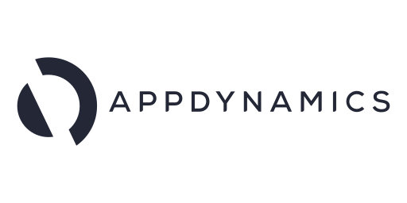
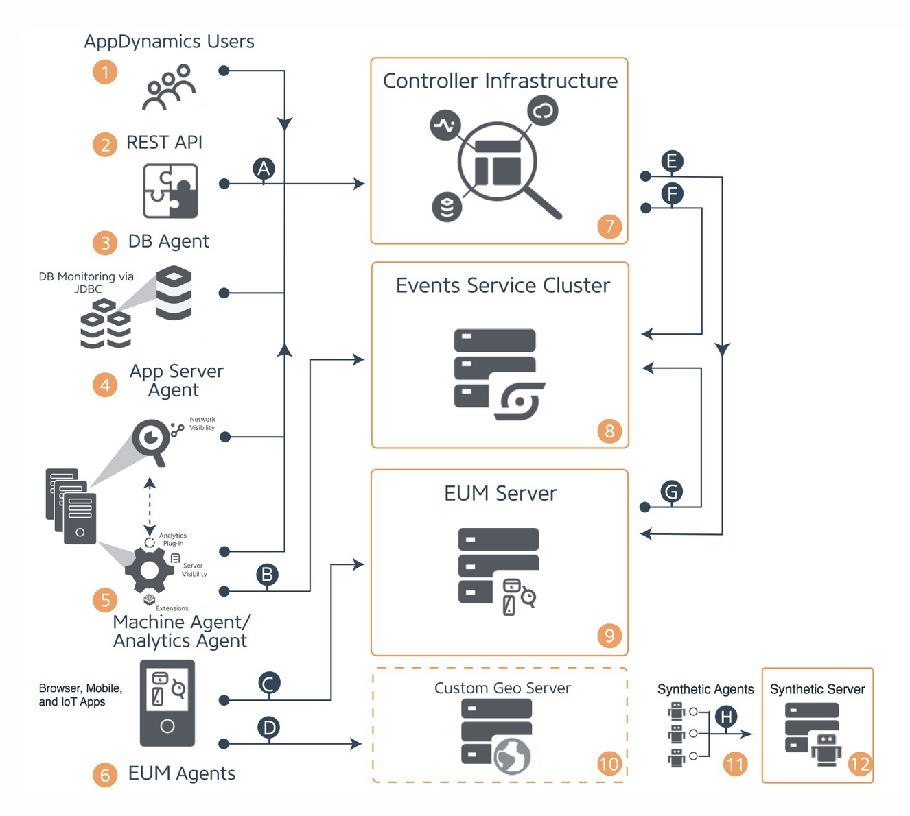

# Cisco Appdynamics

Exploring the Future of Application Performance Management with Cisco AppDynamics.



Authors: Akshay PK, Sriram Seshadri, Sri Balaji
Date: 2024-06-19
Category: devops

tags: appdynamics,devops,system engineering,cloud

---

## **Introduction**

**Cisco Appdynamics** : “Maintain optimal application performance, resilience, and security with real-time full-stack observability. Understand how application performance impacts business outcomes, so you can focus on what matters and invest in what moves the needle”

Another description that one comes across : “Dramatically simplify application instrumentation through intelligent agent automation and lifecycle management”. 

What does Cisco AppDynamics do? Cisco AppDynamics is an application performance management (APM) and IT operations analytics (ITOA) platform that provides comprehensive visibility and insight into application performance, user experiences, and business outcomes. It helps organizations ensure their applications are always running smoothly and efficiently, providing a seamless experience for users. It gathers metrics on various levels and it’s features are : 

- Business performance monitoring

- Application performance monitoring

- End user monitoring

- Infrastructure monitoring

- Network monitoring

- Security Insights

- Analytics & Reporting

- Alerts and Notifications

## **Scope**

The scope of this article is to cover the basic knowledge what Cisco Appdynamics is all about, to provide a overview of it’s platform and components and then to deep dive into the configuration aspects of enabling AppDynamics APM alongside a spring boot application. The article does not cover the installation of AppDynamics platform or it’s control plane components on a Kubernetes like environment. 

<br>

## **Problem Statement** 

In today's digital landscape, organizations rely heavily on complex, distributed applications to drive business operations and deliver services to customers. These applications often span multiple environments, including on-premises, cloud, and hybrid infrastructures. Ensuring optimal performance and availability of these applications is crucial for maintaining user satisfaction, operational efficiency, and achieving business goals.

Organizations face several challenges in managing the performance and reliability of their applications such as to name a few : 

- **Visibility Issues:** Lack of comprehensive visibility into the entire application stack, making it difficult to monitor performance across different layers (For example: frontend, backend, database, infrastructure).

- **Performance Degradation:** Unidentified bottlenecks and performance issues leading to slow response times, errors, and downtime, adversely affecting user experience and business operations.

- **Impact on Business Outcomes:** Inability to correlate application performance with business outcomes, making it challenging to understand the impact of technical issues on user satisfaction, revenue, and other key business metrics.

- **Proactive Monitoring:** Lack of proactive monitoring capabilities to detect and resolve issues before they impact end users, leading to reactive firefighting rather than preventative measures.

- **Scalability and Flexibility:** Challenges in scaling monitoring solutions as the application and infrastructure grow, and adapting to dynamic changes in the IT environment.

Cisco AppDynamics and similar products in the market address these above issues and various others to improve application performance, enhance user satisfaction, minimize downtime, and align IT operations with business goals. Going further in this article, we will take a closer look at AppDynamics APM offering. 


## **AppDynamics - Architecture**

Let’s now take a closer look at the AppDynamics platform components and tools. 

It is described in detail in this document : [AppDynamics Application Performance Monitoring Platform](https://docs.appdynamics.com/appd/4.5.x/en/appdynamics-application-performance-monitoring-platform?showChildren=false#AppDynamicsApplicationPerformanceMonitoringPlatform-AppDynamicsPlatformComponentsandTools) and further an on-premises deployment of AppDynamics is also described : [AppDynamics Application Performance Monitoring Platform](https://docs.appdynamics.com/appd/4.5.x/en/appdynamics-application-performance-monitoring-platform?showChildren=false#AppDynamicsApplicationPerformanceMonitoringPlatform-on-prem-deployment-architectureOn-PremisesDeploymentArchitecture)  



The components depicted above in the diagram are all the components that facilitate or enable all AppDynamics functionality to fulfill application, database, infrastructure, end user monitoring, and more. Depending on the scale of your deployment, your requirements, and the products you are using, your own deployment is likely to consist of a subset of the components shown in the diagram.

## **AppDynamics Integration** 

In this section we will take a look at how the AppDynamics agent can be injected and run as a java process alongside the main application in a modern day Kubernetes like ecosystem. 

Let’s consider the use case where the AppDynamics platform components are installed and we have all the necessary details with us which is described further below in this section to start integrating the spring boot application with the AppDynamics java agent. 

In a Kubernetes like environment, the init-container pattern is used specifically for this use case as it is used to run additional containers at startup that helps initialize an application. Once the init containers have completed their initialization tasks, they terminate but leave the application containers running. For the App Server Agent installation, init containers are used as a delivery mechanism to copy the agent files into the application container at deploy time.

### **Prerequisites**

- To have the AppDynamics controller XML file present as a ConfigMap available in the namespace where the application is to be instrumented. A sample config file looks like : 

```xml
<?xml version="1.0" encoding="UTF-8"?>
<controller-info>

	<controller-host>192.10.10.10</controller-host>
	<controller-port>8090</controller-port>    
    <account-access-key>165e65645-95c1-40e3-9576-6a1424de9625<account-access-key> 
	<controller-ssl-enabled>false</controller-ssl-enabled>
	<enable-orchestration>false</enable-orchestration>
    <sim-enabled>false</sim-enabled> 
    <unique-host-id>your-host-id</unique-host-id>   
    <!-- The following account-related parameter is necessary only for SaaS installations-->
	<!--account-name></account-name-->	

</controller-info> 
```

- If the AppDynamics controller is enabled with SSL connectivity then one must create an agent truststore that contains the root certificate for the authority that signed the controller's certificate to establish connectivity from machine agent to the AppDynamics controller. This is detailed here : [Enable SSL for Machine Agent](https://docs.appdynamics.com/appd/4.5.x/en/infrastructure-visibility/machine-agent/configure-the-machine-agent/enable-ssl-for-machine-agent) 

- The following information is required from the installation of the AppDynamics controller in order for the machine agent in our case the java agent to talk to the AppDynamics controller : 
 

```yaml
"AAA_APP_NAME":
  valueFrom:
    fieldRef:
      fieldPath: metadata.labels['app.kubernetes.io/name']
"APPDYNAMICS_AGENT_APPLICATION_NAME": <>
"APPDYNAMICS_JAVA_AGENT_REUSE_NODE_NAME": "true"
"APPDYNAMICS_CONTROLLER_SSL_ENABLED": "true"
"APPDYNAMICS_CONTROLLER_HOST_NAME": <> #For Example: appdynamicscontrolleruat.example.com
"APPDYNAMICS_CONTROLLER_PORT": "8181"
"APPDYNAMICS_POD_NAMESPACE": <> #For Example: backbase
"APPDYNAMICS_AGENT_ACCOUNT_NAME": <>
"APPDYNAMICS_AGENT_TIER_NAME": <>
"APPDYNAMICS_AGENT_ACCOUNT_ACCESS_KEY":
  valueFrom:
    secretKeyRef:
      key: key
      name: backbase-appdynamics-account-access-key # A secret to talk to the control plane   
"APPDYNAMICS_CONTAINERINFO_FETCH_SERVICE": <> #For Eg : cluster-metadata-service.appdynamics:9090 since the cluster metadata service is running in the cluster in the appdynamics namespace

# The below properties are for the network agent
"APPDYNAMICS_NETVIZ_AGENT_PORT": "3892"
"APPDYNAMICS_NETVIZ_AGENT_HOST":
  valueFrom:
    fieldRef:
      apiVersion: v1
      fieldPath: status.hostIP

# The below properties are for the application metadata distinguished by envs
# The below properties refer to the property "AAA_APP_NAME" and derives the below from it. 
"APPDYNAMICS_JAVA_AGENT_REUSE_NODE_NAME_PREFIX": "dev-$(AAA_APP_NAME)"
"APPDYNAMICS_AGENT_NODE_NAME": "dev-$(AAA_APP_NAME)"
"APPDYNAMICS_CONTAINER_NAME": "backbase-$(AAA_APP_NAME)"
```
A full list of properties are detailed in this page for the AppDynamics java agent. It’s worth taking a look at : [Java Agent Configuration Properties](https://docs.appdynamics.com/appd/23.x/latest/en/application-monitoring/install-app-server-agents/java-agent/administer-the-java-agent/java-agent-configuration-properties#id-.JavaAgentConfigurationPropertiesv23.11-Agent-ControllerCommunicationProperties) 

### **Init-Container Pattern**

Once all the prerequisites are sorted out, the installation of the java agent using the init-container pattern can be used. The following snippet shows a few volumes declared in a Kubernetes Deployment that describes the mounting of emptyDir for the agent itself and two other volumes for the controller XML configuration file and the CA certs in JKS format to establish trust between the agent and the controller. One can use a Kubernetes secret for storing the CA certs but in this example it’s referred to as a ConfigMap resource. 

```yaml
  volumes:
    - name: appd-agent-repo-java
      emptyDir: {}
    - name: appd-controller-info-xml
      configMap:
        name: appdynamics-controller-info-xml
    - name: appd-cacerts-jks
      secret:
        defaultMode: 420
        secretName: appdynamics-cacerts-jks
  volumeMounts:
    - mountPath: /opt/appdynamics-java
      name: appd-agent-repo-java
    - mountPath: /opt/appdynamics-java/conf/controller-info.xml
      name: appd-controller-info-xml
      subPath: controller-info.xml
      readOnly: true
    - mountPath: /opt/appdynamics-java/conf/cacerts.jks
      subPath: cacerts.jks
      name: appd-cacerts-jks
      readOnly: true 
```

The next step is to include a init-container manifest declaration as part of the Kubernetes Deployment which downloads the Appdynamics java agent and places it in the volume declared for the same. 

```yaml
initContainers:
  - resources:
      limits:
        cpu: 200m
        memory: 75M
      requests:
        cpu: 100m
        memory: 50M
    terminationMessagePath: /dev/termination-log
    name: appdynamics-agent
    command:
      - /bin/sh
      - '-c'
      - >-
        cp -r /opt/appdynamics/. /opt/appdynamics-java && chmod -R 777 /opt/appdynamics-java && chown -R
        65532:65532 /opt/appdynamics-java ; ls -la /opt/appdynamics-java 
    securityContext:
      privileged: false
      runAsUser: 65532
      runAsGroup: 65532
      runAsNonRoot: true
      readOnlyRootFilesystem: false
      allowPrivilegeEscalation: false
    imagePullPolicy: IfNotPresent
    volumeMounts:
      - name: appd-agent-repo-java
        mountPath: /opt/appdynamics-java
    terminationMessagePolicy: File
    image: 'appdynamics/java-agent:24.4.1'

```

The final step is to enable the starting of the java agent when the spring boot application starts. This is done using an additional JAVA_TOOL_OPTIONS environment variable, this name can also be changed as per the use case to pick up additional java options. In the below example _JAVA_OPTIONS is used if JAVA_TOOL_OPTIONS is already used as part of the application deployment. 

```yaml
"_JAVA_OPTIONS": '-javaagent:/opt/appdynamics-java/javaagent.jar'
```

## **References**

[Cisco AppDynamics Documentation](https://docs.appdynamics.com/en)<br>
[Cisco AppDynamics On-Premises/On-Premises Virtual Appliance](https://docs.appdynamics.com/appd/onprem/24.x/latest/en)<br>
[Java Agent](https://docs.appdynamics.com/appd/22.x/latest/en/application-monitoring/install-app-server-agents/java-agent)<br>
[Install the Java Agent in Containers](https://docs.appdynamics.com/appd/22.x/latest/en/application-monitoring/install-app-server-agents/java-agent/install-the-java-agent/install-the-java-agent-in-containers)<br>
[Use Environment Variables for Java Agent Settings](https://docs.appdynamics.com/appd/22.x/latest/en/application-monitoring/install-app-server-agents/java-agent/install-the-java-agent/use-environment-variables-for-java-agent-settings)<br>
[Use System Properties for Java Agent Settings](https://docs.appdynamics.com/appd/22.x/latest/en/application-monitoring/install-app-server-agents/java-agent/install-the-java-agent/use-system-properties-for-java-agent-settings)<br>
[Init Containers](https://kubernetes.io/docs/concepts/workloads/pods/init-containers/)<br>


## **Conclusion**

  Cisco AppDynamics addresses the critical challenges organizations face in managing complex, distributed applications by providing comprehensive visibility, real-time performance monitoring, and detailed diagnostics. By correlating application performance with business outcomes and implementing proactive monitoring and automation, AppDynamics enables organizations to enhance user satisfaction, reduce downtime, and align IT operations with business objectives. This robust APM and ITOA solution ensures that applications run smoothly and efficiently, supporting the organization’s overall digital strategy and operational success.