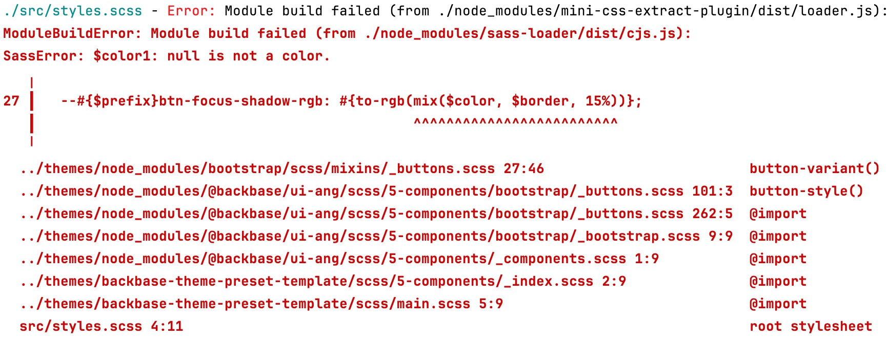
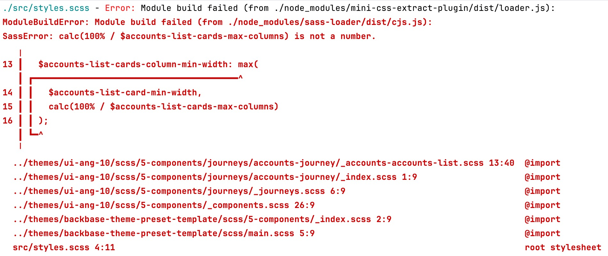

# Styling your legacy Micro Frontends

Different approaches to style legacy Micro Frontends.


Authors: Pablo Villoslada Puigcerber
Date: 2024-08-08T15:51:02.527Z
Category: frontend

tags: angular,frontend,micro-frontends,module-federation,sass,web

---

## Introduction

Using Micro Frontends you shouldn't have any problem styling them, since the remote applications inherit the styles from the shell app.

But what if you want to mix different frameworks like Bootstrap 4 and Bootstrap 5, which is the case when [maintaining legacy code](2024/05/15/maintaining-legacy-code-with-micro-frontends). In such cases, there are two options to consider:
* Use a single theme and address styling issues individually
* Combine two themes into one, leading to duplication of styles

Each option has its own advantages and drawbacks, so it's important to delve deeper into the details.

## One theme

This method requires more effort to maintain as there is no straightforward approach. You'll have to visually scan the app and fix styling problems one by one, including new CSS code as you go.

Some of these problems are harder to solve as you have to deal with overriding the styles of the shell app, and the final look might not be pixel perfect.

Still, the reward for this effort is a smaller bundle while you keep mastering CSS.

### Bootstrap changes from 4 to 5

One good place to start looking is the official Bootstrap [migration](https://getbootstrap.com/docs/5.0/migration/) changelog from 4 to 5, but don't worry, because not necessarily all the changes apply to your situation.

In the Backbase scenario, the renaming of the "screen reader" classes to "visually hidden" hits hard as you start seeing things that should not be on the screen, but at the same time is quite easy to solve.

### Set-up

1. Start by isolating the changes in your remote `AppComponent`.
```markup
<div class="angular17-theme">
  <router-outlet></router-outlet>
</div>
```

2. In the `styles.scss` of your shell app, use the same class you added to the remote `AppComponent`.

```scss
@import '@backbase/backbase-theme-business-preset/scss/main';

.angular17-theme {}
```

3. Now you can start fixing issues; for example, for the mentioned new "visually hidden" classes, you can just extend the old "screen reader" ones.
```scss
.angular17-theme {
  .visually-hidden {
    @extend .sr-only;
  }
}
```

## Two themes

Setting up this approach can be quite challenging as it requires including both Bootstrap versions and, in the Backbase scenario, incorporating both versions of the UI-Ang library along with having two themes.

> **_NOTE:_**   Backbase [design system](https://designsystem.backbase.com/) is a collection of guidelines, tools, and resources to help build superior banking experiences. The `@backbase/ui-ang` library exposes the UI components for web and since the version 9 it depends on Bootstrap 5.

Including coupled packages results in a significant amount of code duplication, but once it's set and configured you can nearly forget about making further changes to your CSS.

### Set-up

For a full working example, you can have a look to the [two-css-themes](https://github.com/Backbase/backbase-micro-frontends/commits/feature/two-css-themes/) branch of the backbase-micro-frontends repository.

1. Create a `/themes` folder at the root level.
2. Go to the newly created folder and install UI-Ang with its dependencies.
```bash
npm i @backbase/ui-ang@10 ngx-quill@16
```
3. Copy `/backbase-theme-preset-template` from the `/node_modules/@backbase/ui-ang/dist` to the `/themes` folder and name it `angular17-theme`.
4. Update the `/shell/src/styles.scss` to include the new theme.
```scss
@import '@backbase/backbase-theme-business-preset/scss/main';

.angular17-theme {
  @import '../../themes/angular17-theme/scss/main';
}
```
5. Don't forget to update your remote `AppComponent`.
```markup
<div class="angular17-theme">
  <router-outlet></router-outlet>
</div>
```

In an ideal world this should be enough to have both themes working side by side, but the compiler throws some errors because of the incompatibilities of using two Sass versions.



`"sass"` and `"sass-loader"` are dependencies of `"@angular-devkit/build-angular"` so there is not much you can do as the legacy app must stay in Angular 12. Then it's time for you to update manually the source scss files.

1. Copy the `/scss` folder from `/themes/node_modules/bootstrap` to a new `/themes/bootstrap5` directory.
2. Do the same for UI-Ang copying the `/scss` and `/assets` folder from `/themes/node_modules/@backbase/ui-ang` to a new `/themes/ui-ang-10` directory.
3. Search for all the references to bootstrap imports inside `/themes/ui-ang-10` and replace them to point to the custom `/themes/bootstrap5` one. For example, `@import "bootstrap/scss/mixins";` is now `@import "../../../bootstrap5/scss/mixins";`. Make sure to adjust all the relative paths.
4. Now do the same inside `/themes/angular17-theme` and replace the references to UI-Ang. For example, `@import "~@backbase/ui-ang/scss/1-variables/variables";` with `@import "../../../ui-ang-10/scss/1-variables/variables";`.
5. Check that the compiler still throws the same error as before starting with the manual update, or fix the imports otherwise.

In the `/themes/bootstrap5/scss/mixins/_buttons.scss` the offending line is `--#{$prefix}btn-focus-shadow-rgb: #{to-rgb(mix($color, $border, 15%))};` so you need to comment it out. This makes the build pass but throws a new error.


In the `/themes/ui-ang-10/scss/5-components/journeys/accounts-journey/_accounts-accounts-list.scss` the failing block it's:
```scss
$accounts-list-cards-column-min-width: max(
  $accounts-list-card-min-width,
  calc(100% / $accounts-list-cards-max-columns)
);
```
And you can replace it with `$accounts-list-cards-column-min-width: max(18.5rem, 25%);`.

After all these steps you should be able to see the app compiling. Run also the `npm run build` for precaution. And if there are new errors you have to fix them by either commenting the bad lines or finding alternative code that works.

#### CSS custom properties

If your theme relies on the Boostrap 5 [CSS Variables](https://getbootstrap.com/docs/5.0/customize/css-variables/), which is the case in the Backbase design system, you need to include them at root level for everything to work smooth:
```scss
@import '@backbase/backbase-theme-business-preset/scss/main';

// Include Bootstrap 5 custom properties at root level
@import '../../themes/bootstrap5/scss/bootstrap-reboot';
.angular17-theme {
  @import '../../themes/angular17-theme/scss/main';
}
```

## Conclusion

You should have a better idea now of both approaches but choosing one or another depends on the use case, time constraints, and developer experience; although a summary of pros and cons for sure helps to decide.

### One theme

Pros:
* Easy setup
* Lightweight CSS bundle

Cons:
* Difficult to maintain
* Requires more meticulous work and is time-consuming

### Two themes

Pros:
* Easy to maintain

Cons:
* Challenging setup
* Large CSS bundle with lots of duplicates
* Fixes for compilation errors might feel hacky
