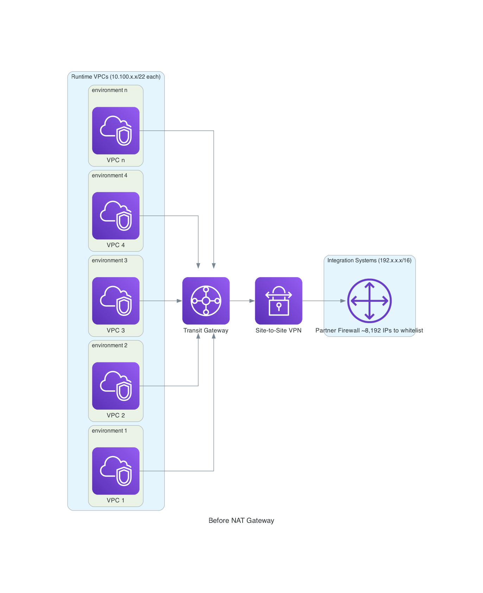
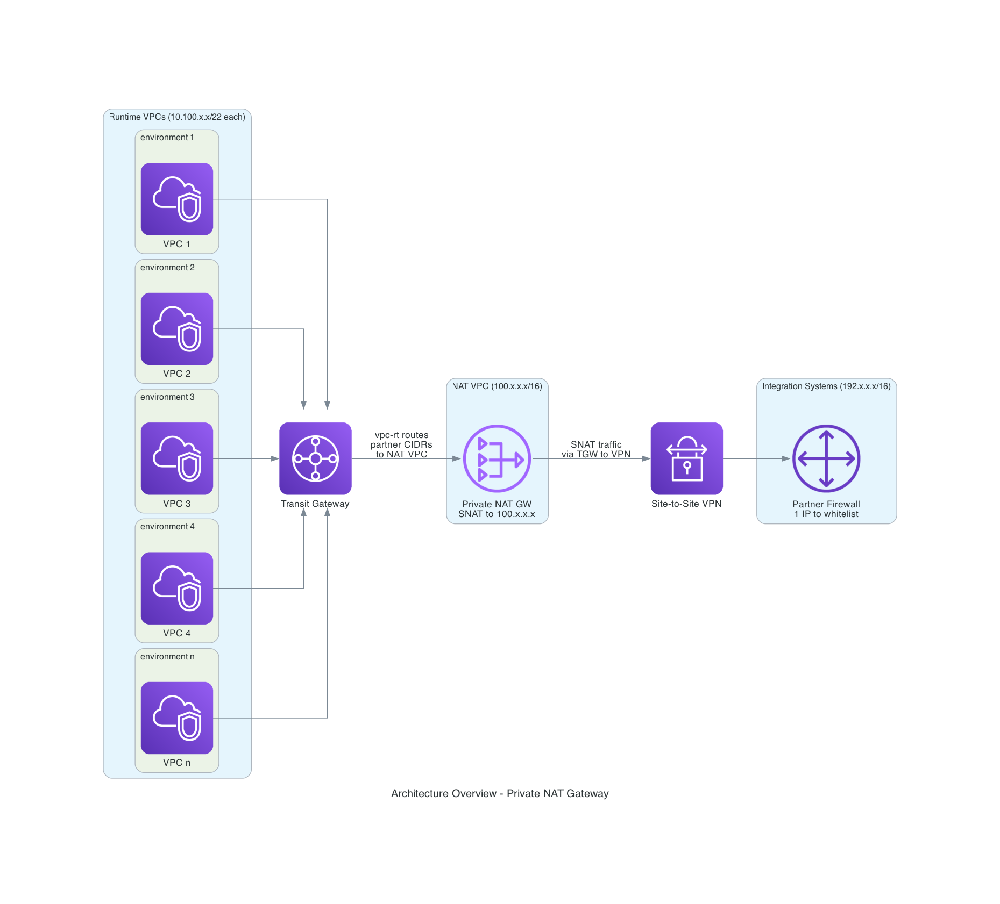
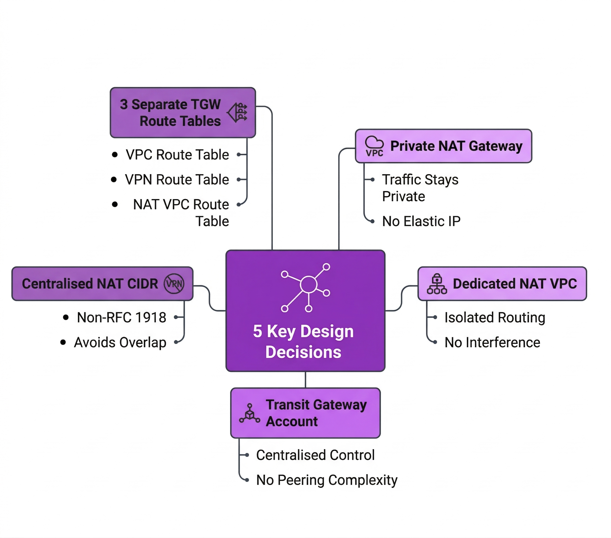
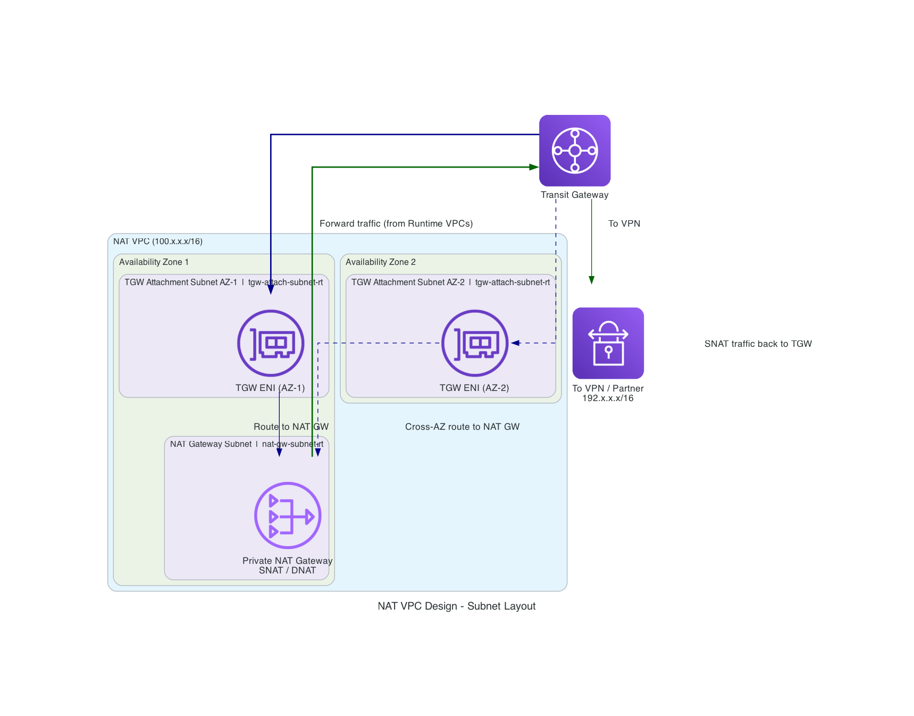
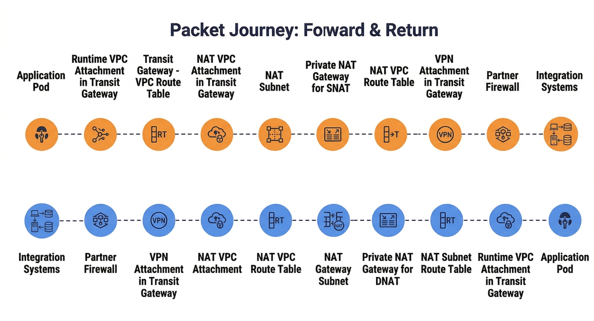
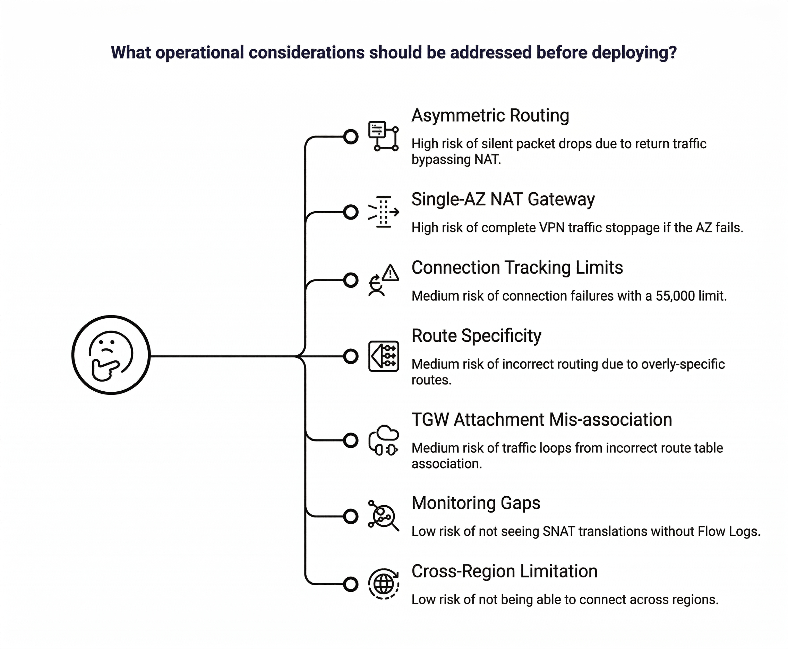

# Centralizing Outbound Traffic with AWS Private NAT Gateway

A practical guide to consolidating thousands of source IPs into a single address using a Private NAT Gateway, simplifying firewall management for Site-to-Site VPN connectivity.


Authors: Aravind
Date: 2026-04-10
Category: devops

tags: aws,nat gateway,vpn,networking,transit gateway,system engineering,cloud,infrastructure

---

## Introduction

When operating a multi-account AWS environment with several runtime VPCs, connecting to external systems through a Site-to-Site VPN often requires the destination's firewall to whitelist every source IP address. As environments grow, the number of IPs grows with them — and so does the operational burden of maintaining those firewall rules.

This post presents a production-tested architecture that solves this problem: deploying a **Private NAT Gateway** in a dedicated VPC attached to an AWS Transit Gateway. All outbound traffic destined for the VPN partner is Source NAT'd (SNAT) to a single IP address, drastically reducing the firewall management overhead at the partner's end.

**What you'll learn:**

- How to design a NAT VPC with Transit Gateway route tables (IaC-agnostic)
- Complete forward and return traffic flows with SNAT/DNAT
- The asymmetric routing risk and how to prevent silent packet drops
- Operational considerations for production readiness


## The Problem: IP Whitelisting at Scale

Consider this common multi-account architecture:

- Multiple **runtime VPCs** (environment 1, environment 2, environment 3, environment 4, environment n), each with their own CIDR ranges
- A **Transit Gateway** connecting all VPCs
- A **Site-to-Site VPN** routing traffic to an external partner's network
- The partner's **firewall** that requires all source IPs to be whitelisted



In this setup, every private subnet across all runtime VPCs must be individually whitelisted. Each environment uses 2 private subnets with /22 CIDRs — a /22 block provides 1,024 addresses, so each environment contributes **2,048 IPs**. With 4 environments, that totals **~8,192 IP addresses** to whitelist and maintain. This creates several problems:

1. **Operational overhead** — Adding or modifying subnets triggers firewall change requests on the partner side
2. **Overlapping CIDR conflicts** — Large numbers of entries increase the chance of range collisions
3. **Scalability wall** — Every new environment adds more IPs to the whitelist
4. **Audit complexity** — Mapping which IPs belong to which environment becomes error-prone

### How Traffic Flowed Before NAT Gateway

Each runtime VPC attachment was associated with the TGW route table **vpc-rt**, which routed traffic for the partner CIDR (192.x.x.x/16) **directly to the VPN attachment**. The partner's firewall saw a different source IP depending on which environment and pod originated the request — one of ~8,192 possible addresses.

## The Solution: Private NAT Gateway

The fix is architecturally elegant: instead of letting every runtime VPC IP reach the VPN directly, route all traffic through a **central Private NAT Gateway** that performs Source NAT.



### Key Design Decisions



### What Changes for Applications?

**Nothing.** Applications continue connecting to the partner's systems using the same hostnames and ports. The routing change is entirely transparent — no code changes, no configuration changes, no DNS changes.

## Architecture Design

### NAT VPC Layout

The NAT VPC is created in the Transit Gateway account with a deliberate subnet separation:



> This diagram depicts the forward and return traffic paths within the NAT VPC, illustrating why three subnets across two Availability Zones are required — one for the NAT Gateway and two for the TGW attachment ENIs (one per AZ). By default, Transit Gateway maintains AZ affinity: traffic exits through the same AZ it entered. With TGW attachment ENIs in both AZs, traffic from any runtime VPC AZ can reach the NAT Gateway, and return traffic traverses the same AZ path it took on the way out — a requirement for the stateful NAT Gateway to perform correct DNAT. This is the core principle behind preventing asymmetric routing.

> **Why are the NAT Gateway and TGW Attachment in separate subnets?** The TGW attachment subnet routes partner-destined traffic to the NAT Gateway. After SNAT, the packet lands in the NAT Gateway's subnet, whose route table sends it back to the Transit Gateway. If both were in the same subnet, traffic would **loop indefinitely**.

### Transit Gateway Route Table Design

The Transit Gateway uses **three route tables** that enforce symmetric traffic flow. Each table is associated with a specific attachment type:

- **vpc-rt** — Associated with all the runtime VPC attachments where the applications run. Traffic destined for the integration systems reaches the Transit Gateway, which routes partner CIDRs (192.x.x.x/16) to the NAT VPC attachment.
- **nat-vpc-rt** — Associated with the NAT VPC attachment. Receives application traffic from all runtime VPCs via **vpc-rt**, performs SNAT, and routes the translated traffic to partner CIDRs via the VPN attachment. Return traffic that gets DNAT'd is routed to the respective runtime VPC CIDRs through their VPC attachments.
- **vpn-rt** — Associated with the VPN attachment. Routes return traffic for all runtime VPC CIDRs to the NAT VPC attachment.


## Traffic Flow Deep Dive

The diagram below traces a packet end-to-end — from an application pod in a runtime VPC through SNAT at the NAT Gateway to the partner, and the return path through DNAT back to the originating pod. Follow the numbered steps to see how each TGW route table and VPC route table participates in both directions.




## Implementation Guide

This section walks through the key configuration steps. The architecture can be implemented using any IaC tool (Terraform, CloudFormation, CDK, Pulumi) or the AWS Console.

### Step 1: Create the NAT VPC

Create a dedicated VPC in the Transit Gateway account. Use a **non-overlapping CIDR** such as **100.x.x.x/16** to avoid collisions with existing VPC address spaces.

Create **three subnets** across two Availability Zones — one for the NAT Gateway and two for the TGW attachment ENIs (one per AZ).

### Step 2: Deploy the Private NAT Gateway

Create a NAT Gateway with **connectivity type - private** — unlike public NAT Gateways, it requires no EIP and translates private IPs to other private IPs. Deploy it in the **NAT Gateway subnet**, not the TGW attachment subnets.

### Step 3: Create the Transit Gateway VPC Attachment

Create a TGW VPC attachment for the NAT VPC using the **TGW attachment subnets only**. The NAT Gateway subnet must **not** be part of this attachment — this separation prevents routing loops. Enable **appliance mode** on this attachment to ensure Transit Gateway uses a consistent Availability Zone for each traffic flow, preventing asymmetric routing through the stateful NAT Gateway. Per [AWS TGW best practices](https://docs.aws.amazon.com/vpc/latest/tgw/tgw-best-design-practices.html), keep the TGW attachment subnet NACLs open.

### Step 4: Configure VPC Route Tables

Create **two separate route tables** within the NAT VPC:

- **tgw-attach-subnet-rt** (associated with both TGW attachment subnets) — routes partner-destined traffic to the NAT Gateway for SNAT, and runtime VPC CIDRs back to the Transit Gateway.
- **nat-gw-subnet-rt** (associated with the NAT Gateway subnet) — routes SNAT'd partner-destined traffic and DNAT'd runtime traffic back to the Transit Gateway.

### Step 5: Configure Transit Gateway Route Tables

This is the most critical step. Three TGW route tables enforce the symmetric traffic path:

- **vpc-rt** — Associate with all runtime VPC attachments. Routes partner CIDRs **192.x.x.x/16** to the NAT VPC attachment.
- **vpn-rt** — Associate with the VPN attachment. Routes each runtime VPC CIDR such as **10.100.x.x/22** to the NAT VPC attachment.
- **nat-vpc-rt** — Associate with the NAT VPC attachment. Routes partner CIDRs to the VPN attachment, and each runtime VPC CIDR to its respective VPC attachment.

> **This is where asymmetric routing is prevented.** Return traffic from the VPN **must** be routed to the NAT VPC first — never directly to the runtime VPC attachments.

## Validation

Confirming that application traffic to the partner is traversing the NAT Gateway requires verification from both the AWS control plane and the data plane (Linux networking from within the pod).

### AWS-Side Verification

**VPC Flow Logs** — Enable Flow Logs on the NAT VPC subnets (both the TGW attachment subnets and the NAT Gateway subnet). Look for flow log entries where the source IP belongs to a runtime VPC CIDR (10.100.x.x) and the destination is the partner CIDR (192.x.x.x). A second flow log entry from the NAT Gateway's ENI with the same destination but a translated source IP (100.x.x.x) confirms SNAT is occurring.

**CloudWatch NAT Gateway Metrics** — Monitor **ActiveConnectionCount**, **PacketsOutToDestination**, and **BytesOutToDestination** on the NAT Gateway. A non-zero and increasing value after an application makes a request to the partner confirms traffic is flowing through the NAT Gateway.

**Transit Gateway Flow Logs** — If enabled, TGW Flow Logs show which attachment the traffic entered from (runtime VPC) and which attachment it exited through (NAT VPC), confirming the route table configuration is working.

### Linux Networking Verification (from the Application Pod)

**traceroute** — Run a traceroute to the partner destination. With the NAT Gateway in the path, an additional hop (the NAT VPC) appears before reaching the partner:

```bash
$ traceroute -n 192.x.x.x
 1  10.100.x.x  1.123 ms   ← Node IP Address
 2  100.x.x.x   1.234 ms   ← NAT Gateway hop (confirms SNAT path)
 3  192.x.x.x   5.678 ms   ← Partner router
```

**tcpdump** — Capture packets on the pod's network interface to verify outbound SYN packets reach the partner and SYN-ACK returns successfully, confirming both forward and return paths are intact:

```bash
$ tcpdump -i eth0 host 192.x.x.x -nn
 10.100.x.x.43210 > 192.x.x.x.443: Flags [S], seq ...
 192.x.x.x.443 > 10.100.x.x.43210: Flags [S.], seq ...  ← return path works
```

**curl with timing** — A simple connectivity test that also reveals latency introduced by the NAT hop:

```bash
$ curl -so /dev/null -w "tcp_connect: %{time_connect}s\ntotal: %{time_total}s\n" https://192.x.x.x/health
 tcp_connect: 0.045s
 total: 0.123s
```

Compare these timings before and after the NAT Gateway deployment — a slight increase in `tcp_connect` (typically 1–3 ms) is expected due to the additional network hop through the NAT VPC.

## Asymmetric Routing: The Silent Killer

The single most dangerous failure mode in this architecture is **asymmetric routing** — where forward traffic traverses the NAT Gateway but return traffic bypasses it.

The NAT Gateway is a **stateful** device. When it performs SNAT on a forward packet, it creates an entry in its **connection tracking table** that maps the original source IP to the translated NAT IP. When return traffic arrives, the NAT Gateway looks up this entry to perform DNAT and restore the original destination IP.

**If return traffic bypasses the NAT Gateway, the DNAT lookup never happens.** The packet arrives at the runtime VPC with `dst=100.x.x.x` (the NAT IP), which no pod owns. The packet is **silently dropped** — no ICMP error, no RST, no log entry in the application. The connection simply times out.


**How to prevent it:** Ensure that the `vpn-rt` TGW route table routes return traffic for **all runtime VPC CIDRs** to the NAT VPC attachment — never directly to the runtime VPC attachments. A single misconfigured route (especially a more-specific `/24` that matches before the `/16`) can silently break an entire environment.

## Operational Considerations



Before deploying this pattern in production, consider the constraints outlined above — from asymmetric routing risks and single-AZ failure domains to connection tracking limits, route specificity traps, and monitoring requirements.

## What's Next: Regional NAT Gateways

The most notable limitation of the current architecture is that the Private NAT Gateway is a **zonal resource** — it operates in a single Availability Zone. If that AZ experiences an outage, all partner-bound traffic stops until the NAT Gateway recovers.

AWS now offers [Regional NAT Gateways](https://docs.aws.amazon.com/vpc/latest/userguide/nat-gateways-regional.html) that automatically expand across Availability Zones based on workload presence. Instead of deploying one NAT Gateway in a single AZ and engineering around the failure domain, a Regional NAT Gateway provides **automatic multi-AZ high availability** with a single NAT ID, simplified routing (one route entry for all AZs), and up to 32 IP addresses per AZ — compared to 8 for zonal NAT Gateways.

The Regional NAT Gateway manages its own route table with pre-configured routes, and it detects new workloads in additional AZs automatically — no manual subnet or route table changes needed.

> **Current constraint:** Regional NAT Gateways do not yet support **private connectivity mode**. Since this architecture uses a Private NAT Gateway (private-to-private SNAT with no internet path), migrating to a Regional NAT Gateway is not possible today. AWS recommends [zonal NAT Gateways for private NAT use cases](https://docs.aws.amazon.com/vpc/latest/userguide/nat-gateways-regional.html). Once AWS extends Regional NAT Gateways to support private connectivity, this architecture can evolve to a simpler, fully HA design with minimal routing complexity.

## Conclusion

The Private NAT Gateway pattern is a clean, production-proven solution for consolidating outbound traffic from multiple VPCs to a Site-to-Site VPN destination. By introducing a dedicated NAT VPC in the Transit Gateway account, we reduced the partner's firewall whitelisting requirement from **~8,192 IP addresses to 1** — while keeping the change completely transparent to application teams.

The key takeaways:

1. **Subnet separation** within the NAT VPC prevents routing loops — TGW attachment and NAT Gateway must be in different subnets
2. **Three TGW route tables** (`vpc-rt`, `vpn-rt`, `nat-vpc-rt`) enforce symmetric traffic flow through the NAT Gateway
3. **Asymmetric routing is the primary risk** — return traffic that bypasses the NAT Gateway will be silently dropped with no application-level errors
4. **Monitor actively** — CloudWatch NAT Gateway metrics and VPC Flow Logs are essential for production visibility

This pattern scales naturally: onboarding a new runtime environment only requires adding its VPC CIDR to the NAT VPC's Transit Gateway route table. No firewall changes needed at the partner's end — ever.

## References

- [NAT Gateways — Amazon VPC User Guide](https://docs.aws.amazon.com/vpc/latest/userguide/vpc-nat-gateway.html)
- [NAT Gateway Basics — Limits, Bandwidth, Connection Tracking](https://docs.aws.amazon.com/vpc/latest/userguide/nat-gateway-basics.html)
- [NAT Gateway Use Cases — Allow-listed IP Addresses](https://docs.aws.amazon.com/vpc/latest/userguide/nat-gateway-scenarios.html)
- [Private NAT Gateway — AWS Multi-VPC Whitepaper](https://docs.aws.amazon.com/whitepapers/latest/building-scalable-secure-multi-vpc-network-infrastructure/private-nat-gateway.html)
- [Transit Gateway Design Best Practices](https://docs.aws.amazon.com/vpc/latest/tgw/tgw-best-design-practices.html)
- [Regional NAT Gateways — Multi-AZ Expansion](https://docs.aws.amazon.com/vpc/latest/userguide/nat-gateways-regional.html)
- [AWS Site-to-Site VPN User Guide](https://docs.aws.amazon.com/vpn/latest/s2svpn/VPC_VPN.html)
