# Getting Started with SonarQube Cloud

Everything you need to know to get started with SonarQube Cloud — what it does, how to configure it, and the practices worth keeping.

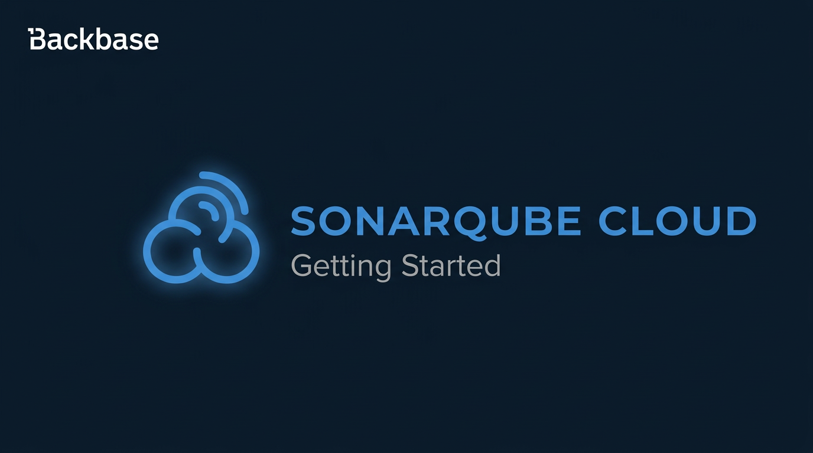

Authors: Anil Kumar Mamidi
Date: 2026-04-14T12:17:14.962Z
Category: devops

tags: code quality, devops, java, ci cd, system engineering, sonarqube cloud

---

## Why Code Quality Slips — and How SonarCloud Stops It

Every developer has that one service they're terrified to touch. Technical debt doesn't show up overnight — it creeps in one merged PR at a time because nothing flags it. A missed null check here, a hardcoded credential there, a test covering 30% of a critical path. None feel urgent alone, but they compound. And with AI generating more code than ever, the surface area for unreviewed bugs and vulnerabilities is growing faster than manual reviews can catch. By the time you notice, you've got a codebase nobody wants to own.

SonarCloud (now officially **SonarQube Cloud**) is what stops that cycle. It's a cloud-based static analysis tool that scans every pull request for bugs, vulnerabilities, code smells, and coverage gaps — and blocks the merge if the code doesn't meet the bar. It also surfaces existing issues across your entire branch, so you can see the legacy debt — but the Quality Gate focuses on new code, stopping you from adding to it.

When you open a project, you see a dashboard with six key metrics. Three — Security, Reliability, and Maintainability — are rated from A (best) to E (worst). The other three — Coverage, Duplications, and Security Hotspots Reviewed — are shown as percentages.

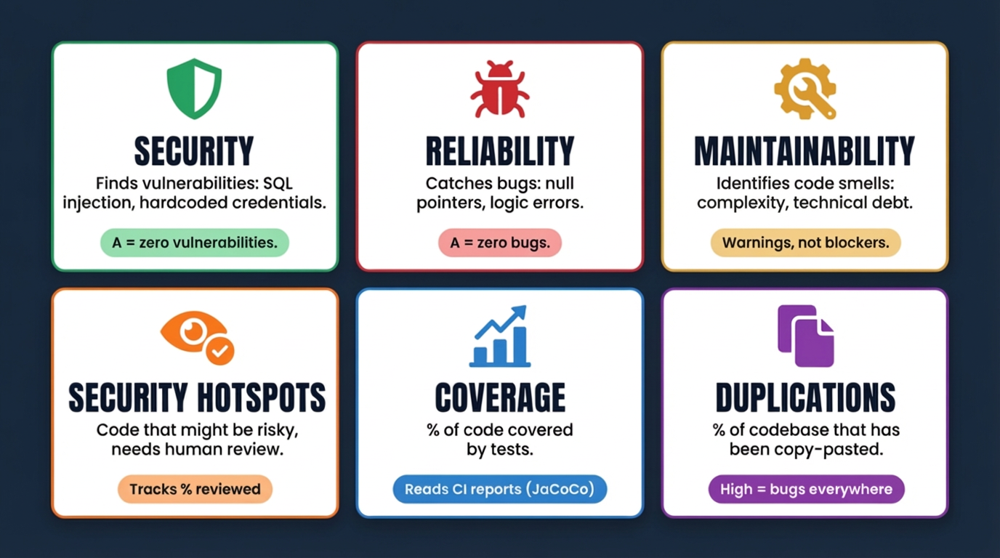

---

## Concepts You'll Need Before Setup

### Quality Gate

This is the one concept that makes or breaks your adoption. A Quality Gate is a set of pass/fail conditions that runs on every analysis. If the code doesn't meet the bar, the gate fails — and if you've wired it into your branch protection, the PR can't merge.

The default gate (called "Sonar Way") applies these conditions on **new code** across all branches and pull requests:

- No new bugs, vulnerabilities, or maintainability issues (A rating on all three)
- All security hotspots reviewed
- Coverage ≥ 80%
- Duplications ≤ 3%

That "new code" part is critical. It means you can adopt SonarCloud on a legacy project without having to fix ten years of existing issues first. The gate only judges what you're adding — not what's already there.

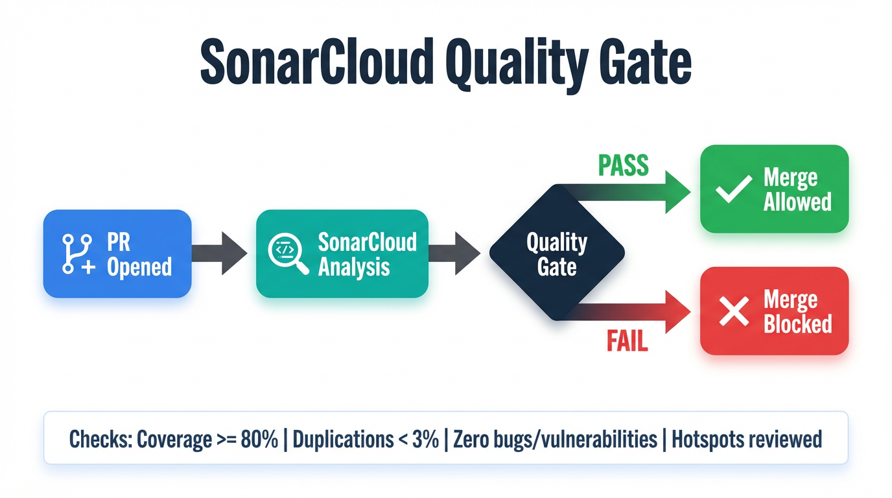

SonarCloud also uses **Quality Profiles** (the set of rules applied per language) and individual **Rules** (each checking for a specific issue type — bugs, vulnerabilities, code smells, or security hotspots). The defaults ("Sonar Way" profiles) are solid starting points. Resist the urge to customise them early — understand why things fail before you start tweaking thresholds.

### New Code Period

This defines what SonarCloud considers "new" code — the reference point the Quality Gate evaluates against. Two practical options:

- **Previous version** — best for teams shipping versioned releases on a regular cadence.
- **Number of days** — best for continuous delivery; issues not addressed within the window roll into the baseline.

### Billable Lines of Code (LOC)

Pricing is based on billable LOC — **hit the plan limit and pipeline analysis stops cold**. You're billed for non-comment, non-blank lines in your **largest branch only** (typically *main*). Test files, documentation files, feature branches, and public repositories don't count.

> **Tip:** Use [cloc](https://github.com/AlDanial/cloc) locally to estimate your billable LOC before onboarding a repository.

---

## Automatic Analysis vs. CI-Based Analysis

SonarCloud offers two ways to analyse your code — picking the wrong one is one of the most common early mistakes.

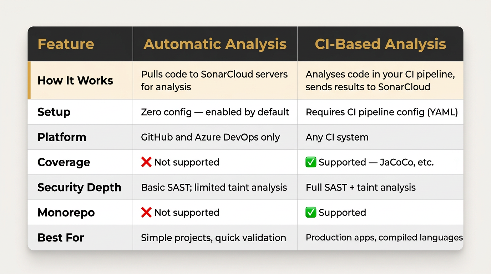

**Pick Automatic** if you're on GitHub or Azure DevOps with a simple project and don't need coverage. **Pick CI-based** if you need test coverage, full security analysis, monorepo support, or non-main branch analysis. We use CI-based for our Java/Maven projects because coverage and full security analysis matter.

> **Remember:** You cannot run both on the same project — if you try, the CI build will fail. Going CI-based? Disable Automatic Analysis in project settings first.

---

## Teams vs. Enterprise: Which One Do You Actually Need?

SonarCloud offers a **Free tier** (up to 50k LOC for private projects, 5 users — public repos are always free) for trying things out. Beyond that, there are two paid plans — Teams is likely where you'll start.

Both plans include PR decoration, Quality Gates, CI-based and automatic analysis, 30+ languages, full SAST, taint analysis, AI CodeFix, and secrets detection. **Enterprise adds:** portfolio dashboards, SAML/SSO, audit logs, IP allowlisting, org-wide default settings, and dedicated SLA support.

Both plans are billed by Lines of Code — not by users or repositories. For most teams, Teams plan covers everything you need.

### Where Teams Plan Gets Rough

None of these are dealbreakers, but they're friction you should know about going in:

- **Selective project import at scale** — SonarCloud lets you bulk-import all repos or pick from pages of 25, but there's no way to filter and selectively import across a large org (say, 150 of 250 repos) without paging through manually
- **Automatic Analysis disabled per-project** — no org-wide toggle on Teams (Enterprise only), so onboarding 150 projects means 150 trips to the settings UI

---

## Setting Up CI-Based Analysis for a Java Maven Project

Most of our repos are single-module Java Maven projects. Here's the setup we use.

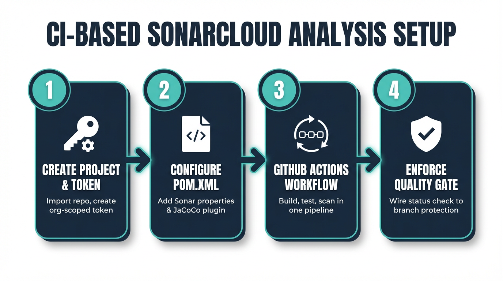

### Step 1: Create the Project and Set Up Tokens

**Import the project.** Log in to SonarCloud, click **+** > **Analyse new project**, find your repository in the list, and click **Set Up**.

> The generated project key follows the pattern *github-org_repo-name* — for example, *my-org_my-service*.

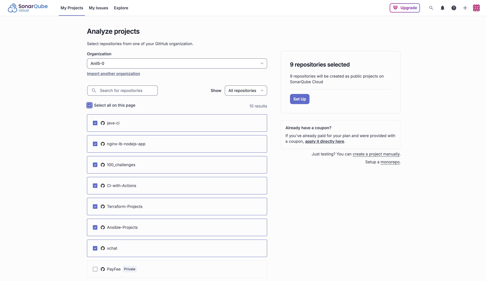

**Disable Automatic Analysis — but not immediately.** When you first import a project, SonarCloud automatically analyses your default branch and the 5 most recently active pull requests — giving you instant visibility into existing issues with zero setup. Let that initial scan complete first. Once it's done, go to **Administration** > **Analysis Method** and turn off Automatic Analysis before configuring CI-based analysis. If both run at the same time, they'll conflict.

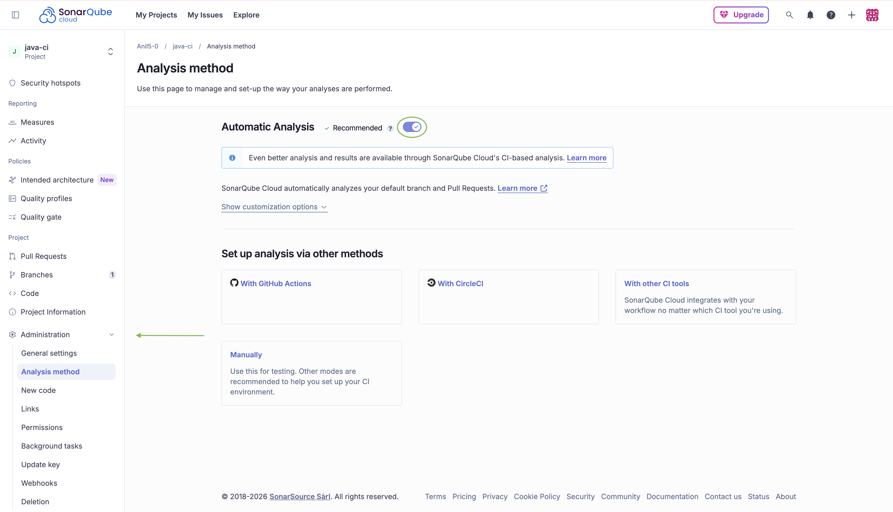

**Use an Organization-scoped token, not per-project tokens.** Managing individual tokens per repo doesn't scale. Instead, create a single org-scoped token:

> **Note:** Organization-scoped tokens require a Team or Enterprise plan. On the Free tier, use a [Personal Access Token](https://docs.sonarsource.com/sonarqube-cloud/managing-your-account/managing-tokens/) instead — but be aware it's tied to your individual account and will stop working if that account is removed from the org.

1. Go to **Administration** > **Scoped Organization Tokens** > **Create token**
2. Set expiration to **No Expiration** and grant access to **All current and future projects**
3. Store it as a **GitHub Organization secret** (e.g., `SONAR_TOKEN` ) — every repo in the org gets access automatically

### Step 2: Configure Sonar Properties in pom.xml

For Java Maven projects, configure SonarCloud through Maven properties in your *pom.xml*:

```xml
<properties>
    <!-- Sonar -->
    <sonar.projectKey>${SONAR_PROJECT_KEY}</sonar.projectKey>
    <sonar.organization>${SONAR_ORGANIZATION}</sonar.organization>
    <sonar.host.url>https://sonarcloud.io</sonar.host.url>
    <sonar.exclusions>**/database/**/*,**/test/*,**/encryption/*</sonar.exclusions>
</properties>
```

**Project key and organization are environment variables** — resolved at build time from the CI workflow, so the Sonar properties block is identical across repos.

**Exclusions are project-specific** — adjust paths to skip generated code, migrations, or anything not meaningful to analyse.

**JaCoCo handles coverage reporting** — SonarCloud reads the report JaCoCo generates during `mvn verify`. Add this inside the `<build><plugins>` section of your *pom.xml*:

```xml
<plugin>
    <groupId>org.jacoco</groupId>
    <artifactId>jacoco-maven-plugin</artifactId>
    <version>0.8.12</version>
    <executions>
        <execution>
            <goals><goal>prepare-agent</goal></goals>
        </execution>
        <execution>
            <id>report</id>
            <phase>verify</phase>
            <goals><goal>report</goal></goals>
        </execution>
    </executions>
</plugin>
```

SonarCloud picks up the report automatically from *target/site/jacoco/jacoco.xml*.

### Step 3: Add the GitHub Actions Workflow

Create `.github/workflows/build.yml` in your repository:

```yaml
name: Build and Analyse

on:
  push:
    branches:
      - main
  pull_request:
    types: [opened, synchronize, reopened]

jobs:
  build:
    runs-on: ubuntu-latest
    name: Build, test, and analyse
    timeout-minutes: 60
    steps:
      - name: Checkout Repository
        uses: actions/checkout@v6
        with:
          fetch-depth: 0

      - name: Setup Java
        uses: actions/setup-java@v4
        with:
          java-version: '17'
          distribution: 'temurin'
          cache: maven

      - name: Cache SonarCloud Packages
        uses: actions/cache@v4
        with:
          path: ~/.sonar/cache
          key: ${{ runner.os }}-sonar

      - name: Run Tests and SonarCloud Scan
        run: |
          mvn -ntp -B clean verify \
            org.sonarsource.scanner.maven:sonar-maven-plugin:sonar \
            -Dsonar.token=$SONAR_TOKEN \
            -Dsonar.organization=$SONAR_ORGANIZATION \
            -Dsonar.projectKey=$SONAR_PROJECT_KEY
        env:
          SONAR_TOKEN: ${{ secrets.SONAR_TOKEN }}
          SONAR_ORGANIZATION: ${{ github.repository_owner }}
          SONAR_PROJECT_KEY: ${{ github.repository_owner }}_${{ github.event.repository.name }}
```

A few things to note about this workflow:

- **Dual triggers** — runs on both PRs (pre-merge analysis) and pushes to *main* (keeps the dashboard current post-merge)
- **`fetch-depth: 0`** — gives SonarCloud the full Git history so it can tell which code is new and which already existed
- **`SONAR_TOKEN`** — the org-level secret you created in Step 1
- **Dynamic project key** — built from github.repository_owner and github.event.repository.name, so no hardcoding needed
- **Single Maven command** — compile, test, generate JaCoCo report, and analyse, all in one pass

> **Scaling tip:** In practice, we use a reusable workflow in a shared repository so that every repo calls it with a single uses: line instead of duplicating this file. But the workflow above is the complete, working version — start here and extract into a reusable workflow when the duplication across repos justifies it.

### Step 4: Enforce the Quality Gate on PRs

Without this step, everything you've set up so far is advisory. SonarCloud will analyse your code and leave a comment on the PR, but nothing stops a developer from clicking "Merge" anyway. The Quality Gate needs teeth.

**In SonarCloud**, the Quality Gate result is automatically reported back to GitHub as a commit status check after every analysis. You don't need to configure anything on the SonarCloud side — this happens by default once CI-based analysis runs successfully on a PR.

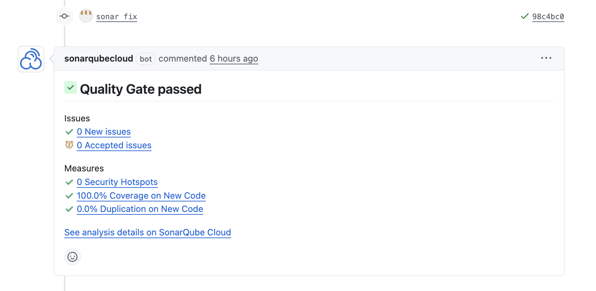

**In GitHub**, you wire that status check into your branch protection rules:

1. Go to your repository's **Settings** > **Branches**
2. Under **Branch protection rules**, click **Edit** on the rule for *main* (or create one if it doesn't exist)
3. Enable **Require status checks to pass before merging**
4. Search for and add *SonarCloud Code Analysis*
5. Save

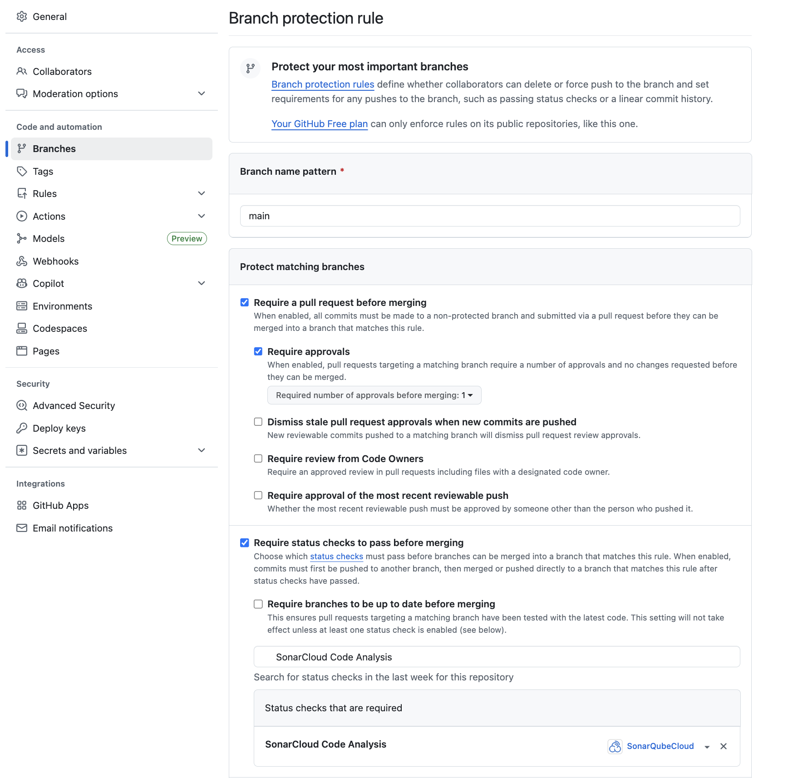

Now a PR that fails the Quality Gate — coverage below 80%, a new bug — can't merge until the issues are fixed.

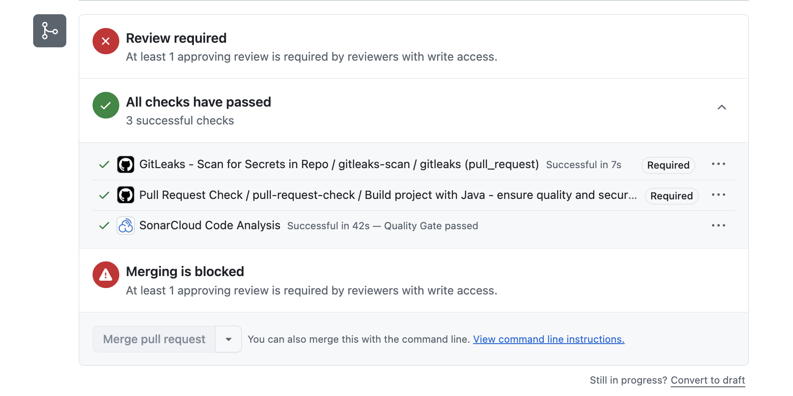

> **Note:** The status check name *SonarCloud Code Analysis* only appears in GitHub's search after at least one successful analysis has run on a PR. If you let automatic analysis complete in Step 1, the check should already be visible here. If not, push a test PR, let the CI workflow run, and then configure this rule.

---

## Best Practices That Actually Matter

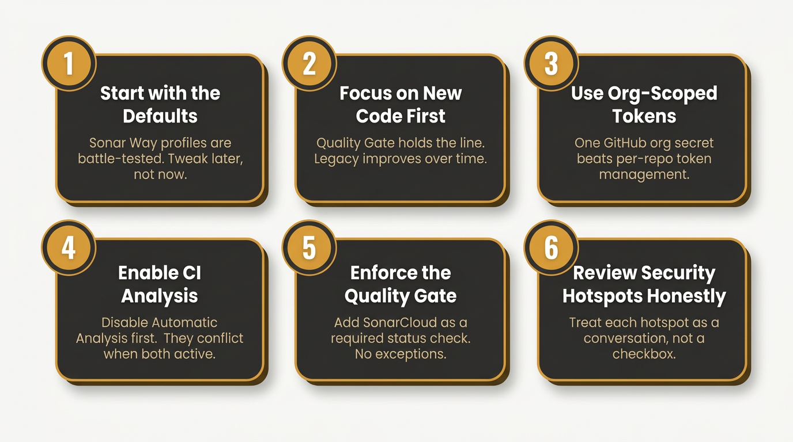

---

## Closing Thoughts

SonarCloud won't automatically fix legacy mess — but it surfaces it. Branch analysis reveals existing issues, while the Quality Gate ensures everything new meets the bar. Code reviews shift from mechanical checks to design discussions, and the codebase improves one clean PR at a time.

The hard part isn't the tooling or the setup. It's the discipline — trusting the defaults, reviewing hotspots honestly, and not softening the gate the first time it blocks a Friday afternoon merge.

If you've read this far and haven't set up SonarCloud yet, pick one repository and try it. You'll know within a few PRs whether it's working for your team.

---

## References

- [SonarQube Cloud Documentation](https://docs.sonarsource.com/sonarqube-cloud/)
- [Quality Gates](https://docs.sonarsource.com/sonarqube-cloud/standards/managing-quality-gates/)
- [New Code Definition](https://docs.sonarsource.com/sonarqube-cloud/standards/about-new-code#new-code-definitions)
- [GitHub Actions Integration](https://docs.sonarsource.com/sonarqube-cloud/analyzing-source-code/ci-based-analysis/github-actions-for-sonarcloud/)
- [SonarQube Cloud Pricing](https://www.sonarsource.com/plans-and-pricing/sonarcloud/)
- [Sonar Maven Plugin](https://docs.sonarsource.com/sonarqube-cloud/analyzing-source-code/scanners/sonarscanner-for-maven/)
- [JaCoCo Maven Plugin](https://www.jacoco.org/jacoco/trunk/doc/maven.html)
- [Security Hotspots](https://docs.sonarsource.com/sonarqube-cloud/managing-your-projects/issues/reviewing-security-hotspots/)
- [GitHub Reusable Workflows](https://docs.github.com/en/actions/how-tos/reuse-automations/reuse-workflows)
