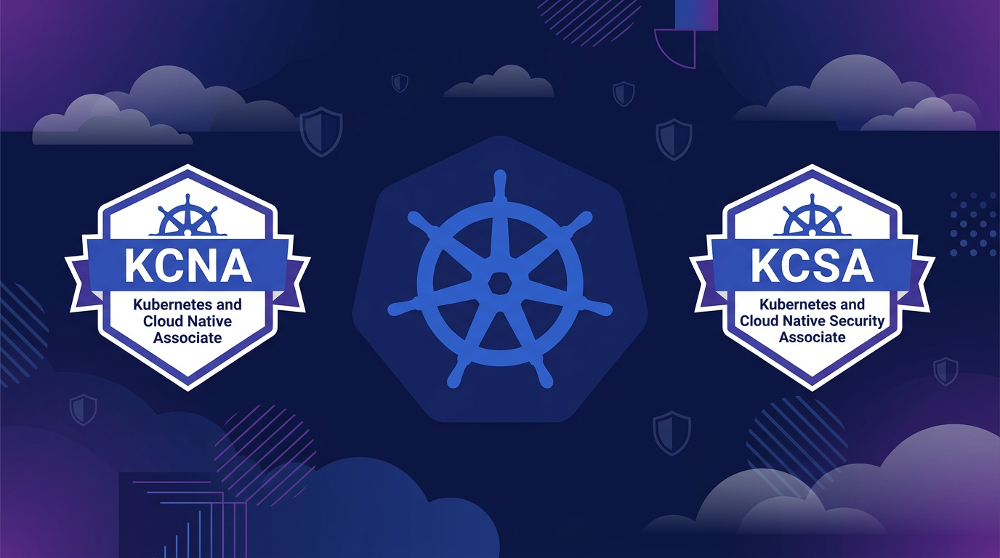
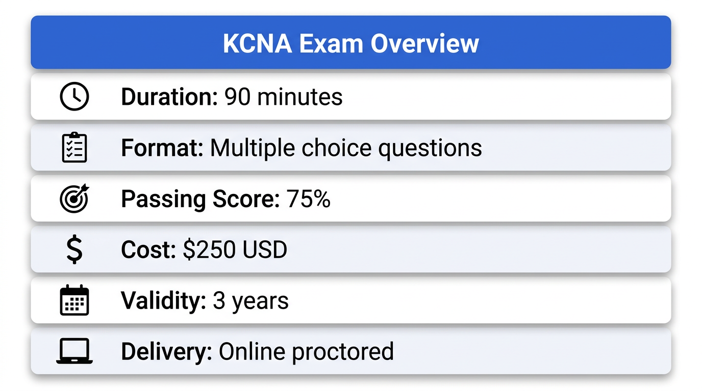
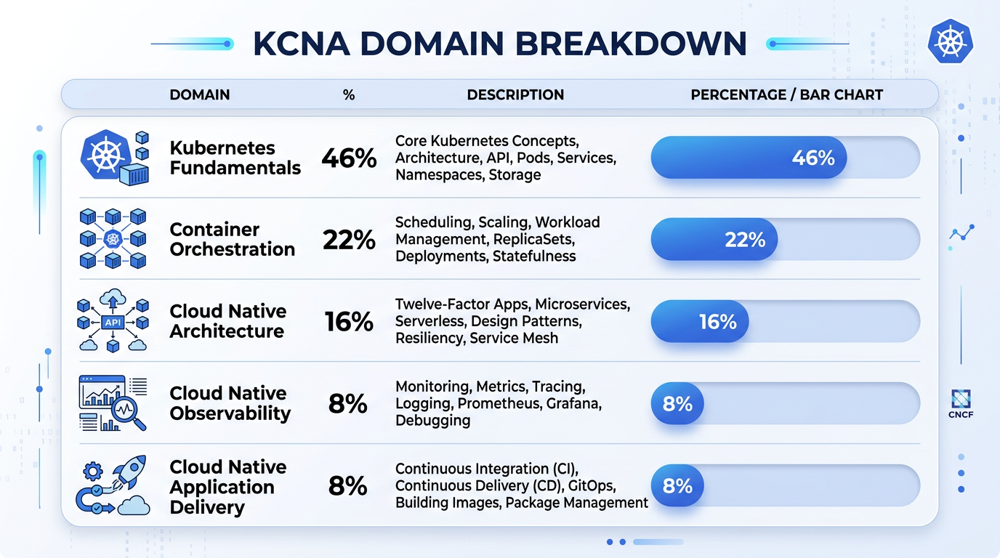
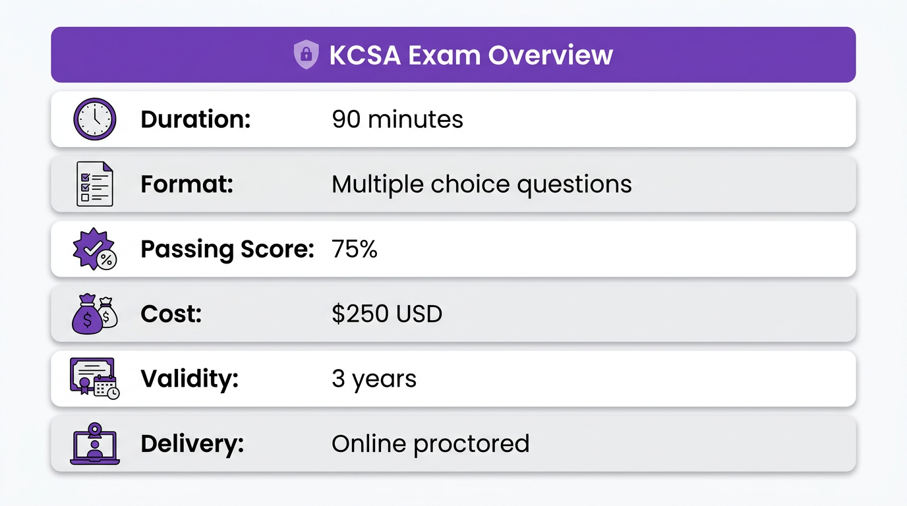
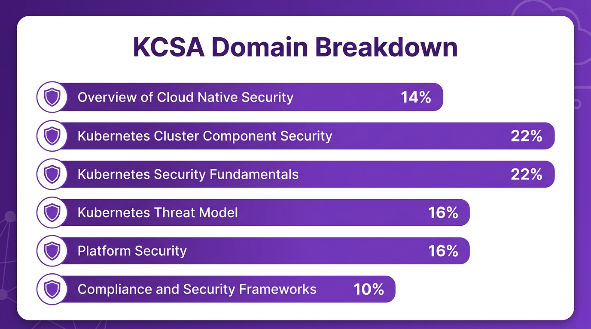
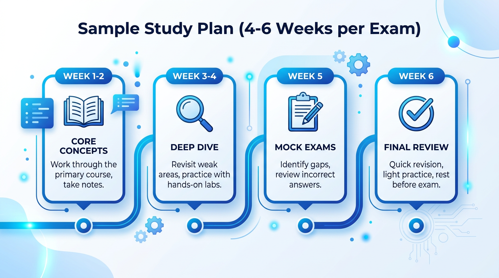
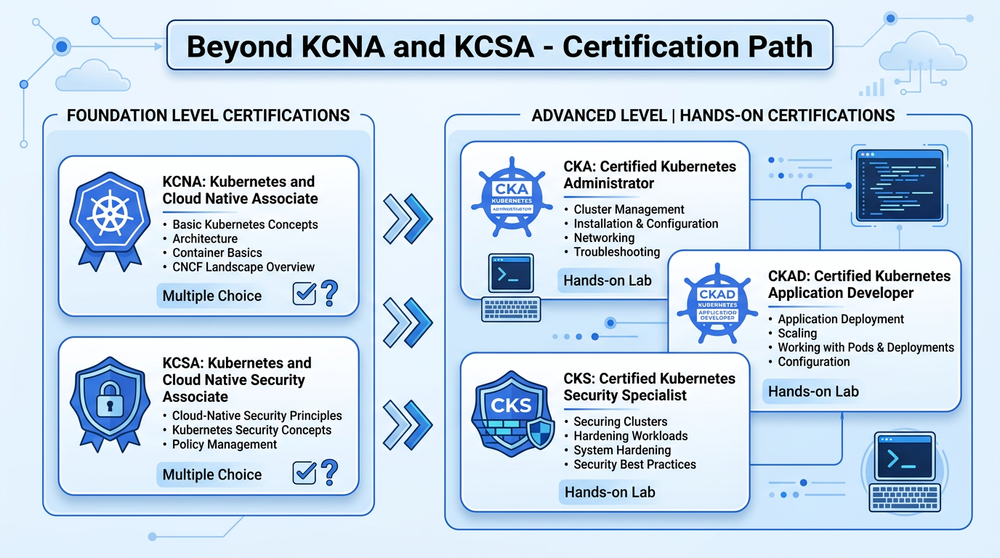

# A Practical Guide to KCNA and KCSA Certifications

Everything you need to know to prepare for and pass the Kubernetes and Cloud Native Associate (KCNA) and Kubernetes and Cloud Native Security Associate (KCSA) certifications — including recommended resources, study strategies, and exam tips.

Authors: Suraj Kumar
Date: 2026-04-15T12:00:00.000Z
Category: devops

tags: kubernetes, kcna, kcsa, certification, cloud native, security, cncf, devops

---

## Why These Certifications Matter

Deploying to Kubernetes is one thing. Explaining how the API server authenticates requests, what the 4Cs of cloud native security mean, or how STRIDE threat modeling applies to Kubernetes is another.

The KCNA and KCSA certifications offer a structured way to fill those knowledge gaps. KCNA covers Kubernetes and cloud native fundamentals, while KCSA dives deep into security. Together, they build a solid foundation for tackling hands-on certifications like CKA or CKS.

This guide covers everything needed to prepare for both exams.

---

## KCNA: Kubernetes and Cloud Native Associate

### Exam Overview

### Domain Breakdown

The KCNA exam covers five domains with the following weightage:

### Key Topics to Master

**Kubernetes Fundamentals (46%)** — This is nearly half the exam. Focus on:
- **Kubernetes architecture** — control plane components (API server, etcd, scheduler, controller manager) and worker node components (kubelet, kube-proxy, container runtime) *(high priority)*
- **Core objects** — Pods, Deployments, ReplicaSets, Services, ConfigMaps, Secrets *(high priority)*
- Namespaces and resource management
- Labels, selectors, and annotations
- Basic kubectl commands and their purposes

**Container Orchestration (22%)** — Understand:
- **Container fundamentals and OCI standards** *(high priority)*
- Container runtimes (containerd, CRI-O)
- Pod lifecycle and container states
- Resource requests and limits
- Scheduling basics

**Cloud Native Architecture (16%)** — Know the principles:
- Microservices architecture patterns
- **Twelve-factor app methodology** *(frequently tested)*
- Stateless vs stateful applications
- Service mesh concepts
- **CNCF landscape and graduated projects** (Kubernetes, Prometheus, Envoy, etc.) *(know the major projects)*

**Cloud Native Observability (8%)** — Basics of:
- **The three pillars: logging, monitoring, tracing** *(understand the differences)*
- Prometheus and Grafana concepts
- Log aggregation approaches
- Distributed tracing with Jaeger/Zipkin

**Cloud Native Application Delivery (8%)** — Understand:
- **GitOps principles** *(frequently tested)*
- CI/CD concepts
- Helm and package management
- Argo CD / Flux basics

### Recommended Resources for KCNA

**Primary Course: [James Spurin's KCNA Practice Exams](https://www.udemy.com/course/dive-into-kubernetes-and-cloud-native-associate-kcna-practice-exams/)**

James Spurin, a CNCF Ambassador, offers one of the most comprehensive KCNA preparation courses available. The content maps directly to the exam objectives and is regularly updated.

What makes this course effective:
- Comprehensive coverage of all five KCNA domains
- Practice questions aligned with the actual exam format
- Regular updates to match curriculum changes
- Active community support

**Supplementary Resources:**
- [Official Kubernetes Documentation](https://kubernetes.io/docs/) — The authoritative source for all concepts
- [CNCF Landscape](https://landscape.cncf.io/) — Essential for understanding the cloud native ecosystem
- [Kubernetes the Hard Way](https://github.com/kelseyhightower/kubernetes-the-hard-way) — For deeper understanding (optional but valuable)

---

## KCSA: Kubernetes and Cloud Native Security Associate

### Exam Overview

### Domain Breakdown

The KCSA exam covers six security-focused domains:

### Key Topics to Master

**Overview of Cloud Native Security (14%)** — Foundation concepts:
- **The 4Cs of Cloud Native Security: Cloud, Cluster, Container, Code** *(must know thoroughly)*
- **Defense in depth strategy** *(high priority)*
- Shift-left security principles
- Security as a shared responsibility

**Kubernetes Cluster Component Security (22%)** — Securing the cluster:
- **API server security** (authentication, authorization, admission control) *(high priority)*
- **etcd security and encryption at rest** *(frequently tested)*
- Kubelet security configuration
- Control plane component hardening
- Certificate management

**Kubernetes Security Fundamentals (22%)** — Core security features:
- **RBAC: Roles, ClusterRoles, RoleBindings, ClusterRoleBindings** *(must know thoroughly)*
- Service Accounts and their security implications
- **Network Policies for pod-to-pod traffic control** *(high priority)*
- **Pod Security Standards (Privileged, Baseline, Restricted)** *(frequently tested)*
- Pod Security Admission
- Secrets management best practices

**Kubernetes Threat Model (16%)** — Understanding attacks:
- **STRIDE threat modeling** *(understand each letter)*
- Common attack vectors in Kubernetes
- Container escape techniques and prevention
- Privilege escalation scenarios
- **Supply chain attacks** *(increasingly important)*

**Platform Security (16%)** — Broader platform concerns:
- **Image security and vulnerability scanning** *(high priority)*
- Runtime security and anomaly detection
- Supply chain security (image signing, SBOM, provenance)
- **Admission controllers for policy enforcement** *(know OPA/Gatekeeper)*
- Security contexts and capabilities

**Compliance and Security Frameworks (10%)** — Standards and benchmarks:
- **CIS Kubernetes Benchmark** *(frequently referenced)*
- NIST guidelines for containers
- Pod Security Standards mapping
- Audit logging and compliance evidence

### Recommended Resources for KCSA

**Primary Course: [Zeal Vora's KCSA Course](https://www.udemy.com/course/kubernetes-cloud-native-security-associate-kcsa/)**

KCSA is a relatively new certification with limited preparation materials available. Zeal Vora's course stands out as one of the few comprehensive resources covering all exam objectives.

What makes this course essential:
- One of the few comprehensive KCSA preparation courses available
- Covers all six security domains in depth
- Practical security scenarios and demonstrations
- Updated content aligned with current exam objectives

Given the scarcity of KCSA resources, this course is highly recommended for anyone preparing for this exam.

**Supplementary Resources:**
- [Kubernetes Security Documentation](https://kubernetes.io/docs/concepts/security/)
- [CNCF Security TAG Resources](https://github.com/cncf/tag-security)
- "Kubernetes Security" by Liz Rice — Excellent book for deeper understanding

**Hands-on Tools to Practice:**
- **Trivy** — Vulnerability scanning for containers and Kubernetes
- **Falco** — Runtime security and threat detection
- **OPA/Gatekeeper** — Policy enforcement and admission control
- **Kubescape** — Security posture management and CIS benchmark scanning
- **kube-bench** — CIS Kubernetes Benchmark checks

---

## Study Strategy and Timeline

### Recommended Order

Start with KCNA, then progress to KCSA. The foundational Kubernetes knowledge from KCNA makes KCSA security concepts much easier to grasp. Many KCSA topics assume you understand core Kubernetes objects and architecture.

### Sample Study Plan (4-6 Weeks per Exam)

### Effective Study Strategies

1. **Don't just watch videos** — Take notes, draw architecture diagrams, and explain concepts out loud to reinforce learning
2. **Hands-on practice is crucial** — Set up a local cluster with Minikube or kind and experiment with the concepts
3. **Understand, don't memorize** — Both exams test comprehension, not rote recall
4. **Use the official documentation** — Get comfortable navigating Kubernetes docs; this skill pays off beyond the exam
5. **Track weak areas** — Spend more time on domains with lower practice scores

---

## Exam Day Tips

**Before the Exam:**
- Test your system and internet connection beforehand
- Ensure your environment meets proctoring requirements (clean desk, proper lighting, no second monitors)
- Have your ID ready
- Get a good night's sleep

**During the Exam:**
- Read each question carefully — watch for "NOT," "EXCEPT," or "LEAST"
- Use the flag feature for uncertain questions — come back to them later
- Manage your time — 90 minutes for ~60 questions means roughly 1.5 minutes per question
- Eliminate obviously wrong answers first
- There's no penalty for guessing — never leave a question blank
- Trust your preparation

**KCNA-Specific Insights:**
- Kubernetes Fundamentals questions often test architecture understanding — know which component does what and why
- Expect questions about CNCF graduated projects — know at least what Prometheus, Envoy, and Helm do
- GitOps and Twelve-factor app concepts appear more than their 8% weight might suggest

**KCSA-Specific Insights:**
- The 4Cs model (Cloud, Cluster, Container, Code) is foundational — many questions reference this framework
- RBAC and Network Policies are heavily tested — understand not just what they do, but when to use each
- Know the difference between Pod Security Standards levels (Privileged, Baseline, Restricted)

**Time Management:**
- First pass: Answer questions you're confident about (~45-50 minutes)
- Second pass: Work through flagged questions (~30-35 minutes)
- Final review: Quick check of all answers (~5-10 minutes)

---

## Beyond KCNA and KCSA

These certifications are stepping stones. Once you've cleared them, consider the hands-on certifications:

The hands-on certifications (CKA, CKAD, CKS) require you to perform actual tasks in a live Kubernetes environment. KCNA and KCSA provide the theoretical foundation that makes these practical exams more approachable.

---

## Final Thoughts

Passing KCNA and KCSA is not just about adding certifications to a resume — it's about building a solid foundation in Kubernetes and cloud native security. The structured preparation covers concepts that are easy to skip in day-to-day work, and the validation builds confidence when working with these technologies in production.

The key is consistent, focused study. Pick a course, follow it through, practice hands-on, and trust the process. Both exams are achievable with 4-6 weeks of dedicated preparation.

For those ready to start, book the exam first — the deadline creates focus.

---

## References

- [CNCF Certification Programs](https://www.cncf.io/certification/)
- [KCNA Exam Curriculum](https://github.com/cncf/curriculum/blob/master/KCNA_Curriculum.pdf)
- [KCSA Exam Curriculum](https://github.com/cncf/curriculum/blob/master/KCSA_Curriculum.pdf)
- [Kubernetes Documentation](https://kubernetes.io/docs/)
- [CNCF Landscape](https://landscape.cncf.io/)
