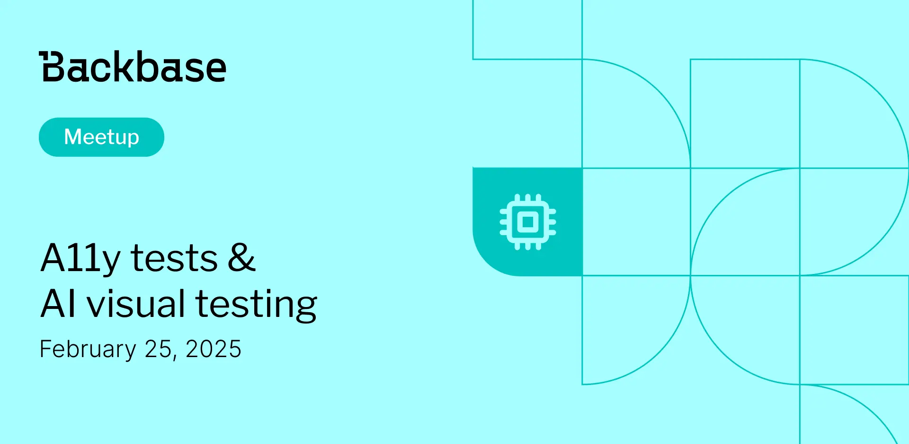

# a11y Tests and AI Visual Testing

Event date: February 25, 2025 | Backbase office | QA

Authors: Backbase Meetups
Date: 2025-02-25T10:00:42.612Z  
Category: meetups
Location: Krakow

tags: krakow, meetup, QA
 
--- 
## ✅ Book your spot

Join us for the next Backbase meetup where we speak not only about Tech

[Get your ticket](https://www.meetup.com/backbase-meetups/)

## Speakers & Topics

### [Robert Bobby Gedlek](https://www.linkedin.com/in/robert-gedlek/)
"Testy dostępności (accessibility) — “Od zera do… bohatera?”: Nie takie testy dostępności straszne jak je malują"

#### BIO
Bobby developer in Test. 23 years of experience in IT. His technology stack is Java ecosystem.

---

### [Darek Majcherczyk]()
"AI na Straży Pikseli: Ewolucja w Visual Testing"

#### BIO
QA automation and CI freak with many years of experience. Testing everything... starting with frontend, through backend, ending with mobile devices. Quality is his mission and AI his hidden weapon to leverage testing to the next level.

## Place and time

🗓️ Event Date: February 25, 2025

🕑 Time: 6:00  PM

📍 Location: Backbase Office, High 5ive Four, Pawia 21, 31-154 Kraków
[See the map](https://maps.app.goo.gl/UWpwQ9zNaJBxPLEV9)

## Agenda

6:00 - 6:05 PM - Registration, grab a drink

6:05 - 6:45 PM - Robert Bobby Gędłek | "Testy dostępności (accessibility) — “Od zera do… bohatera?”: Nie takie testy dostępności straszne jak je malują" [POL]

6:50 - 7:30 PM - Darek Majcherczyk | "AI na Straży Pikseli: Ewolucja w Visual Testing" [POL]

7:30 - 08:00 PM - Networking, food & drinks

[Get your ticket](https://www.meetup.com/backbase-meetups/)
