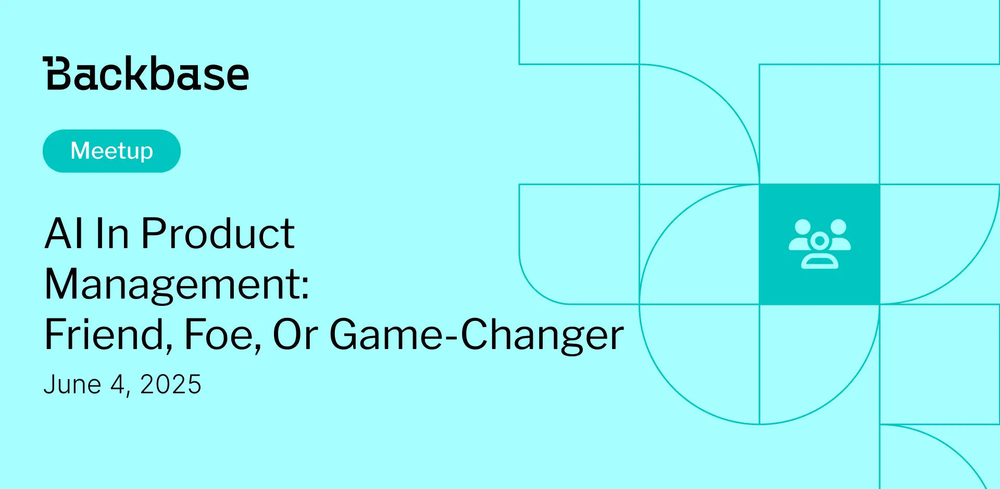

# AI in Product Management

Event date: June 4, 2025 | Backbase office | Product Owner, Product Management

Authors: Magdalena Firlit
Date: 2025-06-04T07:18:14.406Z  
Category: meetups
Location: Krakow

tags: krakow, meetup, product management, product owner
 
--- 

## ✅ Book your spot

Join us for the next Backbase meetup where we speak not only about Tech

[Get your ticket](https://www.meetup.com/backbase-meetups/)

## Speakers & Topics

### [Magdalena Firlit](https://www.linkedin.com/in/magdalenafirlit/)
"AI in Product Management: Friend, Foe, or Game-Changer?"

In an era where AI is rapidly transforming industries, how will it shape the role of Product Owners? This session explores the key trends, opportunities, and challenges AI brings to product management. We’ll discuss how AI can enhance decision-making, streamline workflows, and drive better outcomes—without replacing the human touch.

#### BIO
Magdalena Firlit is a Professional Scrum Trainer (PST) at Scrum.org, Consultant, and Product Management Strategist who helps organizations improve decision-making through Evidence-Based Management (EBM). Magdalena has worked with US and European enterprises. She is also a guest lecturer at universities, a speaker, a mentor and a volunteer.

## Place and time

🗓️ Event Date: June 4, 2025

🕑 Time: 5:45 PM

📍 Location: Backbase Office, High 5ive Four, Pawia 21, 31-154 Kraków
[See the map](https://maps.app.goo.gl/UWpwQ9zNaJBxPLEV9)

## Agenda

5:45 - 6:05 PM - Registration, grab a drink

6:05 - 6:30 PM - Magdalena Firlit | "AI in Product Management: Friend, Foe, or Game-Changer?"

7:30 - 9:00 PM - Networking, food & drinks

[Get your ticket](https://www.meetup.com/backbase-meetups/)
