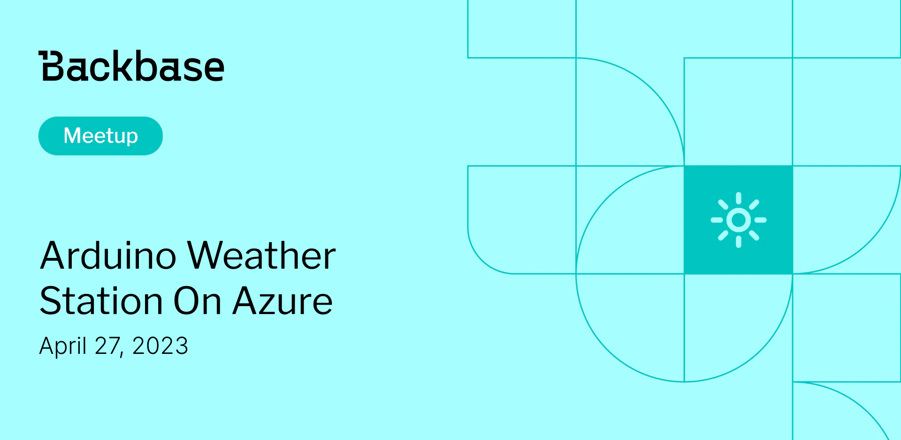

# Arduino weather station on Azure - IoT, Terraform, Azure, Programming

Event date: April 27, 2023 | Backbase office | Arduino, IoT, Azure

Authors: Backbase Meetups
Date: 2023-04-01T06:41:26.235Z  
Category: meetups

tags: krakow, meetup, Arduino, IoT, Azure

---

# ✅ Book your spot

Join us for the next Backbase meetup where we speak not only about Tech

[Get your ticket](https://www.meetup.com/backbase-meetups/)

# Speakers & Topics

[Mariusz Walania](https://www.linkedin.com/in/mariusz-walania-7a3a573/)
"Arduino weather station on Azure - IoT, Terraform, Azure, Programming"

# Place and time

🗓️ Event Date: April 27, 2023

🕑 Time: 5:00  PM

📍 Location: Backbase Office, High 5ive Four, Pawia 21, 31-154 Kraków
[See the map](https://maps.app.goo.gl/UWpwQ9zNaJBxPLEV9)

# Agenda

5:00 PM - 5:15 PM - Doors open, grab a drink
5:15 PM - 5:30 PM - Welcome
5:30 PM - 6:15 PM - Mariusz Walania | "Arduino weather station on Azure - IoT, Terraform, Azure, Programming" (in english)
6:15 PM - 7:00 PM - Networking, food&drinks

[Get your ticket](https://www.meetup.com/backbase-meetups/)
