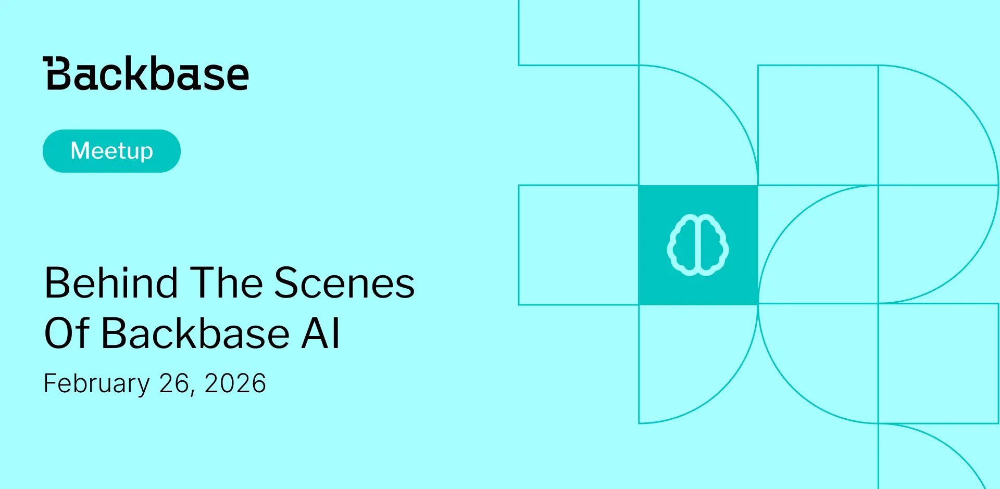

# Behind the Scenes of Backbase AI

Event date: February 26, 2026 | Backbase office | AI

Authors: Backbase Meetups
Date: 2026-02-26
Category: meetups

tags: krakow, meetup, AI
 
--- 

## ✅ Book your spot

Join us for the next Backbase meetup where we speak not only about Tech

[Get your ticket](https://www.meetup.com/backbase-meetups/)

## Speakers & Topics

### Ernest Szczekocki

"The Emulator as an Environment for AI Agents in Mobile Development"

The Android Emulator is evolving into a powerful execution environment for AI agents in modern mobile development. This session explores how emulator-driven agents can observe runtime behavior, interact with applications, and enable new levels of automation, testing, and intelligent developer tooling.

#### BIO - [LinkedIn](https://www.linkedin.com/in/eszczekocki/)

Senior Android Developer bridging the Android ecosystem with AI and LLMs. I build agent-based systems and RAG solutions that optimize developers’ day-to-day work

### Mariusz Jakowienko

"Integrating the LLM Agent with Cucumber Studio via the MCP server to support test writing automation and test coverage"

As a principal iOS Developer specializing in AI-driven tooling for modern iOS development I design and build solutions that use LLM agents to meaningfully support unit and UI testing, focusing on reducing manual effort while improving quality and reliability. By integrating LLM agents with Cucumber Studio through an MCP server, I enable automated test writing, smarter test scenarios, and increased test coverage. My work bridges mobile engineering and applied AI to make testing more scalable, maintainable, and developer-friendly.

#### BIO - [LinkedIn](https://www.linkedin.com/in/mariusz-ios-developer/)

Principal iOS Developer creating AI solutions to support unit and UI testing

### Lukasz Koperniak

"Engineering the Customer Lifetime Orchestrator"

The Customer Lifetime Orchestrator (CLO) is Backbase’s strategic engine designed to maximize long-term Customer Lifetime Value (CLV). This session dives into how our R&D team integrates traditional predictive ML with Generative AI to automate personalized banking experiences at scale.

#### BIO - [LinkedIn](https://www.linkedin.com/in/lukaszkoperniak/)

R&D Engineering Director

## Place and time

🗓️ Event Date: February 26, 2026

🕑 Time: 17:45

📍 Location: Backbase Office, High 5ive Four, Pawia 21, 31-154 Kraków

[See the map](https://maps.app.goo.gl/UWpwQ9zNaJBxPLEV9)

## Agenda

17:45 - 18:00 - Registration, grab a drink

18:00 - 18:30 - Mariusz Jakowienko | "Integrating the LLM Agent with Cucumber Studio via the MCP server to support test writing automation and test coverage"

18:35 - 19:05 - Ernest Szczekocki | "The Emulator as an Environment for AI Agents in Mobile Development"

19:10 - 19:40 - Lukasz Koperniak | "Engineering the Customer Lifetime Orchestrator"

19:45 - 20:45 - Networking, food & drinks

[Get your ticket](https://www.meetup.com/backbase-meetups/)
