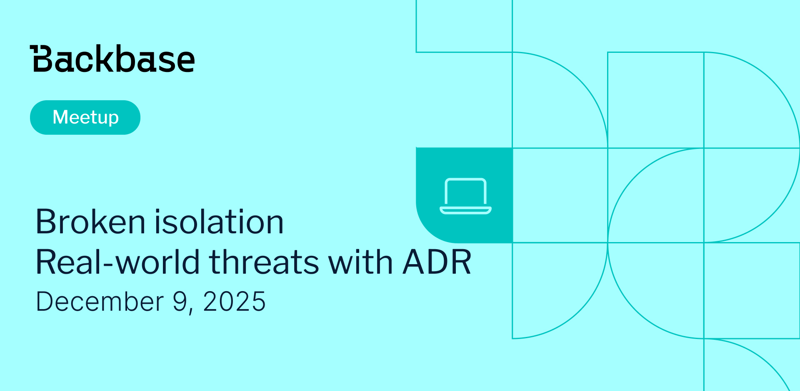

# Broken isolation. Real-world threats with ADR

Event date: December 9, 2025 | Backbase office | Security | macOS

Authors: Backbase Meetups
Date: 2025-11-07T14:02:48.085Z  
Category: meetups

tags: krakow, meetup, security, securinga, ADR

Location: Krakow
 
--- 
## ✅ Book your spot

Join us for the next Backbase meetup where we speak not only about Tech

[Get your ticket](https://www.meetup.com/backbase-meetups/)

## Speakers & Topics

### [Wojciech Reguła](https://wojciechregula.blog/post/)
"Broken isolation - draining your credentials from popular macOS password managers"

In theory, theory and practice are the same. In theory, all modern macOS applications must be isolated what is enforced by notarization and sandboxing. In practice these enforcements are usually ineffective. This talk starts by explaining basic isolation assumptions and quickly shifts to exploitation. I have selected a few the most popular macOS password managers written in different technologies to prove how a low-privileged malware can abuse various tricks and 0,n-day vulnerabilities to drain your credentials.
During this talk you will:
- learn how macOS hardened runtime, sandboxing, and TCC app management privilege work
- see 0,n-day vulnerabilities and architectonical problems I have found in popular macOS password managers
- understand why software distributed via websites is sometimes more secure than from the Apple Mac App Store
- see my exploits and a lot of *demos*

After the talk, the audience should be able to explain macOS isolation mechanisms (in)security, check their password managers for presented vulnerabilities, and effectively support their macOS blue/red teams.

#### BIO
Wojciech is a Principal Security Specialist working at SecuRing. He specializes in application security on Apple devices and created the iOS Security Suite – an open-source anti-tampering framework. Wojciech has earned recognition as a Bugcrowd MVP and has discovered vulnerabilities in Apple (70+ CVEs), Facebook, Malwarebytes, Slack, Atlassian, and others. In his free time, he runs an infosec blog at https://wojciechregula.blog. Wojciech has shared his research at prominent conferences, including Black Hat (US, EU, Asia), DEF CON (USA), Objective by the Sea (USA), AppSec Global (Israel), TyphoonCon (South Korea), NULLCON (India), and CONFidence (Poland).

### [Brian Vlootman](https://www.linkedin.com/in/brianvlootman/)
"Walking the path: addressing real-world threats with ADR"

An effective application security program focuses on applying the right tools and processes at the right moment. But you will need to rethink your security strategy beyond shift-left practices; while identifying and fixing vulnerabilities early in development before deploying to production is essential, it is simply not enough.
The reality is that vulnerabilities inevitably make it into production. Many security programs overlook how to deal with attacks against the vulnerabilities that were missed. Application Detection and Response (ADR) fills this critical gap by providing real-time visibility into running applications and the ability to block attacks on application vulnerabilities in your production applications.

#### BIO
Brian Vlootman is an experienced security leader with over 25 years in IT and cybersecurity, currently serving as CISO at Backbase. At Backbase, he focuses on implementing a defensible security architecture and driving cyber resilience for the digital banking platform.
His career includes offensive and defensive roles across different tech and security domains, spanning industries like banking and healthcare. He is passionate about bridging the gap between business and technical teams to foster a collaborative approach continuously improving security. He takes a pragmatic approach to cybersecurity, emphasising measurable outcomes and the real-world effectiveness of tools and processes rather than theoretical perfection.

## Place and time

🗓️ Event Date: December 9, 2025

🕑 Time: 18:00

📍 Location: Backbase Office, High 5ive Four, Pawia 21, 31-154 Kraków

[See the map](https://maps.app.goo.gl/UWpwQ9zNaJBxPLEV9)

## Agenda

18:00 - 18:15 - Registration, grab a drink

18:20 - 19:00 - Wojciech Reguła | "Broken isolation - draining your credentials from popular macOS password managers"

19:05 - 19:40 - Brian Vlootman | "Walking the path: addressing real-world threats with ADR"

19:50 - 21:00 - Networking, food & drinks

[Get your ticket](https://www.meetup.com/backbase-meetups/)
