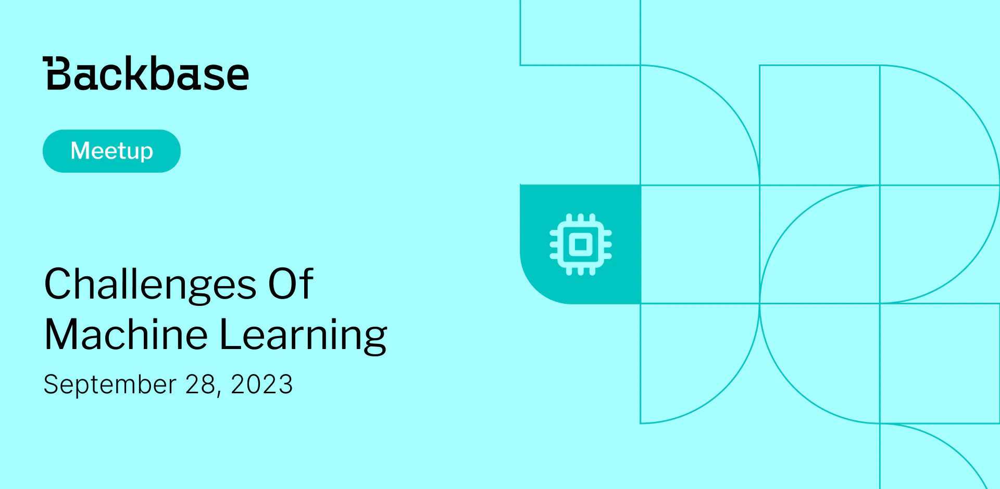

# Challenges of machine learning

Event date: September 28, 2023 | Backbase office | Machine Learning

Authors: Backbase Meetups
Date: 2023-10-01T07:09:11.368Z  
Category: meetups

tags: krakow, meetup, Machine Learning
 
--- 

# ✅ Book your spot

Join us for the next Backbase meetup where we speak not only about Tech

[Get your ticket](https://www.meetup.com/backbase-meetups/)

# Speakers & Topics

[Sandra Jagiełło](https://www.linkedin.com/in/sandrajagiello/)
"Challenges of machine learning"

# Place and time

🗓️ Event Date: 28 September 2023

🕑 Time: 5:00 pm

📍 Location: Backbase Office, High 5ive Four, Pawia 21, 31-154 Kraków
[See the map](https://maps.app.goo.gl/UWpwQ9zNaJBxPLEV9)

# Agenda

5:00pm - 5:15pm - Doors open, grab a drink
5:15pm - 5:30pm - Welcome
5:30pm - 6:15pm - Sandra Jagiełło | "Challenges of machine learning" (in english)
6:15pm - 7:00pm - Networking, food&drinks

[Get your ticket](https://www.meetup.com/backbase-meetups/)
