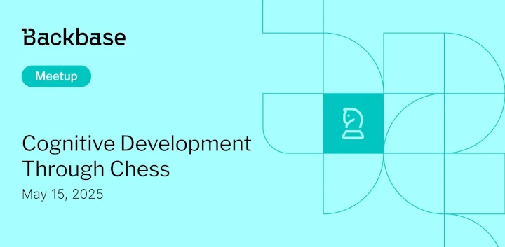

# Cognitive Development through Chess

Event date: May 15, 2025 | Backbase office | Chess IT

Authors: Backbase Meetups
Date: 2025-03-27T09:12:54.344Z  
Category: meetups

tags: krakow, meetup, Chess IT

Location: Krakow

---
## ✅ Book your spot

Join us for the next Backbase meetup where we speak not only about Tech

[Get your ticket](https://www.meetup.com/backbase-meetups/)

## Speakers & Topics

### [Mateusz Bartel](https://pl.wikipedia.org/wiki/Mateusz_Bartel)
"Cognitive Development through Chess: Discuss how chess enhances problem-solving skills, critical thinking, and decision-making abilities"

#### BIO
Mateusz Bartel - Polish chess grandmaster (since 2005), four-time Polish champion in classical chess and the country's leading player over the last 20 years. Multiple representatives of Poland in team competitions, such as the Chess Olympiad and the European Team Championship, from which he brought back three gold medals for individual results. Together with the Polish team, he stood on the podium in the World Team Championship in 2017. His most important achievements include the bronze medal in the Individual European Championship (2015) and victories in the Aeroflot Open (2012), Biel Schachfestivval (2017), Prague Challengers (2023) tournaments.

## Place and time

🗓️ Event Date: May 15, 2025

🕑 Time: 17:30

📍 Location: Backbase Office, High 5ive Four, Pawia 21, 31-154 Kraków
[See the map](https://maps.app.goo.gl/UWpwQ9zNaJBxPLEV9)

## Agenda

17:30 - 17:45 - Registration, grab a drink

17:45 - 17:55 - Intro

18:00 - 18:30 - Mateusz Bartel | "Cognitive Development through Chess" [POL]

18:30 - 19:15 - Mateusz Bartel | Q&A, Discussion Panel [POL]

19:15 - 20:00 - Mateusz Bartel | Simultaneous Exhibition

20:00 - 21:00 - Networking, food & drinks

[Get your ticket](https://www.meetup.com/backbase-meetups/)
