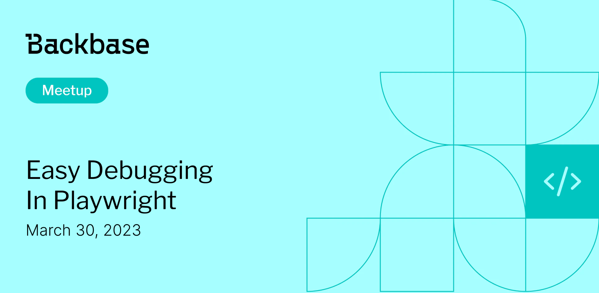

# Easy debugging in Playwright

Event date: March 30, 2023 | Backbase office | Playwright

Authors: Backbase Meetups
Date: 2023-03-01T08:54:35.051Z  
Category: meetups

tags: krakow, meetup, Playwright, debugging

---

# ✅ Book your spot

Join us for the next Backbase meetup where we speak not only about Tech

[Get your ticket](https://www.meetup.com/backbase-meetups/)

# Speakers & Topics

[Joanna Morgaś](https://www.linkedin.com/in/joanna-morgas/)
"Easy debugging in Playwright"

Considering Software Quality in general there looms up the scary principle that the absence-of-errors in a software
product is a fallacy. It just so happens that Playwright library provides some interesting utilities for error hunting
in automated tests written in Playwright. Familiarising ourselves with these debugging tools can make finding bugs
easier and faster. This talk is to discuss and present some of them.

# Place and time

🗓️ Event Date: 30 March 2023

🕑 Time: 5:00  PM

📍 Location: Backbase Office, High 5ive Four, Pawia 21, 31-154 Kraków
[See the map](https://maps.app.goo.gl/UWpwQ9zNaJBxPLEV9)

# Agenda

5:00 PM - 5:15 PM - Doors open, grab a drink
5:15 PM - 6:00 PM - Joanna Morgaś | "Easy debugging in Playwright" (in english)
6:00 PM - 6:15 PM - Q&A
6:15 PM - 7:00 PM - Networking, food&drinks

[Get your ticket](https://www.meetup.com/backbase-meetups/)
