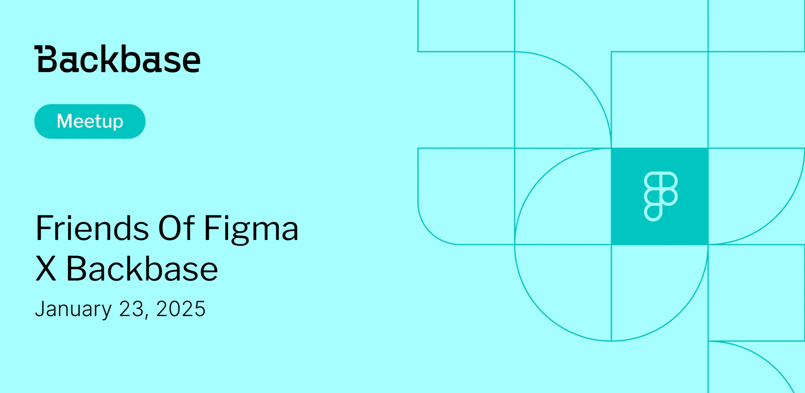

# Friends of Figma x Backbase

Event date: January 23, 2025 | Backbase office | User Experience

Authors: Backbase Meetups
Date: 2024-12-04T07:18:14.406Z  
Category: meetups

tags: krakow, meetup, UX
 
--- 

# ✅ Book your spot

Join us for the Friends of Figma event organized in collaboration with Backbase.

[Get your ticket](http://www.friends.figma.com/krakow/)

# Speakers & Topics

[Phil Barrett](https://www.linkedin.com/in/philbuk/)
"How to build your reputation, influence and impact as a real-world UX designer"

Figma is 70% of your job.  The other 70% (yes, your job requires 140%) is about making sure design actually has an impact and makes your product better for customers. In this talk, I cover  seven* practical principles you can follow to help make design (and yourself) indispensable in your organisation.
* May not actually be seven.

BIO
I’ve done a lot of things in the world of design, including working on the BBC’s first ever website, starting and selling the same UX consultancy twice, working in Africa for ages, becoming a Design Thinking facilitator for Deloitte consulting, leading design for a major bank, and being a product manager.  He has tried to remember what he has learned along the way, so that he can share it with you.

–––––

[Paulina Duźniak](https://pl.linkedin.com/in/paulina-duzniak/pl)
"Good enough research – how to gather data without direct access to users"

In the world of B2B2B products, conducting user research can be uniquely challenging due to limited direct access to end-users. Join us to hear about our way to navigate these constraints by employing unconventional methods to gather insights.

BIO
As a Senior UX Designer I am specializing in employee solutions at Backbase. My journey began in Graphic Design, where I contributed to diverse projects ranging from city wayfinding systems to packaging design. After several years in graphic design, I shifted my focus to user experience in the digital realm, primarily working on PaaS and SaaS solutions. I am deeply involved in every stage of the design process, from defining value and conducting research to crafting business requirements and delivering high-fidelity design.

# Place and time

🗓️ Event Date: 23 January 2025

🕑 Time: 6:00  PM

📍 Location: Backbase Office, High 5ive Four, Pawia 21, 31-154 Kraków
[See the map](https://maps.app.goo.gl/UWpwQ9zNaJBxPLEV9)

# Agenda

6:00 PM - 6:30 PM - Doors open, grab a drink
6:30 PM - 6:45 PM - Welcome
6:45 PM - 7:20 PM - Phil Barrett | "How to build your reputation, influence and impact as a real-world UX designer" (in english)
7:25 PM - 8:00 PM - Paulina Duźniak | "Good enough research – how to gather data without direct access to users" (in english)
8:00 PM - 9:30 PM - Networking, food&drinks

[Get your ticket](http://www.friends.figma.com/krakow/)
