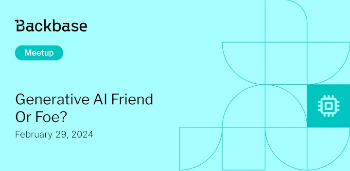

# Generative AI Friend or Foe?

Event date: February 29, 2024 | Backbase office | AI

Authors: Backbase Meetups
Date: 2024-02-01T07:15:19.654Z  
Category: meetups

tags: krakow, meetup, AI
 
--- 

# ✅ Book your spot

Join us for the next Backbase meetup where we speak not only about Tech

[Get your ticket](https://www.meetup.com/backbase-meetups/)

# Speakers & Topics

[Tomasz Aleksandrowicz](https://www.linkedin.com/in/tomasz-aleksandrowicz-7757372/)
"Generative AI Friend or Foe?"

# Place and time

🗓️ Event Date: 29 February 2024

🕑 Time: 4:00 pm

📍 Location: Backbase Office, High 5ive Four, Pawia 21, 31-154 Kraków
[See the map](https://maps.app.goo.gl/UWpwQ9zNaJBxPLEV9)

# Agenda

4:00pm - 4:15pm - Doors open, grab a drink
4:15pm - 4:30pm - Welcome
4:30pm - 5:15pm - Brian Vlootman | "Generative AI Friend or Foe?" (in english)
5:15pm - 7:00pm - Networking, food&drinks

[Get your ticket](https://www.meetup.com/backbase-meetups/)
