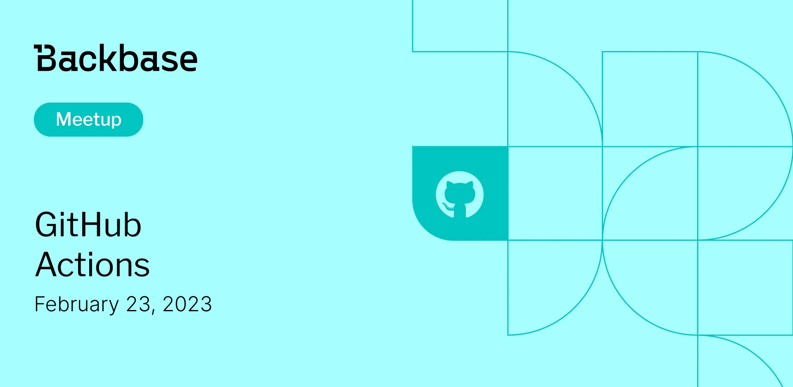

# GitHub Actions

Event date: February 23, 2023 | Backbase office | GitHub

Authors: Backbase Meetups
Date: 2023-02-01T08:53:54.871Z  
Category: meetups

tags: krakow, meetup, Github, GitHub Actions

---

## ✅ Book your spot

Join us for the next Backbase meetup where we speak not only about Tech

[Get your ticket](https://www.meetup.com/backbase-meetups/)

## Speakers & Topics

### Oleksandr Aleksandrov (Backend Engineer, RnD)
**Topic:** "GitHub Actions"

## Place and time

🗓️ Event Date: February 23, 2023

🕑 Time: 4:00  PM

📍 Location: Backbase Office, High 5ive Four, Pawia 21, 31-154 Kraków
[See the map](https://maps.app.goo.gl/UWpwQ9zNaJBxPLEV9)

## Agenda

4:00 PM - 4:15 PM - Doors open, grab a drink

4:15 PM - 5:00 PM - Oleksandr Aleksandrov | "GitHub Actions" (in english)

5:00 PM - 6:00 PM - Networking, food&drinks

[Get your ticket](https://www.meetup.com/backbase-meetups/)
