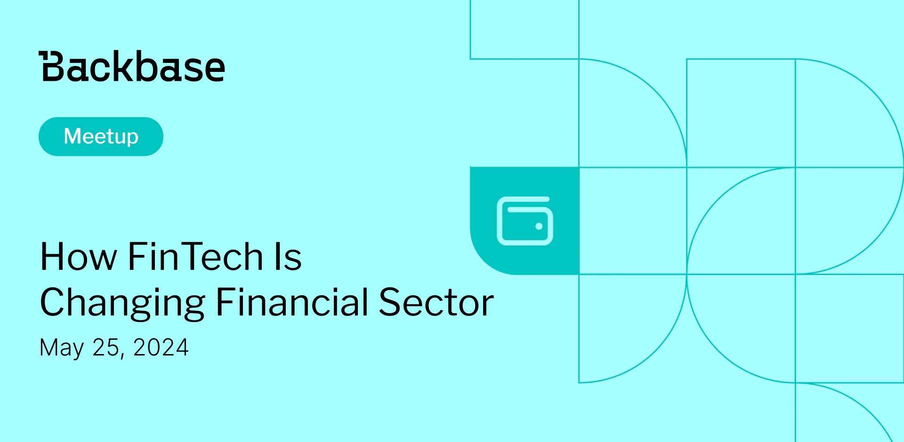

# How FinTech is Changing Financial Sector

Event date: May 25, 2023 | Backbase office | FinTech

Authors: Backbase Meetups
Date: 2023-05-01T07:03:38.357Z  
Category: meetups

tags: krakow, meetup, FinTech
 
--- 

## ✅ Book your spot

Join us for the next Backbase meetup where we speak not only about Tech

[Get your ticket](https://www.meetup.com/backbase-meetups/)

## Speakers & Topics

### [Grzegorz Ditrich](https://www.linkedin.com/in/grzegorzditrich/)
**Topic:** "How FinTech is changing financial sector"

## Place and time

🗓️ Event Date: May 25, 2023

🕑 Time: 5:00  PM

📍 Location: Backbase Office, High 5ive Four, Pawia 21, 31-154 Kraków
[See the map](https://maps.app.goo.gl/UWpwQ9zNaJBxPLEV9)

## Agenda

5:00 PM - 5:15 PM - Doors open, grab a drink

5:15 PM - 5:30 PM - Welcome

5:30 PM - 6:15 PM - Grzegorz Ditrich | "How FinTech is changing financial sector" (in english)

6:15 PM - 7:00 PM - Networking, food&drinks

[Get your ticket](https://www.meetup.com/backbase-meetups/)
