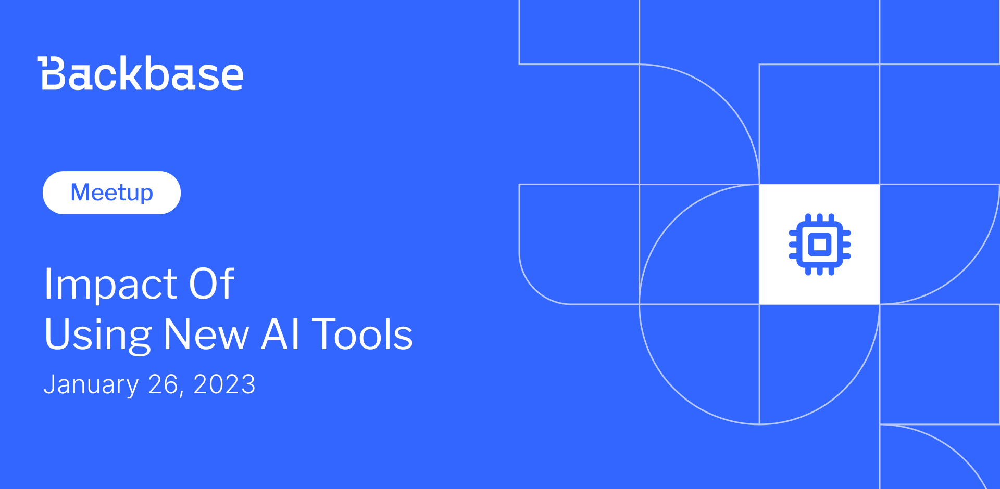

# Impact of using new AI tools

Event date: January 26, 2023 | Backbase office | AI, OpenAI

Authors: Backbase Meetups
Date: 2023-01-01T08:44:35.203Z  
Category: meetups

tags: ux, test, fine
 
--- 

# ✅ Book your spot

Join us for the next Backbase meetup where we speak not only about Tech

🚨 Limited spots available!

[Get your ticket](https://#)

# Speakers & Topics

[Tomasz Aleksandrowicz](https://www.linkedin.com/in/tomasz-aleksandrowicz-7757372/)
"Impact of using new AI tools on software development with OpenAI Chat example"

We'd like to invite everyone for the extended Tech-Talk. Starting from this event CS, RnD and Business are included.
The presentation will take place onsite in Kraków office and will be transmitted online.

# Place and time

🗓️ Event Date: 26 January 2023

🕑 Time: 4:00 pm

📍 Location: Backbase Office, High 5ive Four, Pawia 21, 31-154 Kraków
[See the map](https://googlemaps)

# Agenda

4:00pm - 4:15pm - Doors open, grab a drink
4:15pm - 6:00pm - Tomasz Aleksandrowicz | "Impact of using new AI tools on software development with OpenAI Chat example" (in english)
6:00pm - 7:00pm - Networking, food&drinks

🚨 Don't forget to book your spot!

[Get your ticket](https://#)
