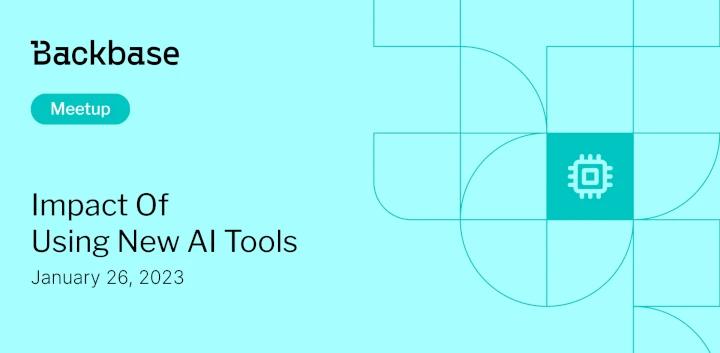

# Impact of Using New AI Tools

Event date: January 26, 2023 | Backbase office | AI, OpenAI

Authors: Backbase Meetups
Date: 2023-01-01T08:44:35.203Z  
Category: meetups

tags: krakow, meetup, AI, OpenAI

---

## ✅ Book your spot

Join us for the next Backbase meetup where we speak not only about Tech

[Get your ticket](https://www.meetup.com/backbase-meetups/)

## Speakers & Topics

### [Tomasz Aleksandrowicz](https://www.linkedin.com/in/tomasz-aleksandrowicz-7757372/)
**Topic:** "Impact of using new AI tools on software development with OpenAI Chat example"

We'd like to invite everyone for the extended Tech-Talk. Starting from this event CS, RnD and Business are included.
The presentation will take place onsite in Kraków office and will be transmitted online.

## Place and time

🗓️ Event Date: January 26, 2023

🕑 Time: 4:00  PM

📍 Location: Backbase Office, High 5ive Four, Pawia 21, 31-154 Kraków
[See the map](https://maps.app.goo.gl/UWpwQ9zNaJBxPLEV9)

## Agenda

4:00 PM - 4:15 PM - Doors open, grab a drink

4:15 PM - 6:00 PM - Tomasz Aleksandrowicz | "Impact of using new AI tools on software development with OpenAI Chat example" (in english)

6:00 PM - 7:00 PM - Networking, food&drinks

[Get your ticket](https://www.meetup.com/backbase-meetups/)
