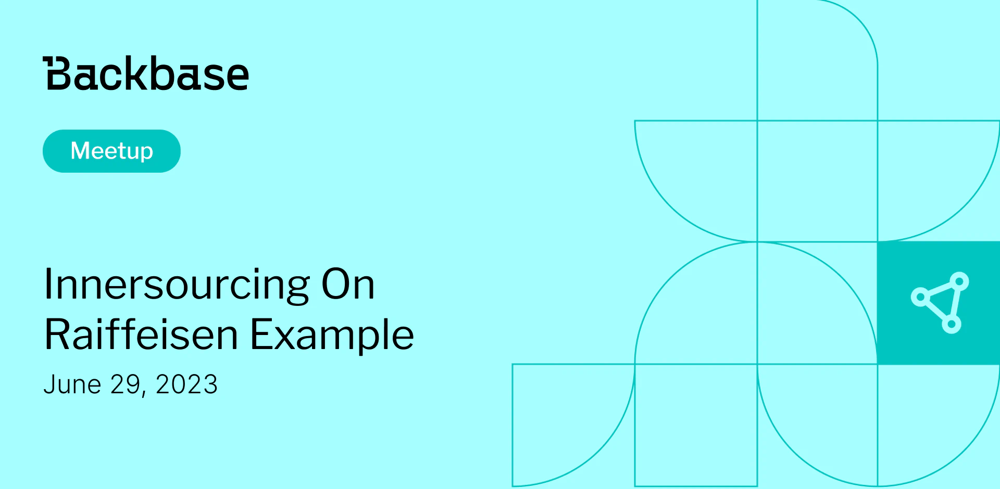

# Innersourcing on Raiffeisen example

Event date: June 29, 2023 | Backbase office | iOS

Authors: Backbase Meetups
Date: 2023-06-01T07:05:04.716Z  
Category: meetups

tags: krakow, meetup, iOS
 
--- 

# ✅ Book your spot

Join us for the next Backbase meetup where we speak not only about Tech

[Get your ticket](https://www.meetup.com/backbase-meetups/)

# Speakers & Topics

[Mariusz Jakowienko](https://www.linkedin.com/in/mariusz-ios-developer/)
"Innersourcing on Raiffeisen example"

# Place and time

🗓️ Event Date: 29 June 2023

🕑 Time: 5:00 pm

📍 Location: Backbase Office, High 5ive Four, Pawia 21, 31-154 Kraków
[See the map](https://maps.app.goo.gl/UWpwQ9zNaJBxPLEV9)

# Agenda

5:00pm - 5:15pm - Doors open, grab a drink
5:15pm - 5:30pm - Welcome
5:30pm - 6:15pm - Mariusz Jakowienko | "Innersourcing on Raiffeisen example" (in english)
6:15pm - 7:00pm - Networking, food&drinks

[Get your ticket](https://www.meetup.com/backbase-meetups/)
