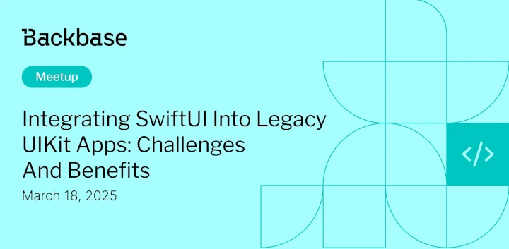

# Integrating SwiftUI into Legacy UIKit Apps

Event date: Event date: March 18, 2025 | Backbase office | iOS

Authors: Backbase Meetups
Date: 2025-03-18T13:47:04.976Z  
Category: meetups

tags: krakow, meetup, UX

Location: Krakow
 
--- 

## ✅ Book your spot

Join us for the next Backbase meetup where we speak not only about Tech

[Get your ticket](https://www.meetup.com/backbase-meetups/)

## Speakers & Topics

### [Ramazan Abdullayev](https://pl.linkedin.com/in/ramazanabdullayev)
"Modernize Your UIKit App: Adding SwiftUI Screens Seamlessly"

#### BIO
iOS Engineer with around four years of experience creating modern and user-friendly mobile applications. 
Passionate about writing efficient Swift code and continuously improving my skills in building dynamic SwiftUI interfaces, 
with primary experience in the banking domain delivering reliable mobile solutions.

---

### [Aleh Pachtovy](https://www.linkedin.com/in/aleh-pachtovy-34459036/)
"Combine in Action: Building Reactive ViewModels for SwiftUI"

#### BIO
A highly skilled iOS developer with 9 years of experience in designing, developing, and maintaining iOS applications. 
Proficient in Cocoa Touch, Xcode, Swift and SwiftUI, with a strong background in modularizing and optimizing code for improved performance and user experience

## Place and time

🗓️ Event Date: March 18, 2025

🕑 Time: 18:00

📍 Location: Backbase Office, High 5ive Four, Pawia 21, 31-154 Kraków
[See the map](https://maps.app.goo.gl/UWpwQ9zNaJBxPLEV9)

## Agenda

18:00 - 18:05 - Registration, grab a drink

18:05 - 18:35 - Ramazan Abdullayev | "Modernize Your UIKit App: Adding SwiftUI Screens Seamlessly" [ENG]

18:40 - 19:05 - Aleh Pachtovy | "Combine in Action: Building Reactive ViewModels for SwiftUI" [ENG]

19:10 - 19:55 - Networking, food & drinks

[Get your ticket](https://www.meetup.com/backbase-meetups/)
