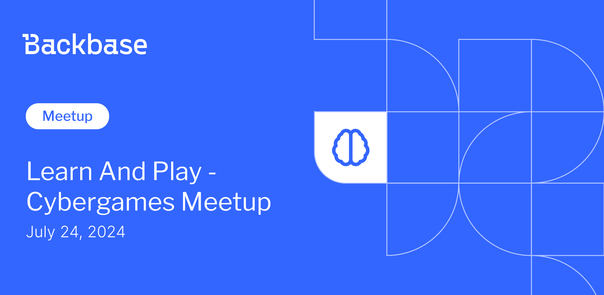

# Learn and play - Cybergames meetup

Event date: July 24, 2024 | Backbase office | Games

Authors: Backbase Meetups
Date: 2024-07-01T08:56:49.711Z  
Category: meetups

tags: ux, test, fine
 
---

# ✅ Book your spot

Join us for the next Backbase meetup where we speak not only about Tech

🚨 Limited spots available!

[Get your ticket](https://www.meetup.com/backbase-meetups/events/301693056)

# Speakers & Topics

[Jonathan Bevers](https://www.linkedin.com/in/jonathan-b-019524156/)
"Backdoors & Breaches, an Incident Response Card Game"

# Place and time

🗓️ Event Date: 24 July 2024

🕑 Time: 6:00 pm

📍 Location: Backbase Office, High 5ive Four, Pawia 21, 31-154 Kraków
[See the map](https://googlemaps)

# Agenda

4:00pm - 4:15pm - Doors open, grab a drink
4:15pm - 5:00pm - Jonathan Bevers | "Behavioral Science Meets UX: Leveraging Psychology to Improve User Engagement" (in english)
5:00pm - 5:15pm - Break
6:00pm - 7:00pm - Networking, food&drinks

🚨 Don't forget to book your spot!

[Get your ticket](https://www.meetup.com/backbase-meetups/events/301693056
