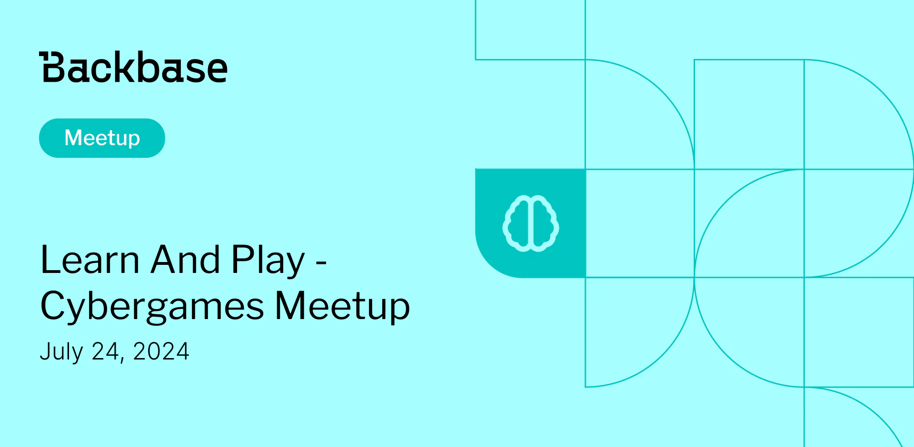

# Learn and Play - Cybergames Meetup

Event date: July 24, 2024 | Backbase office | Games

Authors: Backbase Meetups
Date: 2024-07-01T08:56:49.711Z  
Category: meetups

tags: krakow, meetup, Cybergames
 
---

## ✅ Book your spot

Join us for the next Backbase meetup where we speak not only about Tech

[Get your ticket](https://www.meetup.com/backbase-meetups/)

## Speakers & Topics

### [Jonathan Bevers](https://www.linkedin.com/in/jonathan-b-019524156/)
**Topic:** "Backdoors & Breaches, an Incident Response Card Game"

## Place and time

🗓️ Event Date: July 24, 2024

🕑 Time: 6:00  PM

📍 Location: Backbase Office, High 5ive Four, Pawia 21, 31-154 Kraków
[See the map](https://maps.app.goo.gl/UWpwQ9zNaJBxPLEV9)

## Agenda

4:00 PM - 4:15 PM - Doors open, grab a drink

4:15 PM - 5:00 PM - Jonathan Bevers | "Behavioral Science Meets UX: Leveraging Psychology to Improve User Engagement" (in english)

5:00 PM - 5:15 PM - Break

6:00 PM - 7:00 PM - Networking, food&drinks

[Get your ticket](https://www.meetup.com/backbase-meetups/)
