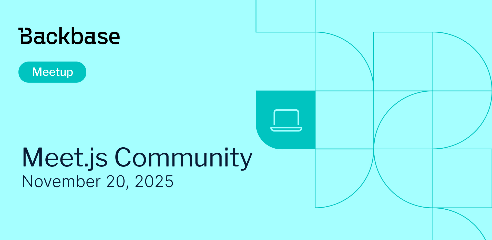

# Meet.js Community

Event date: November 20, 2025 | Backbase office | Meet.js

Authors: Backbase Meetups
Date: 2025-11-20T08:35:07.567Z  
Category: meetups

tags: krakow, meetup, meet.js, javascript, front-end

Location: Krakow
 
--- 

## ✅ Book your spot

Join us for the next Backbase meetup where we speak not only about Tech

[Get your ticket](https://www.meetup.com/krakowjs/events/311868918/)

## Speakers & Topics

### [Piotr Maliga](https://www.linkedin.com/in/piotr-maliga)

"Angular is not that bad"

Curious why developers are giving Angular another chance? In this talk, we’ll explore the latest updates – like standalone components, faster builds, and cleaner architecture – that have completely transformed the framework. Come see how modern Angular might just surprise you and win back your developer heart!

#### BIO

I am a Frontend Engineer at Backbase with nearly four years of experience in developing web applications. I hold an engineering degree in Information Technology from the Pedagogical University of Cracow and am currently completing my Master's degree with a specialization in Cybersecurity at Cracow University of Technology.

### [Timofei Iatsenko](https://www.linkedin.com/in/timofei-iatsenko-59767375/)

"Internalization with LinguiJS"

In this talk, I’ll share what makes a good internationalization system and how LinguiJS — the library I maintain — approaches these challenges. Even if you decide to use a different solution, you’ll walk away knowing what to look for and how to avoid common i18n pitfalls.

#### BIO

I’ve been working in software development for over 13 years, mostly with JavaScript and TypeScript. I’m a frontend tech lead by day and, in my spare time, I build developer tools — from transpiler plugins and codemods to static analysis utilities. I’ve contributed to projects like Babel and NestJS, and since 2022, I’ve been a maintainer of the LinguiJS library.

### Mikołaj Bogucki

"Beyond Video Calls: A Practical Introduction to WebRTC"

In this talk, we’ll look into the WebRTC – what it is, how its APIs work, and why it’s more than just video chat tool.
We’ll explore unconventional uses like peer‑to‑peer databases, real‑time data sharing, and even distributed systems built entirely in the browser. If you’ve ever wanted to quickly create an app but didn’t want to bother with hosting a backend and a database see how tools built on top of WebRTC might be the right solution for you.

#### BIO

Mikołaj is a software engineer at Lunar Logic specializing in back-end development with Node.js. He is passionate about Infrastructure as Code, privacy-focused development, and crafting modular, maintainable solutions without unnecessary complexity. Mikołaj started coding in primary school, beginning with batch and CMD scripts, and has used Node.js since version 8. He values WebRTC as a technology for building simple, backend-free side projects. Outside work, he enjoys playing cards, organizing bridge tournaments, and rock climbing.

## Place and time

🗓️ Event Date: November 20, 2025

🕑 Time: 17:30

📍 Location: Backbase Office, High 5ive Four, Pawia 21, 31-154 Kraków

[See the map](https://maps.app.goo.gl/UWpwQ9zNaJBxPLEV9)

## Agenda

17:30 - 17:45 - Registration, grab a drink

17:45 - 17:55 - Welcome from Backbase and meet.js

18:00 - 18:20 - Piotr Maliga | "Angular is not that bad"

18:25 - 18:50 - Timofei Iatsenko | "Internalization with LinguiJS"

18:50 - 19:25 - Mikołaj Bogucki | "Beyond Video Calls: A Practical Introduction to WebRTC"

19:30 - 20:30 - Networking, food & drinks
