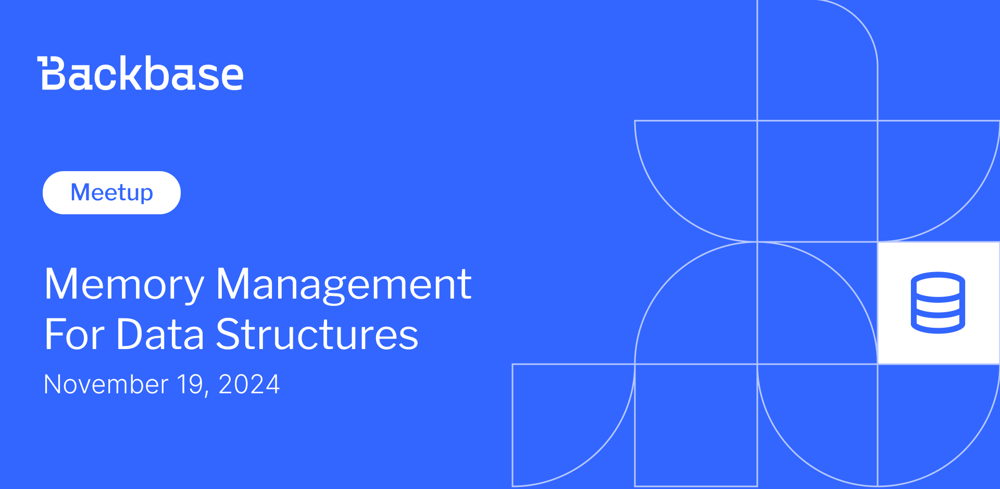

# Memory management for Data Structures - Fundamentals

Event date: November 19, 2024 | Backbase office | Backend

Authors: Backbase Meetups
Date: 2024-11-01T08:59:33.493Z  
Category: meetups

tags: ux, test, fine
 
--- 

# ✅ Book your spot

Join us for the next Backbase meetup where we speak not only about Tech

🚨 Limited spots available!

[Get your ticket](https://www.meetup.com/backbase-meetups/events/304374021)

# Speakers & Topics

[Pawel Chrzanowski](https://www.linkedin.com/in/pchrzanowski/)
"Memory management for Data Structures - Fundamentals"

Data structures are the pillars of programming in any language. Working with them with a good understanding of how they interact with memory and how they perform in time is crucial for every software engineer.
On a daily basis developers need to solve problems first conceptually but later on if they want to tackle them properly only coding foundation is not enough.
The talk is going to first cover different data types that apply to any programming language and then focus on memory usage in context of performance.

# Place and time

🗓️ Event Date: 19 December 2024

🕑 Time: 5:30 pm

📍 Location: Backbase Office, High 5ive Four, Pawia 21, 31-154 Kraków
[See the map](https://googlemaps)

# Agenda

5:30pm - 5:45pm - Doors open, grab a drink
5:45pm - 5:50:pm - Welcome
5:50pm - 7:00pm - Pawel Chrzanowski | "Memory management for Data Structures - Fundamentals" (in english)
7:05pm - 8:00pm - Networking, food&drinks

🚨 Don't forget to book your spot!

[Get your ticket](https://www.meetup.com/backbase-meetups/events/304374021)
