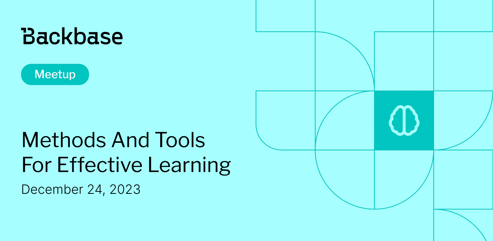

# Methods and Tools for Effective Learning and Memory Retention

Event date: December 14, 2023 | Backbase office | Learning

Authors: Backbase Meetups
Date: 2023-12-01T07:11:29.876Z  
Category: meetups

tags: krakow, meetup, Learning
 
--- 

# ✅ Book your spot

Join us for the next Backbase meetup where we speak not only about Tech

[Get your ticket](https://www.meetup.com/backbase-meetups/)

# Speakers & Topics

[Magdalena Chmura-Kula](https://www.linkedin.com/in/magdalena-chmura/)
"Methods and Tools for Effective Learning and Memory Retention"

# Place and time

🗓️ Event Date: December 14, 2023

🕑 Time: 5:00  PM

📍 Location: Backbase Office, High 5ive Four, Pawia 21, 31-154 Kraków
[See the map](https://maps.app.goo.gl/UWpwQ9zNaJBxPLEV9)

# Agenda

5:00 PM - 5:15 PM - Doors open, grab a drink
5:15 PM - 5:30 PM - Welcome
5:30 PM - 6:15 PM - Magdalena Chmura-Kula | "Methods and Tools for Effective Learning and Memory Retention" (in english)
6:15 PM - 7:00 PM - Networking, food&drinks

[Get your ticket](https://www.meetup.com/backbase-meetups/)
