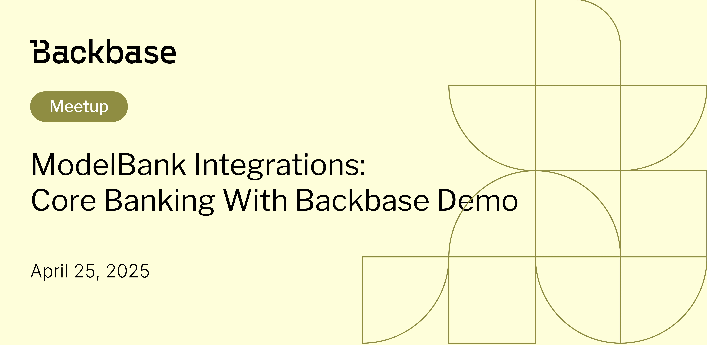
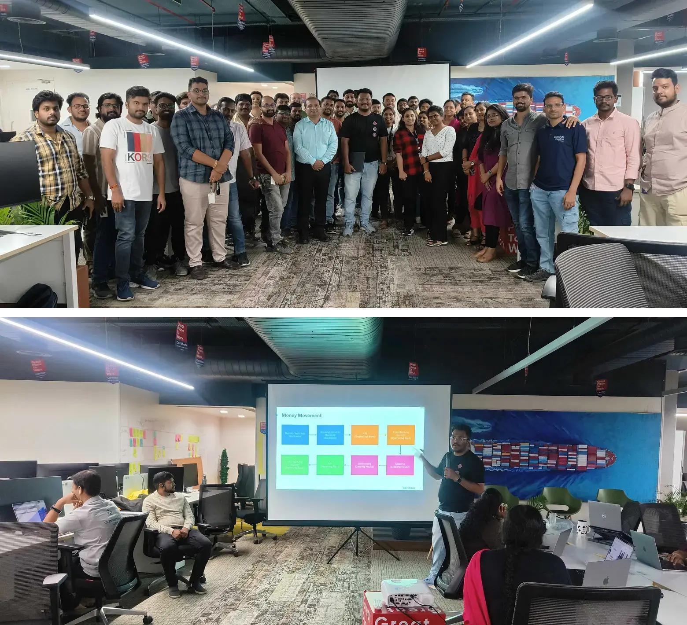

# ModelBank Integrations

Event date: April 25, 2025 | Backbase office | BaaS

Authors: Backbase Meetups
Date: 2025-04-25T15:29:35.900Z  
Category: meetups

tags: hyderabad, meetup, baas, modalbank, transaction, payments

Location: Hyderabad
 
--- 

## See how it went

## Speakers & Topics

### [Anil G](https://www.linkedin.com/in/g-anil/)
"Explore the fundamentals of core banking operations and Backbase's Model Bank through a hands on money movement demo using out of the box functionalities—no customizations, just real insights."

#### BIO
Namaste, I'm a Solutions Architect with 14+ years of experience in event driven microservices, intelligent automation, and cloud native apps. Currently leading digital banking projects with the largest private bank in the Philippines, I bring deep expertise in Java, Kafka, AWS, and Philippine payment systems like InstaPay and PESONet. Off the clock, you’ll find me smashing shuttles on the badminton court, my ultimate happy place

## Place and time

🗓️ Event Date: April 25, 2025

🕑 Time: 3:30 - 4:15 PM

📍 Location: Backbase Office, Ground Floor, Western Aqua Whitefield Road, Hitec City Hyderabad - 500084 
[See the map](https://maps.app.goo.gl/zSPnbmr9i9EAFD747)

## Agenda

How Core Banking Works? - 5 mins

Model Banking Integrations? 15 mins

Q & A - 15 mins

[Get your ticket](https://www.meetup.com/backbase-meetups/)
<!-- vale on -->
