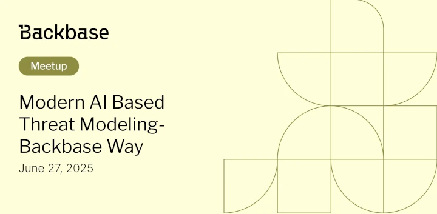

# Modern AI Based Threat Modeling

Event date: June 27, 2025 | Backbase office | BaaS

Authors: Backbase Meetups
Date: 2025-06-27T15:29:35.900Z  
Category: meetups

tags: hyderabad, meetup, SDLC, Threat modeling, Security

Location: Hyderabad
 
--- 

## Speakers & Topics

### [Krishna Kumar Sekar](https://www.linkedin.com/in/krishna-kumar-sekar-9a090048/)
"Secure by design is a key principle in SDLC but maintaining the same design in throughout SDLC is not really happening in Agile world due to regular change/addition of requirement in mid of the SDLC. To eradicate and to overcome the security loopholes throughout SDLC a best and effective way in AI world is to automate threat modeling. Whenever a DFD changed threat modeling will happen automatically"

#### BIO
Highly accomplished Senior Backend/Cloud Engineer with over 12 years of experience architecting and developing robust, secure micro-services for the banking sector. Proven expertise in authentication/authorization (3DS, Fingerprint) and payment engines (Apple Pay, Worldline) for leading institutions like BNPP and Lloyds.

Successfully delivered secure customer onboarding solutions on Google Cloud, integrating ID/passport verification via anonymous micro-services routed through ThreatMetrix. Currently spearheading the development of STRIDE-analyzed, BIAN-compliant unified integration services on Azure within the BACKBASE Banking Engagement Platform.

## Place and time

🗓️ Event Date: June 27, 2025

🕑 Time: 3:30 - 4:15 PM

📍 Location: Backbase Office, Ground Floor, Western Aqua Whitefield Road, Hitec City Hyderabad - 500084 
[See the map](https://maps.app.goo.gl/zSPnbmr9i9EAFD747)

## Agenda

About Threat modeling - 15 mins

Q & A - 15 mins

[Get your ticket](https://www.meetup.com/backbase-hyderabad/)
<!-- vale on -->
