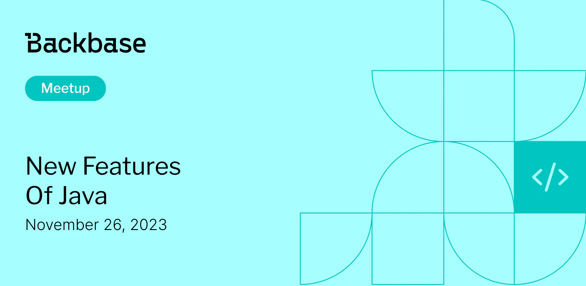

# New features of Java

Event date: November 26, 2023 | Backbase office | Java, Back-end

Authors: Backbase Meetups
Date: 2023-11-01T07:10:03.011Z  
Category: meetups

tags: krakow, meetup, Java, Back-end
 
--- 

# ✅ Book your spot

Join us for the next Backbase meetup where we speak not only about Tech

[Get your ticket](https://www.meetup.com/backbase-meetups/)

# Speakers & Topics

[Michał Wadas](https://www.linkedin.com/in/micha%C5%82-wadas-285b68171/)
"New features of Java"

# Place and time

🗓️ Event Date: 26 November 2023

🕑 Time: 5:00 pm

📍 Location: Backbase Office, High 5ive Four, Pawia 21, 31-154 Kraków
[See the map](https://maps.app.goo.gl/UWpwQ9zNaJBxPLEV9)

# Agenda

5:00pm - 5:15pm - Doors open, grab a drink
5:15pm - 5:30pm - Welcome
5:30pm - 6:15pm - Michał Wadas | "New features of Java" (in english)
6:15pm - 7:00pm - Networking, food&drinks

[Get your ticket](https://www.meetup.com/backbase-meetups/)
