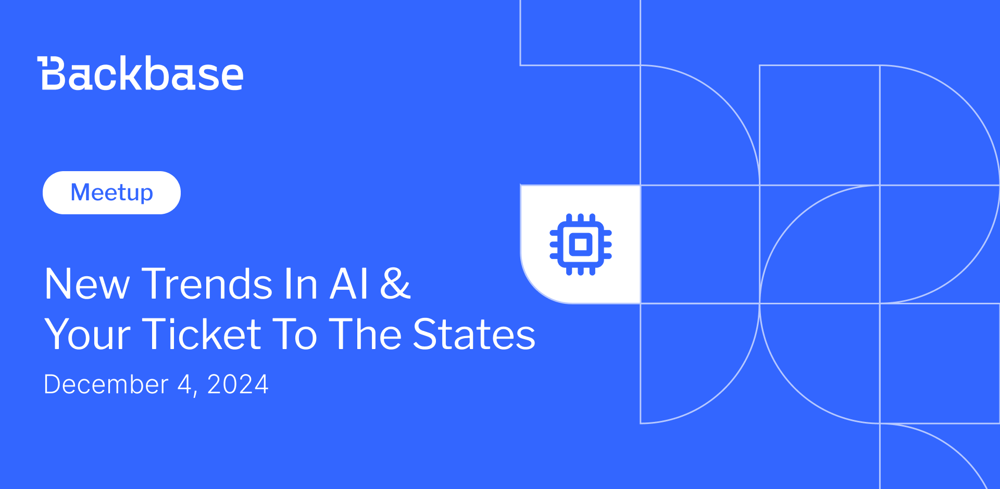

# New trends in AI & Your Ticket to the States

Event date: December 4, 2024 | Backbase office | AI

Authors: Backbase Meetups
Date: 2024-12-01T09:00:11.276Z  
Category: meetups

tags: ux, test, fine
 
--- 

# ✅ Book your spot

Join us for the next Backbase meetup where we speak not only about Tech

🚨 Limited spots available!

[Get your ticket](https://www.meetup.com/backbase-meetups/events/304522625)

# Speakers & Topics

[Tomasz Aleksandrowicz](https://www.linkedin.com/in/tomasz-aleksandrowicz-7757372/)
"AI and what next?"

Summary of 2024: biggest events and most important changes, products and announcements
Examples of most current applications of AI in products and services
Following AI-trends predictions on what to expect in 2025

–––––

[Monika Nowakowska](https://www.linkedin.com/in/monika-nowakowska-71b196105/)
"Your Ticket to the States: Plan, Pack, and Go!"

Have you ever thought about traveling to the States but didn’t know where to start? I was in the same boat, and I’d be happy to share my journey and tips from my American adventure. 1 month, 4,000 kilometers, and 7 national parks. Get set for an unforgettable adventure across the States!

# Place and time

🗓️ Event Date: 4 December 2024

🕑 Time: 6:00 pm

📍 Location: Backbase Office, High 5ive Four, Pawia 21, 31-154 Kraków
[See the map](https://googlemaps)

# Agenda

6:00pm - 6:15pm - Doors open, grab a drink
6:15pm - 6:20pm - Welcome
6:20pm - 7:15pm - Tomasz Aleksandrowicz | "AI and what next?" (in english)
7:15pm - 7:30pm - Monika Nowakowska | "Your Ticket to the States: Plan, Pack, and Go!" (in english)
7:30pm - 8:15pm - Networking, food&drinks

🚨 Don't forget to book your spot!

[Get your ticket](https://www.meetup.com/backbase-meetups/events/304522625)
