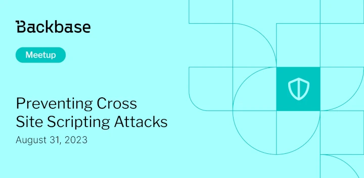

# Preventing Cross Site Scripting Attacks

Event date: August 31, 2023 | Backbase office | hacking, backend

Authors: Backbase Meetups
Date: 2023-09-01T07:06:24.046Z  
Category: meetups

tags: krakow, meetup, hacking, backend

Location: Krakow
 
--- 

## ✅ Book your spot

Join us for the next Backbase meetup where we speak not only about Tech

[Get your ticket](https://www.meetup.com/backbase-meetups/)

## Speakers & Topics

### [Michał Kozak ](https://www.linkedin.com/in/mkozak/)
**Topic:** "Preventing Cross Site Scripting Attacks"

## Place and time

🗓️ Event Date: August 31, 2023

🕑 Time: 5:00  PM

📍 Location: Backbase Office, High 5ive Four, Pawia 21, 31-154 Kraków
[See the map](https://maps.app.goo.gl/UWpwQ9zNaJBxPLEV9)

## Agenda

5:00 PM - 5:15 PM - Doors open, grab a drink

5:15 PM - 5:30 PM - Welcome

5:30 PM - 6:15 PM - Michał Kozak | "Preventing Cross Site Scripting Attacks" (in english)

6:15 PM - 7:00 PM - Networking, food & drinks

[Get your ticket](https://www.meetup.com/backbase-meetups/)
