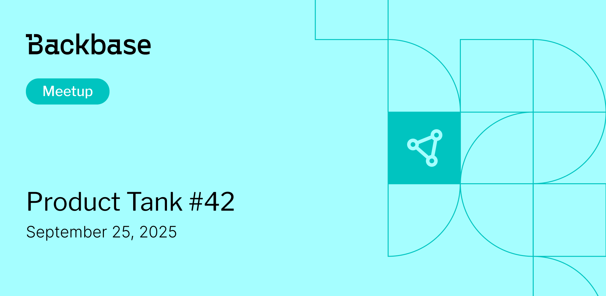

# Product Tank #42

Event date: September 25, 2025 | Backbase office | Product Tank | Product Management

Authors: Backbase Meetups
Date: 2025-08-28T12:28:28.948Z  
Category: meetups
Location: Krakow

tags: krakow, meetup, product management, product owner, product tank

--- 

## ✅ Book your spot

Join us for the next Backbase meetup where we speak not only about Tech

[Get your ticket](https://www.meetup.com/backbase-meetups/)

## Speakers & Topics

### [Carlos Oliveira](https://www.linkedin.com/in/carloscxo/)

"AI in Content Marketing: 4 Practical Tips and Observations"

AI is reshaping how products connect with their audiences. This talk shares four practical ways product professionals can apply AI in content marketing to better position products, streamline go-to-market efforts, and support data-driven storytelling.

#### BIO

Carlos is a Product Marketing Manager with over 15 years of experience in content creation and strategy. Born and raised in Brazil, he has called Poland home for the past eight years. He's worked for seven years as a journalist and has interviewed over 200 people from all over the world, from Honduras to Kosovo! He now brings that expertise to the world of marketing within the IT sector.

---

### [Viacheslav Husarov](https://www.linkedin.com/in/vee-husarov)

"Embracing the AI Bubble: A Practical Tips for AI Strategy for SMB B2B"

The strongest AI advantages rarely announce themselves. This talk reveals “quiet” levers for small/mid-size B2B teams: from unlocking your data potential to positioning for the next distribution shift. Expect practical steps, a few unsettling questions, and a playbook for moving first.

#### BIO

Product leader with 6 years in B2B SaaS Product Management and 3 years in Software Development. Expert at shaping AI-driven product strategies, driving cross-functional teams, and launching features that lift revenue, adoption, and user satisfaction.

## Place and time

🗓️ Event Date: September 25, 2025

🕑 Time: 18:00

📍 Location: Backbase Office, High 5ive Four, Pawia 21, 31-154 Kraków

[See the map](https://maps.app.goo.gl/UWpwQ9zNaJBxPLEV9)

## Agenda

18:00 - 18:15 - Registration, grab a drink

18:15 - 18:20 - Welcome from Product Tank

18:20 - 18:25 - Welcome from Backbase

18:25 - 19:00 - Carlos Oliveira | "AI in Content Marketing: 4 Practical Tips and Observations"

19:00 - 19:10 - food & drinks

19:10 - 19:40 - Viacheslav Husarov | "Embracing the AI Bubble: A Practical Tips for AI Strategy for SMB B2B"

19:30 - 21:00 - Networking, food & drinks

[Get your ticket](https://www.meetup.com/backbase-meetups/)
