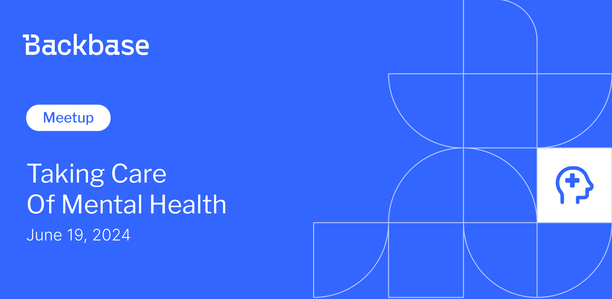

# Taking care of mental health

June 19, 2024 | Backbase office | User Experience

Authors: Backbase Meetups
Date: 2024-06-01T08:56:12.211Z  
Category: meetups

tags: ux, test, fine
 
--- 

# ✅ Book your spot

Join us for the next Backbase meetup where we speak not only about Tech

🚨 Limited spots available!

[Get your ticket](https://www.meetup.com/backbase-meetups/events/301134936)

# Speakers & Topics

[Karolina Sochacz](https://www.linkedin.com/in/karolina-sochacz/)
"Taking care of mental health"

A dive into the behavioral principles that drive user behavior, from cognitive biases to motivation theory. Practical examples on how understanding psychological triggers can improve design for better engagement, retention, and user satisfaction would make this a fascinating session for UX designers and product managers alike.

# Place and time

🗓️ Event Date: 19 June 2024

🕑 Time: 4:00 pm

📍 Location: Backbase Office, High 5ive Four, Pawia 21, 31-154 Kraków
[See the map](https://googlemaps)

# Agenda

4:00pm - 4:15pm - Doors open, grab a drink
4:15pm - 5:00pm - Karolina Sochacz | "Taking care of mental health" (in english)
5:00pm - 5:15pm - Break
5:15pm - 6:00pm - Lightning talks space
6:00pm - 7:00pm - Networking, food&drinks

🚨 Don't forget to book your spot!

[Get your ticket](https://www.meetup.com/backbase-meetups/events/301134936)
