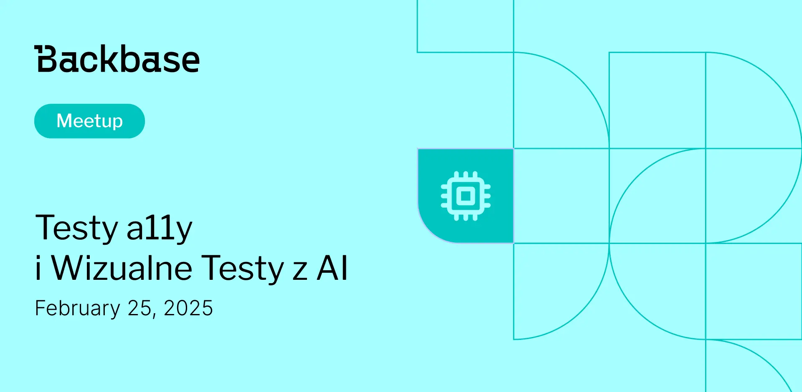

# Testy a11y i wizualne testy z AI

Event date: February 25, 2025 | Backbase office | QA

Authors: Backbase Meetups
Date: 2025-02-25T10:00:42.612Z  
Category: meetups
Location: Krakow

tags: krakow, meetup, QA
 
--- 
## ✅ Book your spot

Zapraszamy serdeniczenie na kolejne wydarzenie z cyklu Tech Talk Meetup

[Get your ticket](https://www.meetup.com/backbase-meetups/)

## Speakers & Topics

### [Robert Bobby Gędłek](https://www.linkedin.com/in/robert-gedlek/)
"Testy dostępności (accessibility) – “Od zera do… bohatera?”: Nie takie testy dostępności straszne jak je malują"

#### BIO
Bobby developer in Test. Ponad 23 lata w branży IT z bagażem doświadczeń. Stack techniczny to ekosystem Javy

---

### [Darek Majcherczyk]()
"AI na Straży Pikseli: Ewolucja w Visual Testing"

#### BIO
Spec od automatyzacji i CI z długoletnim stażem, który testuje wszystko – od frontendu i backendu po mobile. Jakość to moja misja, a AI to sekretna broń, która podnosi testowanie na nowy poziom.

## Place and time

🗓️ Event Date: February 25, 2025

🕑 Time: 6:00  PM

📍 Location: Backbase Office, High 5ive Four, Pawia 21, 31-154 Kraków
[See the map](https://maps.app.goo.gl/UWpwQ9zNaJBxPLEV9)

## Agenda

6:00 - 6:05 PM - Rejestracja uczestnikow

6:05 - 6:45 PM - Robert Bobby Gędłek | "Testy dostępności (accessibility) – “Od zera do… bohatera?”: Nie takie testy dostępności straszne jak je malują" [POL]

6:50 - 7:30 PM - Darek Majcherczyk | "AI na Straży Pikseli: Ewolucja w Visual Testing" [POL]

7:30 - 08:00 PM - Networking, food & drinks

[Get your ticket](https://www.meetup.com/backbase-meetups/)
