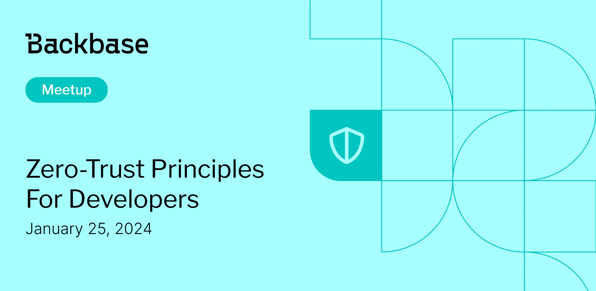

# Zero-Trust principles for developers

Event date: January 25, 2024 | Backbase office | Zero-Trust

Authors: Backbase Meetups
Date: 2024-01-01T07:14:28.488Z  
Category: meetups

tags: krakow, meetup, Zero-Trust
 
--- 

# ✅ Book your spot

Join us for the next Backbase meetup where we speak not only about Tech

[Get your ticket](https://www.meetup.com/backbase-meetups/)

# Speakers & Topics

[Brian Vlootman](https://www.linkedin.com/in/brianvlootman/)
"Zero-Trust principles for developers"

# Place and time

🗓️ Event Date: 25 January 2024

🕑 Time: 5:00  PM

📍 Location: Backbase Office, High 5ive Four, Pawia 21, 31-154 Kraków
[See the map](https://maps.app.goo.gl/UWpwQ9zNaJBxPLEV9)

# Agenda

5:00 PM - 5:15 PM - Doors open, grab a drink
5:15 PM - 5:30 PM - Welcome
5:30 PM - 6:15 PM - Brian Vlootman | "Zero-Trust principles for developers" (in english)
6:15 PM - 7:00 PM - Networking, food&drinks

[Get your ticket](https://www.meetup.com/backbase-meetups/)
