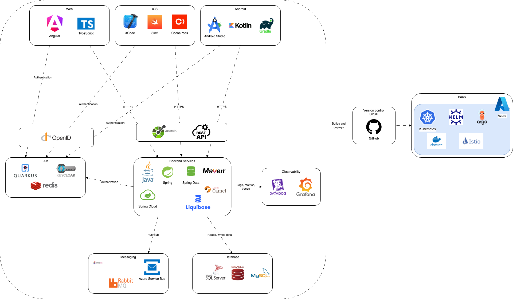

# Backbase Engagement Banking Platform Tech Stack

What exactly is being used to build banking applications in Backbase?

Authors: Paweł Garbacik
Date: unpublished
Category: tech-life

tags: architecture,technology,patterns,stack

---

## Introduction

Backbase Engagement Banking Platform is a comprehensive solution with a lot of capabilities.
It is thought out and designed to provide modern architecture with the latest market standards,
the most advanced security mechanisms, and great extensibility and flexibility to make it easy
to integrate with different core banking systems.

To achieve this, different technologies, frameworks, standards, and architectural patterns need to be combined.

This article aims to provide an insight into how the Backbase software is built and integrated on a high level,
what kind of technologies are used on a different levels and layers.

## High level architecture

Engagement Banking Platform is divided according to the capabilities it offers, the role it plays, and on which level it operates.

Each service is designed to perform completely different tasks and offers specific ways to interact with it.

On the top there are client-facing apps. These applications are available for 2 different platforms:

* Web applications - available on modern web-browsers, dedicated for different group of users, segregated by the roles and responsibilities
* Mobile applications - available on popular mobile devices powered by iOS and Android Mobile OSs

These applications allow to interact with backend services for these users who have proper permissions.
Client APIs are a dedicated and well secured APIs designed for interaction between client-facing applications and backend services.
They use OIDC Authorization flow with PKCE.

Between client-facing applications and backend services there is a dedicated layer of security services and generic services like document store or auditing.

Next layer offers specific banking services like Arrangements, Batches, Cards, Contacts, Payments etc.
These services offer set of functions oriented on a specific banking capability.
Interaction between services on this layer is possible through the Service APIs and it is secured with OAuth2.0 Client Credential flow.

To interact with Core Banking services or Third Party services, there is a dedicated integration layer.
Banking Services have defined set of integration APIs for outbound and inbound connectivity.
Outbound APIs are for communication from BB to Core. Inbound APIs are from communication from Core to BB.
This makes asynchronous data exchange easy to achieve and the load can be optimised by the Core.
In many scenarios, Integration Services are implemented as a separate layer where the communication with Core is defined
and custom logic is implemented.
This approach gives the flexibility of the solution because there is one shared API spec between Banking and Integration Services,
and what is more Integration Services can deliver something specific which is required to properly deliver integration with Core Banking.
Integration APIs are secured with mTLS.

Backbase has also a new way for integrating with Core and Third Parties. It was introduced in 2024, and it is called Grand Central.
Grand Central is something like Integration Platform or Connectivity Platform. It is integrated with Banking Services,
and it is focused on building integration connectors as a small pieces. In this approach the delivery effort is smaller and time to market is shorter.
Grand Central is built with quite different approach. Because GC is focused on quick delivery of new integration connectors it is built with the framework
which supports most of the Enterprise Integration Patterns - Apache Camel. Development of the connectors is focused on delivering serverless lightweight services - Kamelets, 
and thanks to that, developers can devote most of their effort to prepare required business logic that need to be delivered with connectors.

## Technology Stack

To achieve the highest level of security, the best possible performance and to deliver flexibility and extensibility for entire platform,
Backbase combines different market-leading technologies.

### Web

Web solution is built on the top of leading framework Angular. Developers use also dedicated plugins and frameworks which
extend Angular capability and make development process easier and faster.

|                          |                                                                                            |
|:-------------------------|:-------------------------------------------------------------------------------------------|
| Runtime                  | [Node.js](https://nodejs.org/)                                                             |
| Package Manager          | [NPM](https://www.npmjs.com/)                                                              |
| Framework                | [Angular](https://angular.io/)                                                             |
| Programming language | [TypeScript](https://www.typescriptlang.org/)                                              |
| Dev Tools                | [NX](https://nx.dev/)                                                                      |
| API mocking tools        | [ng-apimock](https://ngapimock.org/)                                                       |
| UI framework             | [Bootstrap](https://getbootstrap.com/) [ng-bootstrap](https://ng-bootstrap.github.io/) |
| Linter                   | [ESLint](https://eslint.org/)                                                              |
| Code formatter           | [Prettier](https://prettier.io/)                                                           |
| State management         | [NgRx](https://ngrx.io/)                                                                   |
| Reactive programming | [RxJs](https://rxjs.dev/)                                                                  |
| CSS preprocessor         | [Sass](https://sass-lang.com/)                                                             |
| Testing framework        | [Jest](https://jestjs.io/)                                                                 |
| Automation library       | [Playwright](https://playwright.dev/)                                                      |

### Mobile

Mobile applications are built using native technologies. It means both platforms iOS and Android have separate codebases
for mobile applications, and they are developed in dedicated environments. This approach guaranties the best possible
performance,
and it follows best practices defined platforms creators like Apple Inc.  or Google LLC.

#### iOS

|                                  |                                                                          |
|:---------------------------------|:-------------------------------------------------------------------------|
| Programming language         | [Swift](https://www.swift.org/about/)                                    |
| IDE                              | [Xcode](https://developer.apple.com/xcode/)                              |
| Dependency manager           | [CocoaPods](https://cocoapods.org/)                                      |
| UI Framework                     | [UIKit](https://developer.apple.com/documentation/uikit)                 |
| Handling of async events     | [Combine](https://developer.apple.com/documentation/combine)             |
| Reactive programming         | [RxSwift](https://github.com/ReactiveX/RxSwift)                          |
| Unit and performance tests   | [XCTest](https://developer.apple.com/documentation/xctest)               |
| Automated screenshot testing | [SnapshotTesting](https://github.com/pointfreeco/swift-snapshot-testing) |

#### Android

|                                  |                                                                                                       |
|:---------------------------------|:------------------------------------------------------------------------------------------------------|
| Programming language         | [Kotlin](https://kotlinlang.org/docs/home.html) [Java](https://www.java.com/en/)                  |
| IDE                              | [Android Studio](https://developer.android.com/studio)                                                |
| Dependency manager           | [Gradle](https://gradle.org/)                                                                         |
| UI Framework                     | [Android UI](https://developer.android.com/develop/ui) [Material Design](https://m2.material.io/) |
| Dependency Injection         | [Koin](https://insert-koin.io/)                                                                       |
| Concurrency design pattern   | [Coroutines](https://developer.android.com/kotlin/coroutines)                                         |
| Unit tests                       | [JUnit](https://junit.org/junit4/)                                                                    |
| Mocking data                     | [Mockito](https://github.com/mockito/mockito)                                                         |
| UI testing automation        | [Espresso](https://developer.android.com/training/testing/espresso)                                   |
| Automated screenshot testing | [Shot](https://github.com/pedrovgs/Shot)                                                              |

### Backend

Backend solution is built with Java language on the top of Spring Framework. Backend solution is very elastic and configurable.
It currently supports several Database and Messaging solutions.

|                           |                                                                                                                                                                    |
|:--------------------------|:-------------------------------------------------------------------------------------------------------------------------------------------------------------------|
| Programming language  | [Java](https://www.java.com/en/) (JDK 21)                                                                                                                                  |
| Dependency manager    | [Maven](https://maven.apache.org)                                                                                                                                  |
| Frameworks                | [Spring Framework](https://spring.io/) [Spring Boot](https://spring.io/projects/spring-boot) [Spring Cloud](https://spring.io/projects/spring-data)        |
| Integration framework | [Apache Camel](https://camel.apache.org)                                                                                                                           |                                                                                |
| API                       | [RESTful](https://restfulapi.net) [OpenAPI](https://www.openapis.org/)                                                                                         |
| Databases                 | [MySQL](https://www.mysql.com/) [MSSQL](https://www.microsoft.com/en-us/sql-server) [Oracle](https://www.oracle.com/database/)                             |
| ORM                       | [Spring Data](https://spring.io/projects/spring-data)                                                                                                              |
| Database schema managemnt | [Liquibase](https://www.liquibase.org/)                                                                                                                            |
| Messaging                 | [ActiveMQ](https://activemq.apache.org/) [RabbitMQ](https://www.rabbitmq.com/) [Azure Service Bus](https://azure.microsoft.com/en-us/products/service-bus) |
| Event Streaming | [Apache Kafka](https://kafka.apache.org/) |
| Containers for testing purposes | [Testcontainers](https://testcontainers.com/)                                                                                                                      |
| Mocks                     | [WireMock](https://wiremock.org/)                                                                                                                                  |

#### Grand Central
|                           |                                                                            |
|:--------------------------|:---------------------------------------------------------------------------|
| Banking standard          | [BIAN](https://bian.org/)                                                  |
| Programming language  | [Java](https://www.java.com/en/) (JDK 21)                                  |
| Dependency manager    | [Maven](https://maven.apache.org)                                          |
| Framework                 | [Quarkus](https://quarkus.io)                                              |
| Integration framework | [Apache Camel](https://camel.apache.org) [Apache Camel K](https://camel.apache.org/camel-k/2.5.x/index.html) |
| API                       | [OpenAPI](https://www.openapis.org/) |
| JSON Processing           | [JOLT](https://camel.apache.org/components/4.8.x/jolt-component.html) |
| XML Transformation | [XSLT](https://www.w3schools.com/xml/xsl_transformation.asp) |         
| Container solution        | [Docker](https://www.docker.com/)                                       |
| Container orchestrator    | [Kubernetes](https://kubernetes.io/)                                    |
| Package manager           | [Helm](https://helm.sh/docs/)                                           |
| Infrastructure as a Code  | [Terraform](https://www.terraform.io/) |

#### IAM

IAM is an Identity and Access Management solution. It uses under the hood the Keycloak Identity Provider which is much expanded compared to the original version.
It uses Quarkus Java Framework. IAM leverages not only Identity Provider but also internal, custom services for Access Management and Authorization purposes.
These are quite important set of services which are integral part of entire Backbase platform.

|           |                                       |
|:----------|:--------------------------------------|
| Framework | [Quarkus](https://quarkus.io)         |
| Solution  | [Keycloak](https://www.keycloak.org/) |
| Cache     | [Redis Cache](https://redis.io/)      |
| Key/value data store | [Infinispan](https://infinispan.org/)|

### Infrastructure

OK, we shortly discussed the tech stack and high level architecture but these services need to be hosted somehow and somewhere.
Thanks to containerisation and used technology, Backbase services are ready to be deployed almost everywhere
starting from classic application servers and on-premises environments ending with the container platforms such us Kubernetes or OpenShift
deployed in different cloud environments.

Backbase recommends dedicated hosting solution called BaaS - Backbase as a Service.
It is built on the top of Azure and GitHub, and it is fully supported by operational team.

#### BaaS (Backbase as a Service)

|                        |                                                                         |
|:-----------------------|:------------------------------------------------------------------------|
| Cloud vendor           | [Azure](https://azure.microsoft.com/)                                   |
| Container solution     | [Docker](https://www.docker.com/)                                       |
| Container orchestrator | [Kubernetes](https://kubernetes.io/)                                    |
| Package manager        | [Helm](https://helm.sh/docs/)                                           |
| Service Mesh           | [Istio](https://istio.io)                                               |
| GitOps tools           | [Argo](https://argoproj.github.io)                                      |
| Version control        | [GitHub](https://github.com)                                            |
| CI/CD                  | [GitHub Actions](https://github.com/features/actions)                   |
| Observabiity           | [Datadog](https://www.datadoghq.com) [Grafana](https://grafana.com) |

### Security

Security is a key principal in reliable banking environment. Backbase places great emphasis on data security and the safety of using the platform.
All the services and included features are designed in such a way that no unauthorized person gets access to data, functionalities or to perform operations.
Security in Backbase is built on global standards. It is focused on Zero Trust approaches, and it is regurally tested, audited and certified.

|                                                                                                                                  |                                                                                                                                                                                                        |
|:---------------------------------------------------------------------------------------------------------------------------------|:-------------------------------------------------------------------------------------------------------------------------------------------------------------------------------------------------------|
| [OAuth2](https://oauth.net/2/)                                                                                                    | OAuth 2.0 is the industry-standard protocol for authorization.                                                                                                                                         |
| [Authentication](https://auth0.com/intro-to-iam/what-is-authentication)                                                          | Authentication is the process that companies use to confirm that only the right people, services, and apps with the right permissions can get organizational resources.                                |
| [Authorization](https://auth0.com/intro-to-iam/what-is-authorization)                                                            | Authorization is the process of giving someone the ability to access a resource.                                                                                                                       |
| [mTLS](https://www.cloudflare.com/en-gb/learning/access-management/what-is-mutual-tls/)                                          | Mutual TLS is a method for mutual authentication. mTLS ensures that the parties at each end of a network connection are who they claim to be by verifying that they both have the correct private key. |
| [Data at rest encryption](https://www.ibm.com/docs/en/strategicsm/10.1.3?topic=security-data-rest-encryption)                | The encryption of the data that is stored in the databases and is not moving through networks                                                                                                          |
| [Encryption in transit](https://docs.tenable.com/cyber-exposure-studies/data-protection/Content/EncryptionDataInTransit.htm) | Encryption in Transit refers to encrypting data that is transferred between two nodes of the network                                                                                                   |
| [OWASP](https://owasp.org)                                                                                                       | An online community that produces freely available articles, methodologies, documentation, tools, and technologies in the fields of IoT, system software and web application security.                 |

